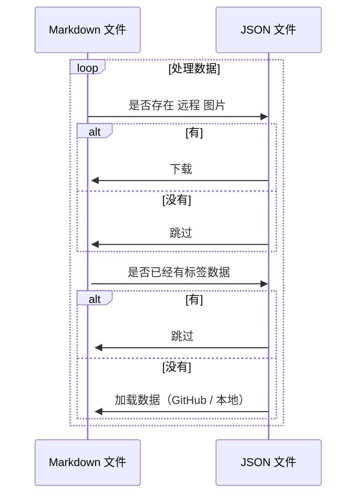

> * 标签：Kotlin、JavaScript、前端

# 自己构建一个博客系统｜项目复盘

## 为神马要搞这个

最近参与了掘金的翻译计划，产出了大量的 Markdown 文章，希望搭建一个个人站，存放自己的一些文章～

看了一些现成的解决方案，感觉局限性太多，不利于后期自定义，再加上我这个超级喜欢造轮子的性格，于是乎 👀


### 我就搭建了一个自己的处理系统

别问我为啥这样做，我觉得好玩（，而且自定义能力超强，可以随意加控件！！！


[](https://github.com/PassionPenguin/passionpenguin.github.io/)

## 需求功能

* 渲染 Markdown 标记
* 自定义页面
* 后期可以简单的对所有文章页面作更新
* 便于移植

### 本次使用的工具有：

#### 前端部分

基础的前端页面构造使用了原生 Vanilla JavaScript + CSS + HTML，构造一个静态的文章展示系统。


在样式方面使用了 SCSS 语言，并且顺带使用了 GitHub 的主题 `@primer` 库，并顺带魔改了一番～


#### 后端部分

在文章处理（标签获取、图片爬取）上使用了 Java + Kotlin 的组合，主要是我对 Kotlin 挺熟的，毕竟做了一年 Kotlin 项目了 = =。


## 构建思路

### 后端处理

#### 元数据处理

Java 主要处理元数据，包括文章的标签（分类）的读取，文章图片的解析爬取，以及文章标题简介等信息的读取，具体思路如下：



先看一下模版内容，默认模版：

```markdown
> * 标签：标签 A、标签 B

# 标题
```

翻译模版：

```markdown
> * 原文地址：[]()
> * 原文作者：[]()
> * 译文出自：[掘金翻译计划](https://github.com/xitu/gold-miner)
> * 本文永久链接：[https://github.com/xitu/gold-miner/blob/master/article/2021/.md](https://github.com/xitu/gold-miner/blob/master/article/2021/.md)
> * 译者：
> * 校对者：

# 标题
```

---

这里的所有的代码都保存在了这里：[PassionPenguin:PageGenerator/io.hoarfroster](https://github.com/PassionPenguin/PageGenerator/tree/master/src/main/kotlin/io/hoarfroster)，首先是实现获取所有文件：

```kotlin
fun main(args: Array<String>) {
    var downloadImage = false
    var inputDir: String? = null

    for (name in args) {
        if (name.contains(Regex("--input=(.+?)")))
            inputDir = name.substring(8)
    }
    if (inputDir == null)
        return

    val dir = File("${inputDir}/documents/")
    val files = dir.listFiles { _, name -> name.endsWith(".md") }
}
```

然后使用 `mapIndexed` 遍历所有 Markdown 文件，读取文件：

```kotlin
files?.mapIndexed { index, it -> 
    var sourceMarkdown = it.readText()
    val document = Jsoup.parse(HtmlRenderer.builder().build().render(Parser.builder().build().parse(sourceMarkdown)))
}
```

这里使用了 `commonmark` 和 `Jsoup` 解析了 Markdown 文件为 HTML 文件（其实也可以不用，全文正则匹配，但感觉还是有些麻烦）。

我们需要的信息有：

* 标题
* 标签
* 简介
* 文件名
* 最后修改时间
* （远程链接）
* （译者）

##### 标题

```kotlin
document.selectFirst("h1").text()
```

##### 标签

1. GitHub 标签

思路很简单，直接用 URLConnection 读取数据并解析就好了：

```kotlin
package io.hoarfroster

import org.jsoup.Jsoup
import java.net.URL
import javax.net.ssl.HttpsURLConnection

class RetrieveResult(val tags: MutableList<Tag>)

fun retrieveResult(repoUrl: String): RetrieveResult {
    println(" - Processing tags data")
    val tags: MutableList<Tag> = mutableListOf()
    val connection = URL(repoUrl.replace("blob", "commits").replace(" ", "%20")).openConnection() as HttpsURLConnection
    val document = Jsoup.parse(connection.inputStream.bufferedReader().readText())
    document.select("[data-hovercard-type=\"pull_request\"][data-url].issue-link.js-issue-link")
        .filter { e ->
            Regex("#([0-9]+?)$").matches(e.html())
        }.map { e ->
            Regex("#([0-9]+?)$").find(e.html())?.groupValues?.get(1)
        }.forEach { it ->
            Thread.sleep(1000)
            val conn = URL("https://github.com/xitu/gold-miner/pull/$it").openConnection() as HttpsURLConnection
            val doc = Jsoup.parse(conn.inputStream.bufferedReader().readText())
            if (doc.select(".js-issue-labels > *").size > 0
                && doc.selectFirst(".js-issue-labels").text().contains("翻译完成")
            ) {
                doc.select(".js-issue-labels > *").forEach {
                    if(!it.text().contains("翻译完成"))
                        tags.add(Tag(it.text()))
                }
            }
        }
    return RetrieveResult(tags = tags)
}
```

2. 文内标签

更简单了，直接 RegEx：

```kotlin
val tags = mutableListOf<Tag>()
Regex("标签：(.+?)\n").find(sourceMarkdown)?.groupValues?.get(1)?.split("、")?.forEach {
    tags.add(Tag(it))
}
```

##### 简介

直接读取第一段文字内容，当作简介内容：

```kotlin
var description = ""
for (e in document.select("p")) {
    if (e.text().isNotBlank()) {
        description = e.text()
        break
    }
}
```

##### 文件名

```kotlin
it.path.replace("${inputDir}/documents/", "")
```

##### 最后修改时间

```kotlin
Date(it.lastModified()).toString()
```

##### （远程链接）

```kotlin
Regex("本文永久链接：\\[.+?]\\((.+?)\\)").find(sourceMarkdown)?.groupValues?.get(1) ?: ""
```

##### （译者）

```kotln
Regex("译者：\\[(.+?)]").find(sourceMarkdown)?.groupValues?.get(1) ?: ""
```

#### 图片下载

挺简单的 = =：

```kotlin
println(" - Processing image")
document.select("img").forEach { img ->
    /* Download external resources */
    val alt = img.attr("alt")
    val urlString = img.attr("src")

    with(
        File(
        "${inputDir}/images/${it.path.replace("${inputDir}/documents/","")
            }-${urlString.getLastSegment()}"
        )
    ) {
        /* Only download the image if the file is not existed */
        if ((!this.isFile || !this.exists()) && !urlString.startsWith("../images/")) {
            Thread.sleep(1000)
            println("   - Processing image $urlString")
            if (!this.parentFile.isDirectory || this.parentFile.exists())
                this.parentFile.mkdirs()
            this.createNewFile()
            val imageUrlConn = URL(urlString).openConnection()
            imageUrlConn.setRequestProperty("referer", URL(urlString).host)
            imageUrlConn.setRequestProperty(
                "user-agent",
                "Mozilla/5.0 (Macintosh; Intel Mac OS X 11_1_0) AppleWebKit/537.36 (KHTML, like Gecko) Chrome/88.0.4324.182 Safari/537.36"
            )
            imageUrlConn.setRequestProperty("origin", "https://www.medium.com/")

            val `in`: InputStream = BufferedInputStream(imageUrlConn.getInputStream())

            val out = ByteArrayOutputStream()
            val buf = ByteArray(1024)
            var n: Int
            while (-1 != `in`.read(buf).also { n = it }) {
                out.write(buf, 0, n)
            }
            out.close()
            `in`.close()
            val response = out.toByteArray()
            this.outputStream().write(response)
            sourceMarkdown = sourceMarkdown.replace(
                """""",
                """
                }-${urlString.getLastSegment()})"""
            )
            it.writeText(sourceMarkdown)
        }
    }
}
```

然后每次运行的时候，直接执行：

* /Users/penguin/Desktop/PageGenerator/build/libs/PageGenerator.jar：Gradle 生成的 JAR 文件
* /Library/WebServer/Documents：文件仓库

```shell
java -jar /Users/penguin/Desktop/PageGenerator/build/libs/PageGenerator.jar --input=/Library/WebServer/Documents/ --downloadImage
```

#### 生成 HTML 文件：

继续魔改了 `markdown-it` 库，关键代码挺简单的：

```js
exports.render = async (config) => {
  const mdFilePath = path.resolve(config.cwd, config['mdFile'])
  let renderContent = md.render(fse.readFileSync(mdFilePath, 'utf-8'))
  let parser = new DOMParser()
  let document = parser.parseFromString(renderContent, 'text/html')
  let title = document.getElementsByTagName('h1')[0].textContent
  let html = `<!doctype html>
<html lang="en">
<head>
    <meta charset="UTF-8">
    <meta name="viewport" content="width=device-width, user-scalable=no, initial-scale=1.0, maximum-scale=1.0, minimum-scale=1.0">
    <meta http-equiv="X-UA-Compatible" content="ie=edge">
    <title>${title} - Hoarfroster</title>
    <link rel="stylesheet" href="/assets/styles/post.css">
    <link rel="stylesheet"
      href="//cdn.jsdelivr.net/gh/highlightjs/cdn-release@10.5.0/build/styles/atom-one-light.min.css">
</head>
<body>
<div class="container post markdown-body">${renderContent}</div>
<div class="footer"></div>
</body>
<script src="/assets/scripts/index.js"></script>
<script>init()</script>
</html>
`
  config.out = path.resolve(config.cwd, config.out)
  const fileReg = /([^/\\]*)\.[^/\\]+$/
  if (!config.out.match(fileReg)) {
    // if no file suffix, use the same as markdown file
    config.out = path.resolve(
      config.out,
      mdFilePath.match(fileReg)[1] + '.html'
    )
  }
  fse.writeFileSync(config.out, html)
}
```

### 前端部分

这里遇到了一个超级大的坑，即 GitHub 的样式和 `@primer` 库的内容完全不一样！于是乎我被迫控制台抄了几千行的 CSS 颜色变量：


结果 GitHub 最近又推了新的主题，这是要榨干企鹅嘛 = =。

最后使用了 JavaScript 为每一篇文章加上 Header 以及 Footer：


## 当前效果

### 主页


### 404 Not Found


### About


### 正文内容


## GitHub CI

```yaml
name: Page Automator

on:
  push:
    branches: [ master ]
  pull_request:
    branches: [ master ]

jobs:
  build:
    runs-on: ubuntu-latest

    steps:
      - name: Set up JDK 1.8
        uses: actions/setup-java@v1
        with:
          java-version: 1.8

      - name: Use Node.js 15.x
        uses: actions/setup-node@v1
        with:
          node-version: 15.x

      - name: setup git config
        run: |
          git config --global user.name "Hoarfroster Bot"
          git config --global user.email "<penguin.zhang@qq.com>"

      - uses: actions/checkout@master
        with:
          repository: PassionPenguin/PageGenerator
          path: ./page-generator

      - uses: actions/checkout@master
        with:
          path: ./documents

      - name: Build with Gradle
        run: |
          cd ./page-generator
          ./gradlew build

      - name: Generate Structure
        run: |
          echo "Processing Markdown Files"
          java -jar page-generator/build/libs/PageGenerator.jar --input=./documents
          cd ./documents

          git add *
          if [[ -n $(git status -uno --porcelain) ]]
          then
            git commit -m "Generate Structure"
            git push origin master
          fi

      - name: NPM Install
        run: |
          npm i -g markdown-html-gen

      - name: Generate HTML Pages with Markdown Files
        run: |
          echo "Generating HTML Files"
          cd ./documents
          for f in documents/*.md
            do
              htmlpath=${f/documents/archive}
              htmlpath=${htmlpath/md/html}
              md2html "$f" -o ./archive
              echo " - Generated $htmlpath"
            done

          git add *
          if [[ -n $(git status -uno --porcelain) ]]
          then
            git commit -m "Build Pages"
            git push origin master
          fi
```

## 反思与总结

尝试倒是不错，不过还有待继续改善：

* 按照 Tag 查看（雏形倒是搭建好了）
* 搜索
* 优化 CI/CD（现在还是手工本地跑，准备用 WebHook，让服务器接 GitHub 的 WebHook，爬取，然后 Push 回 GitHub 上面）

有个问题应该优化：

* Kotlin 的 PageGenerator 代码混乱

话说，在这三个月内，翻译+校对+原创文到了 100 篇咯，撒花撒花，芜湖湖～ 🎉🎉

> 最后的最后，继续推广一下 [掘金翻译计划](https://github.com/xitu/gold-miner)，这是一个翻译优质互联网技术文章的社区，文章来源为 掘金 上的英文分享文章。内容覆盖区块链、人工智能、Android、iOS、前端、后端、设计、产品、算法和其他等领域，以及各大型优质 官方文档及手册，读者为热爱新技术的新锐开发者。
> 
> 掘金翻译计划目前翻译完成 2345 余篇文章，官方文档及手册 13 个，共有 1000 余名译者贡献翻译和校对。
> 
> 欢迎各位加入我们嗷！

* 本文正在参与「掘金 2021 春招闯关活动」, 点击查看 [活动详情](https://juejin.cn/post/6939329638506168334)