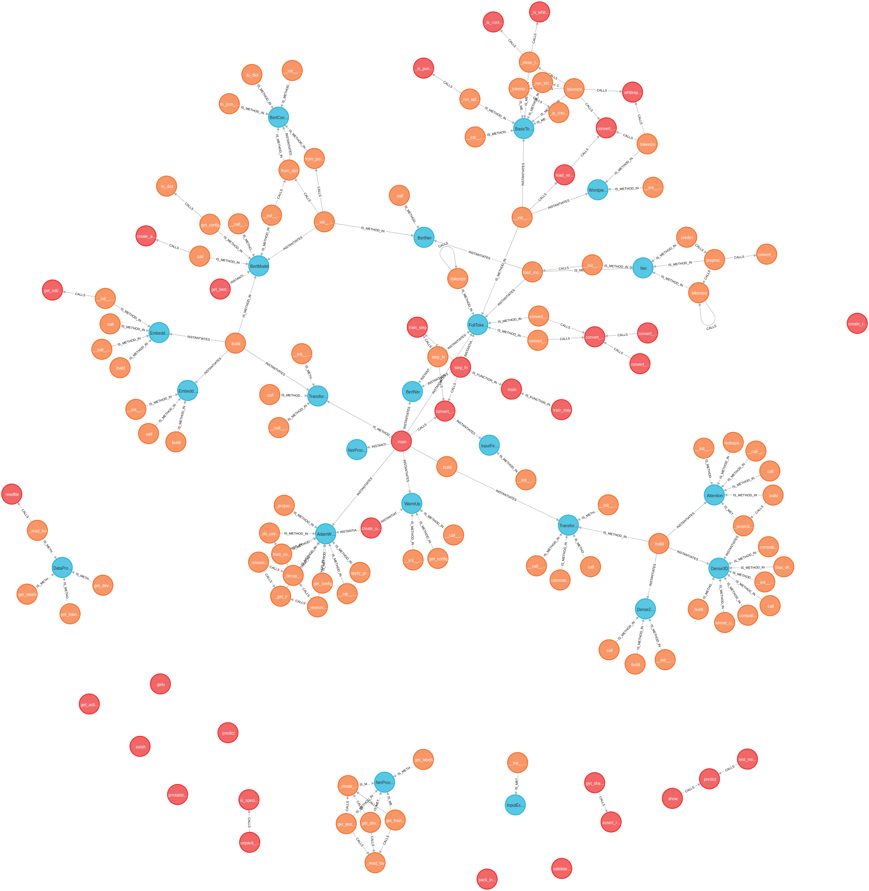
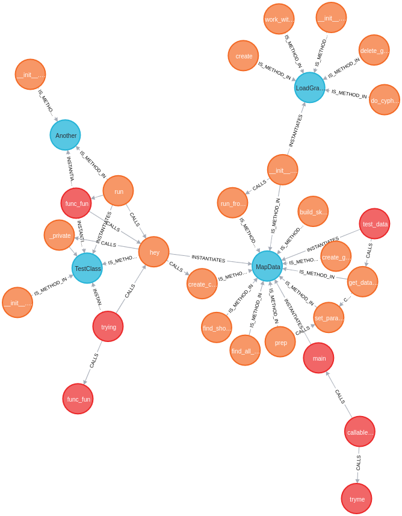
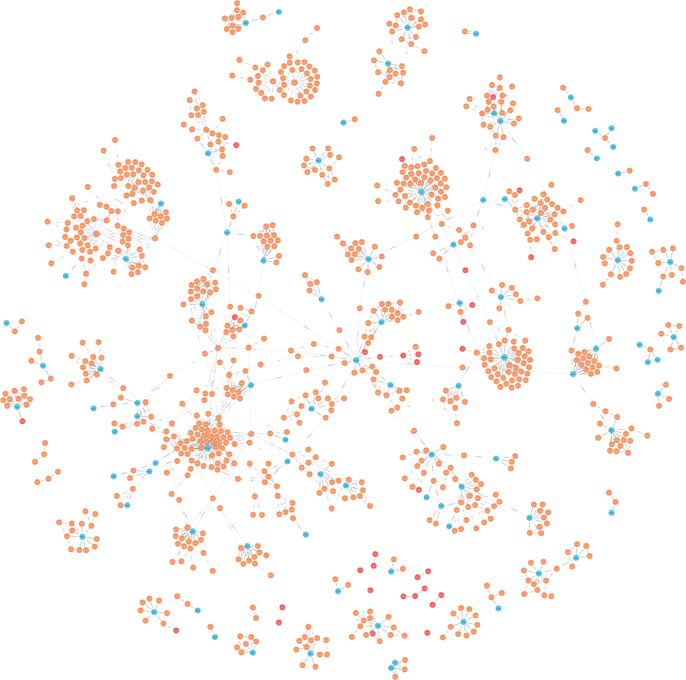

> * 原文地址：[Building a Map of Your Python Project Using Graph Technology — Visualize Your Code](https://towardsdatascience.com/building-a-map-of-your-python-project-using-graph-technology-visualize-your-code-6764e81f3500)
> * 原文作者：[Kasper Müller](https://medium.com/@kaspermuller)
> * 译文出自：[掘金翻译计划](https://github.com/xitu/gold-miner)
> * 本文永久链接：[https://github.com/xitu/gold-miner/blob/master/article/2021/building-a-map-of-your-python-project-using-graph-technology-visualize-your-code.md](https://github.com/xitu/gold-miner/blob/master/article/2021/building-a-map-of-your-python-project-using-graph-technology-visualize-your-code.md)
> * 译者：[Ashira97](https://github.com/Ashira97/)
> * 校对者：[PassionPenguin](https://github.com/PassionPenguin/)、[chzh9311](https://github.com/chzh9311/)

# 代码可视化 —— 使用图技术为 Python 项目绘制结构图



作为一名致力于数据科学的数学家，我对编程语言、机器学习、数据和数学都很感兴趣。

这些技术、工具或者艺术对于我们的社会至关重要。就在你阅读这篇文章的同时，这些技术正在改变我们的生活。但与此同时，另一种新兴技术也正在高速发展。

这种基于数学的技术是由伟大的莱昂哈德·欧拉在挑战一个无人可解的问题时发现的（或者说发明？我认为我们这里的用词应该进行另行讨论）。

这个问题与一种潜在的结构或是形状有关，这样的结构或者形状通常以一种连接事物的形式 —— 关系 —— 所表现出来。

Euler 需要一种工具来检查在特定实体之间的关系和结构，在这里特定实体之间的距离并不重要，重要的是它们之间的连接关系。

为了解决这个问题，他发明了一种被称作数学图的工具（或者简称为**图**）

这就是图论和拓扑学的诞生。

时间迅速向前，经过了286年之后...

## 高阶结构的发现

不久之前，我在工作中需要处理一个相当大的项目。这个项目包含了数百个 Python 的类、方法、和函数，它们彼此之间通过共享数据或者互相调用通信。

在开发之中，我要处理一个文件夹，这个文件夹中的代码是用来解决整个项目中的一个问题，突然我冒出了一个想法：

**如果能看到这个问题在整体项目中的定位，并且能看到不同实体之间的调用和数据传递关系不是更好吗？**

整个图形看上去会是什么样子？

经过了几个傍晚、喝了十七杯特浓咖啡之后，我写了一个 Python 程序。它处理代码作为输入，将代码解析为以对象、调用、作用域和实例形式表示的结点和联系，并将结果存储到了 Neo4j 图形数据库中。

本文一开始展示的图片就是使用这个 Python 图形构建项目处理一个 NLP 项目（用于处理人类语言的机器学习技术）得到的结果。

如果你不知道图形数据库是什么，我们这里暂停一下主线故事~

首先，图是一个数学模型，它由节点和边组成。边在 Neo 命名中叫做关系，这是一个非常合适的命名，因为边代表的含义就是两个节点之间的某种关系。

这种图的一个经典案例就是类似 Facebook 的社交网络：在社交网络中，节点代表人，关系代表人之间的友谊。

图形数据库将这样的图储存起来，这样你就可以探索图中数千条边背后隐藏的模式。

我们需要时刻谨记的重要一点是，图形数据库中不仅储存了节点，同样也储存了关系。这意味着某些查找操作比在关系数据库中关联许多张表再进行查询要快得多。

为了更清楚的说明我们构建了一张什么样的图，我将简单描述图形的结构。

我们先指定 Python 项目的根目录。

图中的节点代表了我们项目文件中的对象，具体一点说就是函数、类和方法。这些节点具有自己的属性，比如在当前节点有父节点的情况下，存储父节点文件信息。（类可以作为方法的父节点、函数也可以被定义在另一个函数中之类的）。

至于关系，我们有调用关系和表示一个方法属于哪个类的实例化关系以及等等其他关系。


我们想要跟踪代码中的调用和依赖关系。

所以我们手头上有了一个新的可视化工具，它不同于 Matplotlib 对数据进行可视化那样，而是将代码的结构用可视化的方式展现出来。

一开始，除了将它看作一种为获奖项目制作海报的有趣工具以外，我没有发现它的更大用处。

然而，在和一个同样学数学并且对图形数据库感兴趣的同事讨论之后，我们发现很多其他的工具已经为我们指明了发展方向，它不仅仅是一个可视化工具。

## 测试和安全

能看到代码中的依赖、用看到的图查出一两个 bug 或者仅仅通过看图就能优化代码是一件非常愉快的事情，但是这一结构图的真正优势在于它能够呈现代码的结构。

例如，除非你真的非常认真的将你的代码分割为可测试的小单元，并且在进行更大的集成测试之前对这些小单元挨个进行测试，否则就很难回答下面的问题：

* 你的代码测试到了什么程度？例如：哪些函数被间接测试过但并没有直接测试过，或者相反？
* 是否有从未使用或者从未测试的代码呢？
* 哪个函数被调用最多次？

**首先，间接测试是什么意思？**

当我调用一个函数（或者是方法、生成器之类的）时，这一函数可能又会去调用其他的函数。这些被二次调用的函数就叫做**间接**调用。第一个被调用的函数叫做**明确的**调用或者是**直接的**调用。

**好的……这一点为什么那么重要呢？**（译者注：此处理解为“明确调用类型可以帮助我们衡量不同函数中的 bug 对系统的危害程度”）

因为，如果一个被不同函数间接调用很多次的函数有一点微小的 bug ，那么首先，这种多次调用的情况下 bug 发生的概率就比每次只被同样的方法调用一次的情况要大；第二点，调用这个函数的函数越多，这个 bug 对系统造成的潜在威胁就越大。

这证明了图是解决该类问题的完美的工具。通过使用图，我们能够获得不同方法、函数和类的重要性指数。而再根据该指数进行排序，我们就可以优先对重要函数进行排查并解决其中的 bug。

## 解决方案

在 Python 真正使用 Neo4j 之前，我们需要安装 Neo4j 的桌面环境，执行以下命令：

```bash
pip install neo4j
```

接下来用 Python 构建一个负责与 Neo4j 通信的类。

现在我们可以在任何一个类中，通过以下代码简单构建一个图加载器：

```python
self.loader = LoadGraphData("Kasper", "strong_pw_123", "bolt://localhost:7687")
```

让我们看看上面描述的映射算法在我的个人项目上的实现结果：



在这个项目中，蓝色的节点代表类，橙色的节点代表方法，红色的节点代表函数。

请注意该项目中的一部分代码是用于测试该映射算法的无用代码，但是也符合 Python 的语法。

我们想知道哪个方法被测试过以及它们是如何被间接调用测试的？例如：从最近的测试方法到某指定的非测试方法中经历了多少次调用？

我们现在有了图形，接下来就该查询图形数据库了。

看下面这个实现了在测试和功能函数之间最短路径算法的查询并且将它和图片进行比较。

请注意，在这个时候测试方法是一个在以 “test” 为开头的文件、类或者函数中定义的对象，或者仅仅是一个名字以 "test" 开头的函数、方法、类。（如果是一个测试类，那么它应该以 "Test" 开头）

这一前提似乎很牵强，但我几乎没有在 Python 文件中写过用除了 "test" 的其他单词开头的测试方法，因为大多数情况下方法名本身就是以 "test" 开头的。

> 如果你有一个以 "test" 开头的文件，那我猜测所有的函数和方法在这个文件中都是测试方法。

上述查询的输出结果在下面的表格中：


嗯……如果我们能够用 Pandas DataFrame 的数据格式得到这张表那就更好了。

让我们改一改代码：

我们将查询语句以字符串形式用三括号包裹存储在变量 **query** 中。之后，在所选择的方法或函数内部，代码可能是这样：

```python
loader = self.loader
records = loader.work_with_data(query)
df = pd.DataFrame(records, columns=["distances", "test_functions", "test_source", "targets", "target_source"])
```

之后就会得到进一步处理所需的以 DataFrame 对象形式存储的表格。

接下来我们可以立即找出所有的非测试方法。让我们构建这张代码图吧~

在继续我们的探索之前，我们应该定义一下安全指数的含义。

> 对于一个给定的函数 **f** ，将其**测试规范**定义为图中展示出来的最近的测试方法和它本身之间的距离。

* 通常定义所有测试方法的测试规范是0。
* 如果某方法被一个测试方法直接调用，那么该方法的测试规范为1。
* 如果一个方法没有被任何测试方法调用，但是被另一个被测试方法调用的函数调用了，那么该方法测试规范为2，以此类推。

接下来我们定义整个项目的安全系数 σ 。我们将 **NT** 定义为所有非测试方法的集合并且定义 N = |NT|。之后我们定义

$$
\sigma=\frac{1}{N} \sum_{f \in \mathbb{N T}} \frac{1}{|f|_{T}}, \quad \text { where }|f|_{T} \text { is the test norm of } f
$$

请注意：

* 如果项目中所有的函数都是被直接测试的，即所有的函数的测试规范都为1，那么 σ = 1。
* 如果所有函数都没有直接或者间接测试，那么 σ 是一系列空值的和，通常规定为 0。

0 \< σ \< 1 ，并且越接近于1，测试就进行的越完善，代码所提供的服务也越安全。

这一公式背后的思想是：某一给定函数距离测试函数越远，针对它的测试就越不足。然而，在这里我假定“平均”缺陷测试是针对图形边缘部分的函数的。但这仅仅只是一个定义，我们可以根据需要改变它。例如，被很多测试函数调用的方法比仅仅被一个测试函数调用的方法测试的更好，我们在当前版本项目中不考虑这种情况，但在之后的版本中可能会解决这种情况。

让我们实现它！

这是可行的，并且上面的项目得到了大约 0.2 的分数，但是记住，只有在你的文件名或用来测试代码的对象以 "test" 开头时才有效。

我将把构建这个 Python 映射的任务留给读者作为练习，因为不方便开放这个项目的源代码。但是，我将给一些帮助您构建的提示。

* 我有一个主要的类用来在一行一行迭代文件的时候跟踪和存储节点和关系。
* 在迭代的时候，我们记录当前所在的作用域。我们是在一个类里？一个方法里？等等
* 如果存在一个对于其他函数或者其他类的调用或者实例化，那我们存储对象并且创建一个关系
* 如果当前的行包含定义语句，那么存储当前对象和父节点（如果存在），也就是方法或者类。之后，以 IS_METHOD_IN, IS_FUNCTION_IN 的形式存储关系。

基本上这就是编写一个 Python 语法解析器的全部要点了。

这比我们一开始想象的要复杂一点。

我们需要在逐行解析文件的时候跟踪对其他文件的引入和调用，因为我们不知道这个项目有多深。我们存储的每个对象都有一个对应的创建它的源文件，并且我们需要将对应的源文件存储为对象的一个属性，因为如果两个对象在两个不同的文件中以相同名字被调用的时候，我们不应该在结构图中将这两个对象合并到一起。

当遍历完项目中所有的 .py 文件的时候，我从数据存储中创建了 csv 文件，这些数据存储是 Python 通过之前 LoadGraphData 方法使用 LOAD CSV 查询从 Neo4j 中加载的。

## 一个现成项目的结构图

这里是一个现成的项目结构图

**Beautiful Soup**



这张图非常完美的表示了 Beautiful Soup 中发生了什么。它的簇之间彼此连接非常紧密。

虽然这份代码并不完美，但我相信它在未来一定是相当有用的。我现在正在开发一个更加稳定的版本，该版本中会将文件的打开次数纳入计算。

> 如果发现译文存在错误或其他需要改进的地方，欢迎到 [掘金翻译计划](https://github.com/xitu/gold-miner) 对译文进行修改并 PR，也可获得相应奖励积分。文章开头的 **本文永久链接** 即为本文在 GitHub 上的 MarkDown 链接。

---

> [掘金翻译计划](https://github.com/xitu/gold-miner) 是一个翻译优质互联网技术文章的社区，文章来源为 [掘金](https://juejin.im) 上的英文分享文章。内容覆盖 [Android](https://github.com/xitu/gold-miner#android)、[iOS](https://github.com/xitu/gold-miner#ios)、[前端](https://github.com/xitu/gold-miner#前端)、[后端](https://github.com/xitu/gold-miner#后端)、[区块链](https://github.com/xitu/gold-miner#区块链)、[产品](https://github.com/xitu/gold-miner#产品)、[设计](https://github.com/xitu/gold-miner#设计)、[人工智能](https://github.com/xitu/gold-miner#人工智能)等领域，想要查看更多优质译文请持续关注 [掘金翻译计划](https://github.com/xitu/gold-miner)、[官方微博](http://weibo.com/juejinfanyi)、[知乎专栏](https://zhuanlan.zhihu.com/juejinfanyi)。
