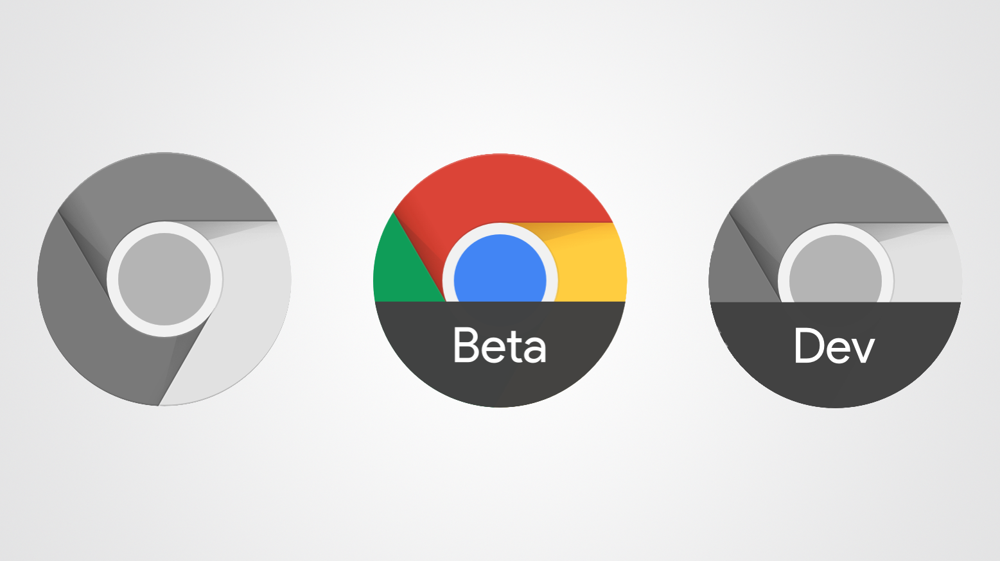

> * 原文地址：[Chrome 90 Beta: AV1 Encoder for WebRTC, New Origin Trials, and More](https://blog.chromium.org/2021/03/chrome-90-beta-av1-encoder-for-webrtc.html)
> * 原文作者：[Chromium Dev](https://twitter.com/ChromiumDev)
> * 译者：[霜羽 Hoarfroster](https://github.com/PassionPenguin)
> * 标签：其他
> 本文发布于 2021 年 3 月 11 日，星期四

# Chrome 90 Beta 版本更新，支持 WebRTC AV1 编码器，新的 Origin Trials，还有更多等着你来～



除非另有说明，否则以下描述的更改适用于适用于 Android、Chrome OS、Linux、macOS 和 Windows 的 Chrome beta 通道版本的更新。你可以通过文中的链接或访问 [ChromeStatus.com](https://www.chromestatus.com/features#milestone%3D90) 上的列表更详细地了解此处列出的功能。 Chrome 90 已于 2021 年 3 月 11 日发布 Beta 版。

# AV1 编码器

Chrome 桌面版目前内置了 [AV1 编码器](https://www.chromestatus.com/feature/6206321818861568)。该编码器经过我们的专门优化，可与 WebRTC 集成，用于视频会议。AV1 编码的优点包括：

* 比其他类型的视频编码有更好的压缩效率，能够减少带宽消耗并提高视觉质量
* 能够在带宽非常低的网络上为用户启用视频（以 30kbps 甚至更低的速度提供视频传送）
* 与 VP9 等其他编解码器相比，屏幕共享效率得到了显着提高。

这是对 WebRTC 的一个重要补充，它最近也成为了 [W3C 和 IETF 官方标准](https://web.dev/webrtc-standard-announcement/)。

# Origin Trails 原始测试

此版本的 Chrome 引入了所谓的“原始测试”，使我们可以在浏览器中尝试新功能，并向 Web 标准社区提供有关可用性，实用性和有效性的反馈。要注册 Chrome 当前支持的任何原始测试（包括以下所述），请访问 [Chrome 原始测试控制台](https://developer.chrome.com/origintrials/#/trials/active)。要了解有关 Chrome 中的原始测试的更多信息，请访问 [Web 开发人员的原始测试指南](https://web.dev/origin-trials/)。Microsoft Edge 与 Chrome 分开运行其自己的原始测试，若要了解更多信息，请参见 [Microsoft Edge Origin Trials 开发人员控制台](https://developer.microsoft.com/en-us/microsoft-edge/origin-trials/)。

## 新的原始测试内容

### `getCurrentBrowsingContextMedia()`

[`mediaDevices.getCurrentBrowsingContextMedia()` 方法](https://developer.chrome.com/origintrials/#/view_trial/3654671097611157505)允许我们使用当前选项卡的视频（和可能的音频）捕获 `MediaStream`，类似于 `getDisplayMedia()`。但是与`getDisplayMedia()` 不同，调用此新方法将为用户提供一个简单的接受拒绝对话框。如果用户接受，则会捕获当前选项卡，二在所有其他的表现中 `getCurrentBrowsingContextMedia()` 与 `getDisplayMedia()` 完全相同。该原始测试预计将在 Chrome 92 中启动。

### `MediaStreamTrack` 可插入流（也称为 Breakout Box “分线盒”）

这是用于[操纵 `MediaStreamTracks` 承载的原始媒体](https://www.chromestatus.com/feature/5499415634640896)的 API，可操纵例如相机，麦克风，屏幕截图或编解码器的解码器部分，并且会输出编解码器的解码器部分。它使用 `WebCodecs` 接口表示原始媒体帧，并使用流公开它们，类似于 WebRTC 可插入流 API 公开来自 `RTCPeerConnections` 的编码数据的方式，旨在支持以下用例：

* [Funny Hats](https://www.w3.org/TR/webrtc-nv-use-cases/#funnyhats*)：指在编码之前和解码之后对媒体的处理，以提供诸如去除背景等效果，有趣的帽子，声音效果。
* [机器学习](https://www.w3.org/TR/webrtc-nv-use-cases/#machinelearning*)：指的是诸如实时对象识别/注释之类的应用程序。

该原始测试预计将在 Chrome 92 中启动。

### WebAssembly 异常处理

WebAssembly [现在提供了异常处理功能](https://developer.chrome.com/origintrials/#/view_trial/2393663201947418625)。异常处理允许代码在引发异常时中断控制流。异常可以是 WebAssembly 模块已知的任何异常，也可以是由调用的导入函数引发的未知异常。预计该原始测试将在 Chrome 94 中启动。

## 启动的原始测试

Chrome 原始测试部分的以下部分已经启动：

### WebXR AR 照明估算

[照明估算](https://www.chromestatus.com/feature/5704707957850112)允许站点在 WebXR 会话中查询环境照明条件的估算。这样既暴露了代表环境照明的球形谐波，又暴露了代表“反射”的立方体贴图纹理。添加“照明估计”可以使您的模型更自然，并使其更适合用户的环境。

# 此版本中的其他功能更新

## CSS

### `aspect-ratio`

如果在任何元素上仅指定宽度或高度中的一个，则 [`aspect-ratio` 属性](https://www.chromestatus.com/feature/5682100885782528)会自动计算其他尺寸。在用于动画时，此属性会默认设置为不可插值形式（这意味着它会捕捉到目标值），用于提供一个从一个长宽比到另一个长宽比的平滑插值。

### 自定义状态的伪类

我们现在将自定义元素的状态通过 CSS State 伪类[公开了出来](https://www.chromestatus.com/feature/6537562418053120)。内置元素的状态会根据用户的交互作用和其他因素随时间变化，并借助伪类向开发者们公开了出来。例如，某些表单控件具有 `invalid` 状态，而该状态会通过 `:invalid` 伪类公开出来。由于自定义元素也具有状态，因此以类似于内置元素的方式公开其状态是有意义的。

### 实现 `appearance` 和 `-webkit-appearance` 的 `auto` 值

以下表单控件的 CSS 属性 `appearance` 和 `-webkit-appearance` 的默认值更改为 `auto`。

* `<input type=color>` and `<select>`
* 仅限安卓：`<input type=date>`、`<input type=datetime-local>`、`<input type=month>`、`<input type=time>` 以及 `<input type=week>`

请注意，这些控件的默认呈现没有被更改。

### `overflow: clip` 属性

`overflow` 的 [`clip` 值](https://www.chromestatus.com/feature/5638444178997248)会让盒容器的内容被裁剪到盒的溢出部分的边缘，并且不会为这个元素再提供滚动接口，并且内容不能在被用户或用编程方式进行滚动。此外，该框不被视为滚动容器，并且不会启动新的格式设置上下文。此值的性能比 `overflow：hidden` 更好。

### `overflow-clip-margin` 属性

[`overflow-clip-margin` 属性](https://www.chromestatus.com/feature/5638444178997248)允许指定在裁剪之前允许元素超出边界的距离。它还允许开发人员扩展剪辑边界。这对于例如墨水溢出这类的情况特别有用。

## `Permissions-Policy` 标头

`Permissions-Policy` HTTP 标头[替换了现有的 `Feature-Policy` 标头”](https://www.chromestatus.com/feature/5745992911552512)，用于控制权限和提供强大的功能。这个标头允许网站更严格地限制授予要素来源的访问权限。

Chrome 74 中引入的 [`Feature Policy` API](https://developers.google.com/web/updates/2018/06/feature-policy#js)，最近已重命名为 `Permissions Policy`，HTTP 标头也被重命名了。同时，社区已基于 [HTTP 的结构化字段值](https://httpwg.org/http-extensions/draft-ietf-httpbis-header-structure.html)为之确定了一种新语法。

## 通过 `Cross-Origin-Read-Blocking` 保护 `application/x-protobuffer`

通过将 `application/x-protobuffer` 添加到 `Cross-Origin-Read-Blocking` 所使用的永不嗅探的 MIME 类型列表中，我们保护它免受推测性执行攻击。`application / x-protobuf` 已经被保护为永不监听的 MIME 类型。`application/x-protobuffer` 是另一种常用的 MIME 类型，被 protobuf 库定义为 `ALT_CONTENT_TYPE`。

> https://www.chromestatus.com/feature/5670287242690560

## 在文件系统访问 API 中寻找文件末尾

当数据传递到将扩展到文件末尾的 `FileSystemWritableFileStream.write()` 时，[现在会被写入 `0x00`（`NUL`）扩展文件](https://www.chromestatus.com/feature/6556060494069760)。借此我们可以创建稀疏文件，并在接收到乱序的待写数据时大大简化了将内容保存到文件的过程。如果没有此功能，那么会接收到混乱的文件内容（例如 BitTorrent 下载）的应用程序将不得不提前或在编写过程中需要时手动调整文件大小。

## StaticRange 构造函数

当前，[`Range`](https://developer.mozilla.org/en-US/docs/Web/API/Range) 是 Web 开发者唯一可用的可构造范围类型。但是，`Range` 对象是可变的，让它们的维护变得困难。对于每个 DOM 树的更改，所有受影响的 `Range` 对象都需要更新。 [新的 `StaticRange` 对象](https://www.chromestatus.com/feature/5676695065460736)则不会这样。它代表的轻量级范围类型，维护难度比 `Range` 轻松不少。`StaticRange` 的可构造使 Web 开发者可以将它们用于不需要在每次 DOM 树更改时都进行更新的范围。

## 支持在 `<picture>` 的 `<source>` 元素上指定宽度和高度

`<picture>` 元素内的 `<source>` 元素[现在支持使用 `width` 和 `height` 属性定义宽高](https://www.chromestatus.com/feature/5737185317748736)，让 Chrome 浏览器可以为 `<picture>` 元素计算宽高比。这与 ``、`<canvas>` 和 `<video>` 元素的类似行为相同。

## WebAudio 的 `OscillatorOptions.periodicWave` 不可为空

创建新的 `OscillatorNode` 对象时，[我们不可以再将 `periodicWave` 设置为 `null`](https://www.chromestatus.com/feature/5086267630944256)。该值在传递给 `OscillatorNode()` 构造函数的 `options` 对象上设置，而现在 WebAudio 规范不允许将此值设置为 `null`。Chrome 与 Firefox 同时践行了这个规则。

# JavaScript 的更新

此版本的 Chrome 内置了 V8 JavaScript 引擎的 9.0 版。特别包含了以下列出的更改。我们还可以在 V8 发行说明中找到完整的[最新功能列表](https://v8.dev/blog)：

## 数组、字符串和 TypedArrays 的相对索引方法

`Array`、`String` 和 `TypedArray` [现在支持 `at()` 方法](https://www.chromestatus.com/feature/6123640410079232)，该方法支持带负数的相对索引。例如，下面的代码返回给定数组中的最后一项。

```js
let arr = [1,2,3,4];
arr.at(-1);
```

# 弃用和移除

此版本的 Chrome 引入了以下弃用和删除项。访问 [ChromeStatus.com](https://www.chromestatus.com)，以获取[当前弃用](https://www.chromestatus.com/features#browsers.chrome.status%3A%22Deprecated%22)和[以前的移除项](https://www.chromestatus.com/features#browsers.chrome.status:%22Removed%22)。

## 删除内容安全策略指令“插件类型”

[`plugin-types` 指令允许开发人员去限制](https://www.chromestatus.com/feature/5742693948850176)可以通过 `<embed>` 或 `<object>` 的 HTML 元素加载的插件的类型。这使开发人员可以在其页面中阻止 Flash 的加载。不过目前 Adobe 以及 Chrome 都已停止对 Flash 的支持，实际上我们不再需要此策略指令。

## 删除 WebRTC RTP 数据通道

Chrome 浏览器已[删除了对非标准 RTP 数据通道的支持](https://www.chromestatus.com/feature/6485681910054912)。用户应改用基于标准 SCTP 的数据通道。

## 为 `navigator.plugins` 和 `navigator.mimeTypes` 返回 `null`

Chrome 浏览器中 [`navigator.plugins` 和 `navigator.mimeTypes` 的调用会返回 `null`](https://www.chromestatus.com/feature/5741884322349056)。随着 Flash 的移除，我们不再需要为这些属性返回任何内容。