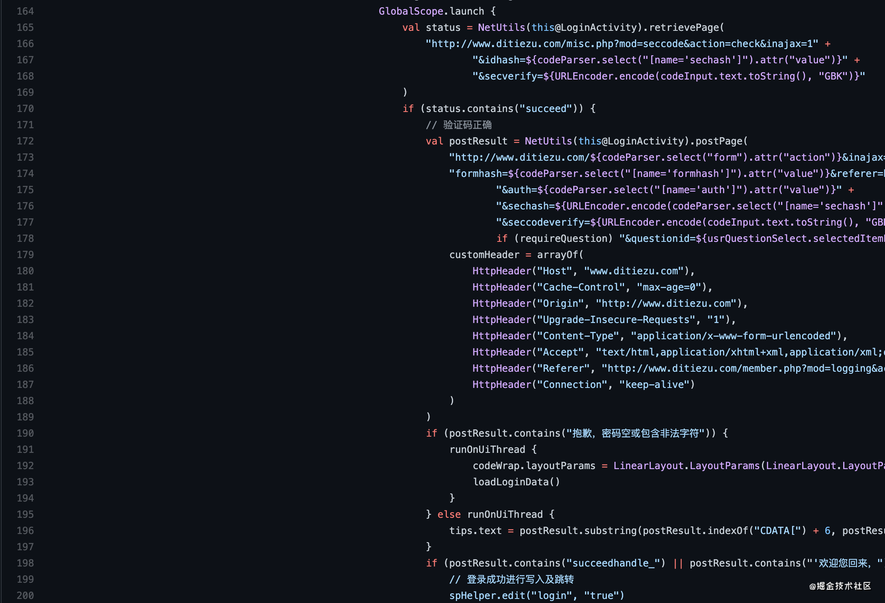
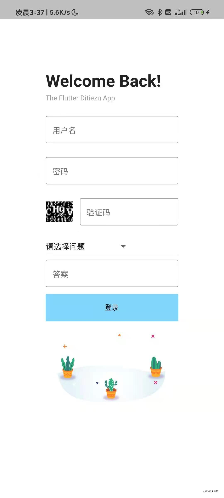
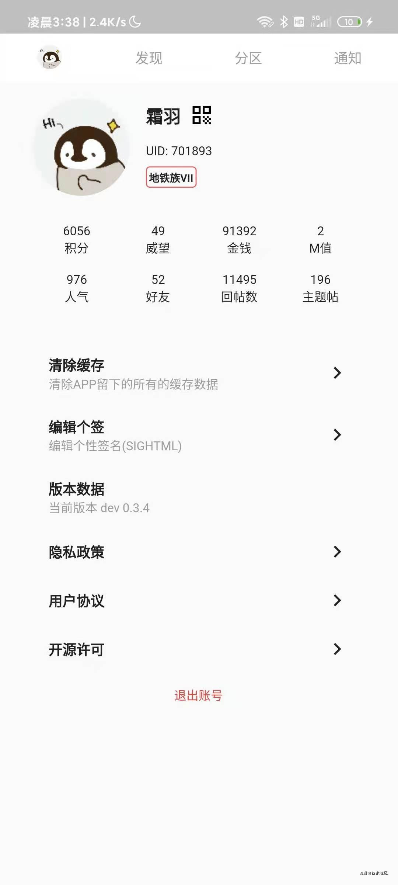
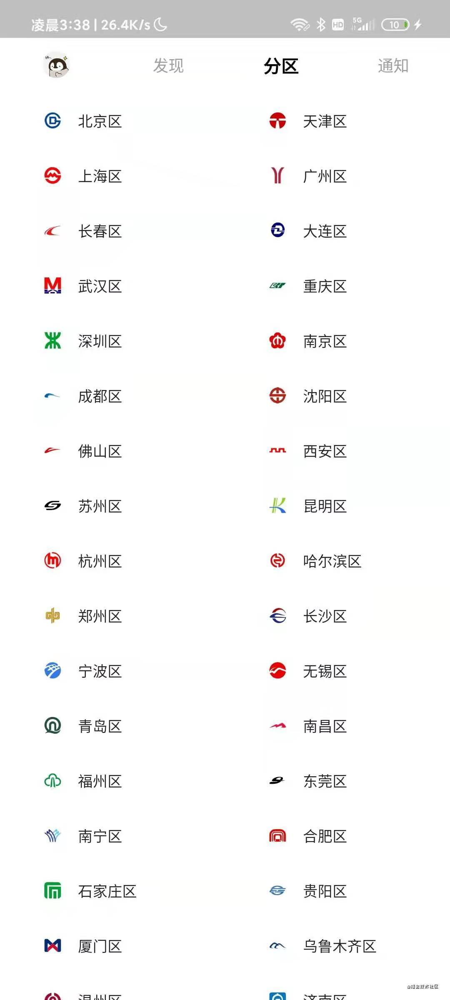
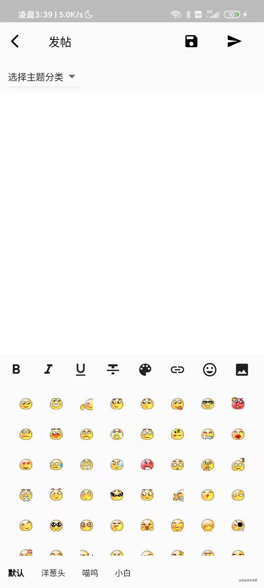

> * 标签：Kotlin、JavaScript、Flutter、安卓

# 基于 Discuz X 系统的论坛手机版应用构建｜项目复盘

## 总得聊点天先吧

说实在的，我也不知道是什么促使我投入到应用程序的开发之中。似乎一开始是 [HumanBeingXenon](https://github.com/HumanBeingXenon) 以及一众论坛朋友们在看到我开发了 [GZMTR，这个项目现在代码被混淆过了，并且弃坑了](https://github.com/PassionPenguin/GZMTR)应用程序之后，希望我做出一款应用程序，以代替 Discuz X 可怜的手机版网页视图。

我实际上是个论坛的活跃er，等级在论坛运营的 20 年内也能排前几了（虽然我只注册了不到一年），也是一个无名的【Web 前端】开发者。

## 背景有些啥

### 现存的主要问题在乎

* 渲染内容少（大量的样式标签在移动端都被忽略掉了）
* 功能少（少了评分（加减分）、高级搜索、传图（多张传图））
* 加载慢（Discuz X 优化拉胯）
* 广告多（10 条回复，AdBlock 能够拦截 10 条广告）
* 不会渲染个性签名以及编辑个性签名

### 希望实现的功能

* 编辑器能够使用样式
* 一次性上传多张照片
* 去广告
* 优化加载（lazy-loading 等）
* 补回缺失的渲染内容
* 渲染个性签名以及提供编辑个性签名的入口

## 歪路 —— 资源脚本注入

首先尝试用最擅长的 Web 技术尝试去构建，事实上，也构建过几版应用程序，并使用 [`WebView`](https://developer.android.google.cn/reference/android/webkit/WebView) 打包整个 Web 项目包。但是在实践中，发现了不少问题，最大的问题还是集中在资源加载的速度 —— **方向选错了！**

我那时候直接了当地选择了 **资源脚本注入** 的方法，借助 [WebView.evaluateJavascript](https://developer.android.com/reference/android/webkit/WebView#evaluateJavascript(java.lang.String,%20android.webkit.ValueCallback%3Cjava.lang.String%3E)) 往 WebView 中注入 `window.onload = () => {}` 并使用 JavaScript 往页面内注入自定义的 CSS 以及改善的脚本。

然而事实证明，我太天真了。WebView 加载页面的速度奇慢，大量的图片没有懒加载，堵塞进程，让页面一直处于加载中状态，并且大量的功能还是缺失，并且难以修改，难以调试。

那时候，平均一个页面的加载时间（原网页的加载时间）为 16s（100 Mbps），而用蜂窝数据，那就可怕咯，直接把我头扬了 😂，令人痛苦 = =。

现在还记得论坛中最多反馈的声音是：

> ### 一直在加载，从未有停止
>
> —— *笑死，根本加载不出来。*

## 转入正轨 —— 原生

> 最近想要重构（原来真的就是一边学一边写，思路很乱），原始代码的 `hash` 是 `afd615412f0d0679a65faa327629fa8a80c78954`

还是 [HumanBeingXenon](https://github.com/HumanBeingXenon) 这个憨憨的提议，让我本就不充实的寒假生活更加不充实 = =。

他问我，要不要以他为开发核心，开发 Java 版的应用程序（笑死，他根本不会 Android 开发 - -），优化现有的应用程序。

我先是犹豫，毕竟初三的寒假，我还想着刷点题目，但是熬不过他的劝说，我竟然开始了 = =。

说实在我也真的没有**任何 Android 开发的经验**，可以说我在安卓领域上就是个萌新。

我是咋干的？看 [developer.android.com](https://developer.android.com/) 的英文页面，一边摸索功能一边搜功能一边拷贝 Exception 到 Google 去搜索。

不过我不是论坛的站长，也没有权限在论坛的系统内搞些什么东西，也只能够借助现有的数据去处理了。

便开始了我的 `爬虫` 生涯。使用 [`URLConnection`](https://developer.android.google.cn/reference/java/net/URLConnection) 爬取数据后使用 [Jsoup](https://jsoup.org/) 处理数据。每天的日子就是在调试和修改中度过，一周内解决了主要功能的开发，基本实现了论坛手机端应用的现代化（doge 🐶）。

#### 反爬的处理

试了挺多 HTTP 标头，与现在我们的校验不同（毕竟复古），它会检测 `User-Agent`（网页版本）、`Origin` `Referer` `Host`（不确定，有的功能会检查有的却不检查）、`Cookie`（用户状态）。于是乎就简简单单的 [`URLConnection.setRequestProperty`](https://developer.android.com/reference/java/net/URLConnection?hl=en#setRequestProperty(java.lang.String,%20java.lang.String)) 解决掉这个问题，甚至后来我还顺便包装成了一个函数，直接返回 [`URLConnection`](https://developer.android.google.cn/reference/java/net/URLConnection)：

```kotlin
@WorkerThread
@Throws(NetworkOnMainThreadException::class)
private fun openConn(url: String, retrieveAsDesktopPage: Boolean): HttpURLConnection {
    val urlConnection = URL(url).openConnection() as HttpURLConnection
    urlConnection.setRequestProperty("Cookie", CookieManager.getInstance().getCookie(url) ?: "")
    urlConnection.setRequestProperty("Referer", "http://www.ditiezu.com")
    urlConnection.setRequestProperty("Origin", "http://www.ditiezu.com")
    urlConnection.setRequestProperty("Host", "www.ditiezu.com")
    urlConnection.setRequestProperty("DNT", "1")
    urlConnection.setRequestProperty("Proxy-Connection", "keep-alive")
    if (retrieveAsDesktopPage)
        urlConnection.setRequestProperty("User-Agent", userAgent)
    return urlConnection
}
```

<small>[com.passionpenguin/NetUtils.kt#L50](https://github.com/PassionPenguin/Ditiezu/blob/afd615412f0d0679a65faa327629fa8a80c78954/app/src/main/java/com/passionpenguin/NetUtils.kt#L50)</small>

#### 个性签名

第二个大的问题是个性签名，也是为数不多的需要自己深挖 API 的功能。这个功能因为论坛在春季的时候遭遇了大面积的广告刷帖，最后站长等管理员决定关闭个人空间，而拉胯的 Discuz X 个人空间包含了密码、个人信息的编辑页面，也顺带着被 ban 掉了。

然而包括管理员都希望重启这个功能，却又发现难以找到一个方法。最后发了上了到应用的更新帖中，我就去看了一下 Discuz X 的源代码（下面的链接是第三方的仓库），发现了这个：

```php
if($_GET['signaturenew']) {
    $signaturenew = censor($_GET['signaturenew']);
    $sightmlnew = discuzcode($signaturenew, 1, 0, 0, 0, $member['allowsigbbcode'], $member['allowsigimgcode'], 0, 0, 1);
} else {
    $sightmlnew = $signaturenew = '';
}
```

<small>[/upload/source/include/modcp/modcp_member.php#L39](https://github.com/codersclub/DiscuzX/blob/50c43cf86738f6e3a4d76b75f2ee456ede14cbd9/upload/source/include/modcp/modcp_member.php#L39)</small>

表单的处理很是简单，直接处理 POST（这个文件是系统内部受保护的文件，见 [L10](https://github.com/codersclub/DiscuzX/blob/50c43cf86738f6e3a4d76b75f2ee456ede14cbd9/upload/source/include/modcp/modcp_member.php#L10)，所以上面代码是 GET）的内容 `signaturenew`，因而我们也只需要发送用户信息 + `editsubmit` + `signaturenew` 即可。

#### 图片处理

Discuz X 是很远古的系统，受限于处理器以及存储空间，默认设置图片上传尺寸应该是 16MP，超过该尺寸的图片能够上传，但不会被服务器写入系统，只会返回错误。

市面上大多数的图片压缩解决思路都不可用 —— 要么压缩后图片反而大小变大了，要么操控起来速度很慢。

搜了搜 GitHub，就发现了 `libjpeg-turbo` 的解决思路，简单的翻译下，就是，Android 使用的 Skia 最初使用 `libjpeg` 时候出于设备的性能（又是你！）而取消掉了 Huffman 算法的压缩，而我们可以使用 JNI + NDK，导入一个自己编译过后的 `libjpeg` 或 `libjpeg-turbo` 并修改接口（话说 Java 16 现在似乎不用写 JNI 接口了？），就可以实现压缩功能。

> Ref: https://github.com/bither/bither-android-lib

一番折腾过后，总算搞定了这个功能，具体实现就是先[判断图片尺寸](https://github.com/PassionPenguin/Ditiezu/blob/afd615412f0d0679a65faa327629fa8a80c78954/app/src/main/java/com/passionpenguin/NetUtils.kt#L397)，然后调用 [`NativeUtils` 类](https://github.com/PassionPenguin/Ditiezu/blob/afd615412f0d0679a65faa327629fa8a80c78954/app/src/main/java/net/bither/util/NativeUtil.kt#L30)，调用 JNI 的 [`Java_net_bither_util_NativeUtil_compressBitmap`](https://github.com/PassionPenguin/Ditiezu/blob/afd615412f0d0679a65faa327629fa8a80c78954/app/src/main/jni/bitherlibjni.c#L148)函数，执行压缩。

一番折腾后，设置压缩比率为 90%，亲测一般图片都能压缩到 10% 甚至最低试过 5%（小米设备截图不优化的吗！ = =）。

##### 但其实

但其实，实现起来很是简单：

```kotlin
object NativeUtil {
    fun compressBitmap(bit: Bitmap, fileName: String, optimize: Boolean, quality: Int = 75) {
        compressBitmap(bit, quality, fileName, optimize)
    }

    private fun compressBitmap(bit: Bitmap, quality: Int, fileName: String, optimize: Boolean) {
        Log.d("native", "compress of native")
        if (bit.config != Bitmap.Config.ARGB_8888) {
            val result: Bitmap = Bitmap.createBitmap(bit.width, bit.height, Bitmap.Config.ARGB_8888)
            val canvas = Canvas(result)
            val rect = Rect(0, 0, bit.width, bit.height)
            canvas.drawBitmap(bit, null, rect, null)
            saveBitmap(result, quality, fileName, optimize)
            result.recycle()
        } else {
            saveBitmap(bit, quality, fileName, optimize)
        }
    }

    private fun saveBitmap(bit: Bitmap, quality: Int, fileName: String, optimize: Boolean) {
        compressBitmap(bit, bit.width, bit.height, quality, fileName.toByteArray(), optimize)
    }

    private external fun compressBitmap(bit: Bitmap, w: Int, h: Int, quality: Int, fileNameBytes: ByteArray, optimize: Boolean): String?

    init {
        System.loadLibrary("jpegbither")
        System.loadLibrary("bitherjni")
    }
}
```

以及 C++ 部分写一个接口，剩下的 `libjpeg-turbo` 代码原封不动都不需要修改 = =。

#### 转向 RecyclerView

一开始使用的是 [`ListView`](https://developer.android.google.cn/reference/android/widget/ListView)，在大量数据上页面极度迟缓，滑都滑不开。一番搜索后，选择使用了 [`RecyclerView`](https://developer.android.google.cn/reference/kotlin/androidx/recyclerview/widget/RecyclerView) 解决问题。现在还能清楚记得，主页的 RecyclerView 的 adapter 像[狗啃了](https://github.com/PassionPenguin/Ditiezu/blob/afd615412f0d0679a65faa327629fa8a80c78954/app/src/main/java/com/ditiezu/android/adapters/ThreadItemAdapter.kt#L61)一样：

```kotlin
class ThreadItemAdapter(private val activity: Activity, items: List<ThreadItem>, private val isHomeMixed: Boolean = false) : RecyclerView.Adapter<ThreadItemAdapter.ViewHolder>() {

    private val mInflater: LayoutInflater = LayoutInflater.from(activity)
    private var mItems: List<ThreadItem> = items
    override fun getItemViewType(position: Int): Int {
        return if (position == 0 && isHomeMixed) 1 else 0
    }

    override fun onCreateViewHolder(parent: ViewGroup, viewType: Int): ViewHolder {
        return ViewHolder(mInflater.inflate(if (viewType == 1) R.layout.item_home_mixed else R.layout.item_thread_item, parent, false))
    }

    override fun getItemCount(): Int {
        return mItems.size + if (isHomeMixed) 1 else 0
    }

    class ViewHolder(view: View) : RecyclerView.ViewHolder(view) {
        var base: ViewGroup = if (view.findViewById<LinearLayout>(R.id.threadItem) != null) view.threadItem else view.homeMixed
    }

    override fun onBindViewHolder(holder: ViewHolder, position: Int) {
        if (position == 0 && isHomeMixed) {
            /* TOP BANNER SHORTCUT */
        }
        val item = mItems[position - if (isHomeMixed) 1 else 0]
        /* THREAD VIEW */
    }
}
```

这个代码里面用了一堆的判断语句，来判断当前 View 是什么类型，从而有针对的渲染内容，不过，代码可读性可真"高"！

#### 登录

这个现在还是不明所以然，目前使用的是看网页端 XHR 得出的 `fastlogin` 功能，然而代码着实[很混乱](https://github.com/PassionPenguin/Ditiezu/blob/afd615412f0d0679a65faa327629fa8a80c78954/app/src/main/java/com/ditiezu/android/LoginActivity.kt)，而且现在还有很多错误：

* 验证码加载
* 一切信息都正确，但提示 `请输入用户名和密码`

反正我是没搞懂，这个错误为什么在多次登录尝试后又能进去？

不过这个页面的代码是最乱的 = =。

**你看这缩进，多么的恐怖，多么的吓人！！！**



## 你别问我为什么我想 Flutter 重构

不知道是三月还是四月，还是什么时候，Flutter 跑到我的眼皮底下，感觉挺有趣的，又是一边读文档（当时还不知道有中文站，不过中文站也是一堆漏洞，读起来不如英文舒服），一边写代码。

思路其实都差不多，最终应用效果却千差万别 —— Skia 等一众优化的工具顺利的将页面动画和流畅性提高几个数量级，也将开发的难度降低了几个数量级，GitHub 仓库在此：[Ditiezu_Flutter](https://github.com/PassionPenguin/Ditiezu_Flutter)。

当时 Flutter 我感觉很不成熟，很多功能都太封闭了，无奈一堆功能难以实现，我修改了 Dart 和 Flutter SDK（/usr/local/bin/flutter/……）仓库的源代码，顺利编译（这真的得夸 Dart 和 Flutter 在这方面的优势）。

> ### 没人能够编译我的仓库的代码
> 
> —— 我也不行，因为我更新了 Flutter，覆盖掉了 SDK 的更新 = =

不过真的得说，Flutter 的代码有几个特点：

* 很简洁，至少，比 Kotlin、Java 写起来要舒服很多
* 很混乱，毕竟，人家的布局，不像是 HTML 支持 CSS，导致一堆控件必须互相套娃，才能实现一定的样式

### 一些刚刚截图的 Flutter 版本应用程序效果图

#### 登录



#### 首页


#### 账户



#### 分区



#### 消息


#### 看帖


#### 加分


太难截图了……

#### 发帖




## 完事后的反思总结

其实一开始的思路也不是不可行，现在也有不少的应用程序是这个思路开发的，但是应该是使用 Node.js 后端处理数据，前端渲染页面，然而当时我在后端前端都是个萌新（虽然说那时候我已经有了开发的履历有了四五年了）。

然后到 Kotlin 版本，架构混乱，代码混乱，像极了初学者的仓库一样，View 和 Script 夹杂在一起，混乱的不能不夸。

Flutter 版本也是一样，架构混乱，代码混乱，像极了初学者的仓库一样，Widget 和 Script 夹杂在一起，混乱的不能不夸。

三种思路其实都有着共同点：

* 我的架构应该优化一下
* 我的代码应该有更多的注释
* 我的代码应该严格的将功能分开，不要堆在一起

### 收获的东西吧

在以上所有尝试中，我都是以全栈的形式，参与到开发中，甚至 [HumanBeingXenon](https://github.com/HumanBeingXenon) 至今也没有 commit 任何一段代码。我包揽了设计、绘图（矢量图图标 + Banner + ……）、构思、编程、部署、运维。

也正是这段经历，我确实在初三这一年，由一个只会 HTML + CSS 以及一丢丢 C++ 和 JS 的萌新成功转入其他领域，拓展了我对 GitHub 等工具的认识以及对不同语言的理解。

### 不过，我还是得说

我的绘图和设计真的丑死了 = =。

感谢一切使用过应用程序的朋友们，也感谢这次机会。

* 本文正在参与「掘金 2021 春招闯关活动」, 点击查看 [活动详情](https://juejin.cn/post/6939329638506168334)