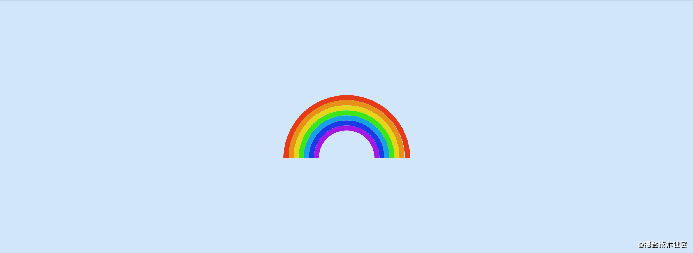

> * 原文地址：[Exploring @property and its Animating powers](https://css-tricks.com/exploring-property-and-its-animating-powers/)
> * 原文作者：[Jhey Tompkins](https://css-tricks.com/author/jheytompkins/)
> * 译文出自：[掘金翻译计划](https://github.com/xitu/gold-miner)
> * 译者：[霜羽 Hoarfroster](https://github.com/PassionPenguin)
> * 标签：前端

# 5w 字的 CSS 的 @property 小结 —— 你说把它用在动画上，会咋样？｜技术点评

诶，你说什么啊，什么是你说的那个 `@property` 啊？

它是一个新的 CSS 功能，能够为我们提供强劲的能力！我可不是说笑的哈，它能够解锁 CSS 的一些功能，让我们能够完成一些以前没法做到的事情。

尽管有关 `@property` 的内容都令我们很是兴奋，但也许最有趣的是，它为我们提供了一种为自定义 CSS 属性指定类型的方法。类型能为浏览器提供了更多的上下文信息，而这就恰好带来了很酷的效果 —— 我们可以为浏览器提供转换和设置这些属性动画所需的信息！

但在我们对此不太了解之前，我们先应该了解到，浏览器对 `@property` 的支持还不够。就目前而言，Chrome 和 Edge 85+、Opera 71+ 支持了 `@property`。在需要适配其他浏览器（例如 Firefox 和 Safari）时候，我们需要在浏览器支持上留个心眼。

## 首先，我们有了类型检查

```css
@property --spinAngle {
  /* 一个对我们自定义类型的初始化值 */
  initial-value: 0deg;
  /* 它会继承父节点的值还是不会 */
  inherits: false;
  /* 具体的类型 —— 就像 TypeScript 那么酷 */
  syntax: '<angle>';
}

@keyframes spin {
  to {
    --spinAngle: 360deg;
  }
}
```

是的！我们现在可以在CSS中进行类型检查了！这可有点像创建我们自己的一小份 CSS 规范！上面的代码只是一个简单的例子，而下面是我们可使用的所有各种类型：

* `length`
* `number`
* `percentage`
* `length-percentage`
* `color`
* `image`
* `url`
* `integer`
* `angle`
* `time`
* `resolution`
* `transform-list`
* `transform-function`
* `custom-ident`（自定义字符串）

在此之前，我们可能依赖于使用一些 `奇淫妙计` 来为具有自定义属性的动画提供动力。


那我们能做些什么酷的事情？让我们来发散一下我们的想象力吧～

## 让我们给颜色添加动画

诶诶你会怎样为一个元素设置动画？像是霓虹夜景那般切换一系列的颜色？还是单纯的颜色之间的过渡转换呢？对我来说，我是个 HSL 色彩空间的拥护者。HSL 色彩空间将色彩分解为可以理解的数字：分别是色相，饱和度和明度。

给颜色加动画可是个有趣的事，毕竟有什么五颜六色的？哦对了就是它！碰上彩虹，吃尽彩虹！我们可以通过多种方式制作彩虹，例如说：

<details>
<summary>HTML <small>(PUG)</small></summary>

```html
.rainbow
  - let b = 0
  while b < 7
    .rainbow__band(style=\`--index: ${b};\`)
    -- b++
```

</details>
<details>
<summary>CSS <small>(Stylus)</small></summary>

```stylus
*
  box-sizing border-box
  
body
  min-height 100vh
  display grid
  place-items center
  background hsl(210, 80%, 90%)
  
.rainbow
  height 25vmin
  width 50vmin
  position relative
  overflow hidden
  
  &__band
    --size calc((50 - (var(--index, 0) * 4)) * 1vmin)
    height 50vmin
    width 50vmin
    border-radius 50%
    position absolute
    top 100%
    left 50%
    border-width 2vmin
    border-style solid
    border-color 'hsl(%s, 80%, 50%)' % var(--hue, 10)
    transform translate(-50%, -50%)
    height var(--size)
    width var(--size)
    
    &:nth-of-type(2)
      --hue 35
    &:nth-of-type(3)
      --hue 55
    &:nth-of-type(4)
      --hue 110
    &:nth-of-type(5)
      --hue 200
    &:nth-of-type(6)
      --hue 230
    &:nth-of-type(7)
      --hue 280
```

</details>



在这个例子中，我们使用了 `:nth-child()` 将我们的 CSS 自定义属性应用在彩虹的不同光环上，以将颜色等样式限制为各个光环，并且为每个光环都设置了一个 `--index` 来帮助我们调整大小。

要为这些光环设置动画，我们可以使用 `--index` 设置一些负的动画延迟，然后用相同的关键帧动画，在不同色相之间循环。

```css
.rainbow__band {
  border-color: hsl(var(--hue, 10), 80%, 50%);
  animation: rainbow 2s calc(var(--index, 0) * -0.2s) infinite linear;
}

@keyframes rainbow {
  0%, 100% {
    --hue: 10;
  }
  14% {
    --hue: 35;
  }
  28% {
    --hue: 55;
  }
  42% {
    --hue: 110;
  }
  56% {
    --hue: 200;
  }
  70% {
    --hue: 230;
  }
  84% {
    --hue: 280;
  }
}
```

如果你想要 阶梯式 的效果，也许我们也可以解决。但是，这些关键帧的每一步的定位并不是特别准确，在这里我使用了 `14％` （七分之一）的跨度作为粗略的时间定位。

<details>
<summary>HTML <small>（PUG）</small></summary>

```html
.rainbow
  - let b = 0
  while b < 7
    .rainbow__band(style=\`--index: ${b};\`)
    -- b++
```

</details>
<details>
<summary>CSS <small>（Stylus）</small></summary>

```stylus
*
  box-sizing border-box
  
body
  min-height 100vh
  display grid
  place-items center
  background hsl(210, 80%, 90%)
  
.rainbow
  height 25vmin
  width 50vmin
  position relative
  overflow hidden
  
  &__band
    --size calc((50 - (var(--index, 0) * 4)) * 1vmin)
    height 50vmin
    width 50vmin
    border-radius 50%
    position absolute
    top 100%
    left 50%
    border-width 2vmin
    border-style solid
    border-color 'hsl(%s, 80%, 50%)' % var(--hue, 10)
    transform translate(-50%, -50%)
    height var(--size)
    width var(--size)
    animation rainbow 2s calc(var(--index, 0) * -0.2s) infinite linear
    
    &:nth-of-type(2)
      --hue 35
    &:nth-of-type(3)
      --hue 55
    &:nth-of-type(4)
      --hue 110
    &:nth-of-type(5)
      --hue 200
    &:nth-of-type(6)
      --hue 230
    &:nth-of-type(7)
      --hue 280
    
      
@keyframes rainbow
  0%, 100%
    --hue 10
  14%
    --hue 35
  28%
    --hue 55
  42%
    --hue 110
  56%
    --hue 200
  70%
    --hue 230
  84%
    --hue 280
```

</details>


我们可以为边框颜色设置动画，就顺利完成任务啦！不过在这里，我们仍然存在关键帧位置的计算问题。我们需要编写不少的 CSS 代码来完成此任务： 

```stylus
@keyframes rainbow {
  0%, 100% {
    border-color: hsl(10, 80%, 50%);
  }
  14% {
    border-color: hsl(35, 80%, 50%);
  }
  28% {
    border-color: hsl(55, 80%, 50%);
  }
  42% {
    border-color: hsl(110, 80%, 50%);
  }
  56% {
    border-color: hsl(200, 80%, 50%);
  }
  70% {
    border-color: hsl(230, 80%, 50%);
  }
  84% {
    border-color: hsl(280, 80%, 50%);
  }
}
```

让我们输入 `@property`，然后首先定义一个色调的自定义属性，这告诉浏览器我们的自定义属性 `--hue` 将是一个数字（而不是看起来像数字的字符串）：

```css
@property --hue {
  initial-value: 0;
  inherits: false;
  syntax: '<number>';
}
```

HSL 中的色相值可以从 `0` 到 `360`，那就让我们定义初始值为 `0`，设置其不继承。那么在这里，我们的值就是数字，而动画是非常简单的：

```css
@keyframes rainbow {
  to {
    --hue: 360;
  }
}
```

这就好啦，我又行了！

<details>
<summary>HTML <small>（PUG）</small></summary>

```html
.rainbow
  - let b = 0
  while b < 7
    .rainbow__band(style=\`--index: ${b};\`)
    -- b++
```

</details>
<details>
<summary>CSS <small>（Stylus）</small></summary>

```stylus
@property --hue
  initial-value 0
  inherits false
  syntax '<number>'

*
  box-sizing border-box
  
body
  min-height 100vh
  display grid
  place-items center
  background hsl(210, 80%, 90%)
  
.rainbow
  height 25vmin
  width 50vmin
  position relative
  overflow hidden
  
  &__band
    --size calc((50 - (var(--index, 0) * 4)) * 1vmin)
    height 50vmin
    width 50vmin
    border-radius 50%
    position absolute
    top 100%
    left 50%
    border-width 2vmin
    border-color 'hsl(%s, 80%, 50%)' % var(--hue)
    border-style solid
    transform translate(-50%, -50%)
    height var(--size)
    width var(--size)
    animation rainbow 2s calc(var(--index, 0) * -0.2s) infinite linear
    
      
@keyframes rainbow
  to
    --hue 360
```

</details>


为了获得准确的动画的开始点，我们每个光环上的动画都可能会有延迟，为我们提供了一些很酷的灵活性。例如，我们可以延长动画持续时间 `animation-duration`，得到一个缓慢的周期。例如下面这个例子的速度：

<details>
<summary>HTML <small>（PUG）</small></summary>

```html
.rainbow
  - let b = 0
  while b < 7
    .rainbow__band(style=\`--index: ${b};\`)
    -- b++
```

</details>
<details>
<summary>CSS <small>（Stylus）</small></summary>

```stylus
property --hue
  initial-value 0
  inherits false
  syntax '<number>'

*
  box-sizing border-box
  
body
  min-height 100vh
  display grid
  place-items center
  background hsl(210, 80%, 90%)
  
.rainbow
  height 25vmin
  width 50vmin
  position relative
  overflow hidden
  
  &__band
    --size calc((50 - (var(--index, 0) * 4)) * 1vmin)
    height 50vmin
    width 50vmin
    border-radius 50%
    position absolute
    top 100%
    left 50%
    border-width 2vmin
    border-color 'hsl(%s, 80%, 50%)' % var(--hue)
    border-style solid
    transform translate(-50%, -50%)
    height var(--size)
    width var(--size)
    animation rainbow calc(var(--duration, 8) * 1s) calc(var(--index, 0) * -0.2s) infinite linear
    
      
@keyframes rainbow
  to
    --hue 360
```

</details>
<details>
<summary>JS <small>（Babel）</small></summary>

```js
import { GUI } from 'https://cdn.skypack.dev/dat.gui'

const CONFIG = {
  DURATION: 8
}

const UPDATE = () => {
  document.documentElement.style.setProperty('--duration', CONFIG.DURATION)
}

const CONTROLLER = new GUI()
CONTROLLER.add(CONFIG, 'DURATION', 1, 15, 0.1).name('Speed').onChange(UPDATE)

UPDATE()
```

</details>


这可能不是最 疯狂 的例子，但是我认为当我们使用逻辑上使用数字的色彩空间时，给动画设置颜色会带来一些有趣的现象。在需要学习一些别的技巧之前，先让我们尝试通过色轮进行动画处理吧，例如，使用预处理器（如 Stylus）生成关键帧：

```stylus
@keyframes party 
  for $frame in (0..100)
    {$frame * 1%}
      background 'hsl(%s, 65%, 40%)' % ($frame * 3.6)
```

我们这样做纯粹是因为浏览器无法理解我们的意图 —— 由于两个 HSL 值都显示相同的颜色，因此它会将色轮从 `0` 直接变为 `360`。

```css
@keyframes party {
  from {
    background: hsl(0, 80%, 50%); 
  }
  to {
    background: hsl(360, 80%, 50%);
  }
}
```

关键帧是相同的，因此当我们真正想要浏览器遍历整个色相谱时，浏览器会假定动画保持在相同的背景值 `background`，然后从一个值开始，并在遍历整个色调后结束于原来的值。

想一想我们在这里拥有的所有其他可以做的，例如：

* 为饱和度设置动画
* 使用不同的动画变化
* 尝试亮度变化
* 尝试使用 `rgb()`
* 尝试将我们的自定义属性类型声明为 `<angle>`，然后直接为 `hsl()` 设置度数

很棒的是，我们可以通过 `scope` 将动画值在各个元素之间共享！例如对于这个按钮而言，对边框和阴影悬停时的色轮进行动画处理：

<details>
<summary>HTML <small>（PUG）</small></summary>

```html
button Start Party!
```

</details>
<details>
<summary>CSS <small>（Stylus）</small></summary>

```stylus
@import url('https://fonts.googleapis.com/css2?family=Inter:wght@500&display=swap')

@property --hue
  syntax '<integer>'
  inherits true
  initial-value 0
  
:root
  --bg hsl(0, 0%, 10%)
  --button-bg hsl(0, 0%, 0%)
  
*
  box-sizing border-box
  
body
  background hsl(0, 0%, 10%)
  display flex
  align-items center
  justify-content center
  min-height 100vh
  transform-style preserve-3d
  perspective 800px
  
button
  --border 'hsl(%s, 0%, 50%)' % var(--hue, 0)
  --shadow 'hsl(%s, 0%, 80%)' % var(--hue, 0)
  user-select none
  font-family 'Inter', sans-serif
  font-size 2rem
  padding 1.25rem 2.5rem
  border-radius 0.5rem
  border 0.25rem solid
  background var(--button-bg)
  color hsl(0, 0%, 100%)
  border-color var(--border)
  box-shadow 0 1rem 2rem -1.5rem var(--shadow)
  transition transform 0.2s, box-shadow 0.2s
  cursor pointer
  outline transparent
  
  &:hover
    --border 'hsl(%s, 80%, 50%)' % var(--hue, 0)
    --shadow 'hsl(%s, 80%, 50%)' % var(--hue, 0)
    animation hueJump 0.75s infinite linear
    transform rotateY(10deg) rotateX(10deg)
    
  &:active
    transform rotateY(10deg) rotateX(10deg) translate3d(0, 0, -15px)
    box-shadow 0 0rem 0rem 0rem var(--shadow)
    animation-play-state paused
    
@keyframes hueJump
  to
    --hue 360
```

</details>


能够为颜色添加动画，就是……一个词，`wow`！

<details>
<summary>HTML <small>（PUG）</small></summary>

```html
- const COUNT = 20
- let t = 0
while t < COUNT
  h1(style=`--index: ${COUNT - t};`) Wow!
  - t++
```

</details>
<details>
<summary>CSS <small>（Stylus）</small></summary>

```stylus
@import url('https://fonts.googleapis.com/css2?family=Montserrat:ital,wght@1,900&display=swap')
  
@property --hue
  inherits false
  initial-value 0
  syntax '<number>'
  
:root
  --bg hsl(45, 80%, 50%)
  --stroke hsl(0, 0%, 10%)
  
*
  box-sizing border-box

body
  min-height 100vh
  background var(--bg)
  font-family 'Montserrat', sans-serif
  min-height 100vh
  overflow hidden
    
h1
  --color 'hsl(%s, 80%, 60%)' % var(--hue)
  text-transform uppercase
  font-size 150px
  letter-spacing 0.25vmin
  position absolute
  margin 0
  top 50%
  left 50%
  line-height 0.8
  color var(--color)
  transform translate(-30%, -70%) translate(calc(var(--index) * (var(--x, -4) * 1%)), calc(var(--index) * (var(--y, 20) * 1%)))
  -webkit-text-stroke 1.25vmin var(--stroke)
  animation party 1s calc(var(--index) * -0.1s) infinite linear
  
@keyframes party
  0%
    --hue 0
  100%
    --hue 360
```

</details>
<details>
<summary>JS <small>（Babel）</small></summary>

```js
import gsap from 'https://cdn.skypack.dev/gsap'

document.addEventListener('pointermove', ({ x, y }) => {
  gsap.set('h1', {
    '--x': gsap.utils.mapRange(0, window.innerWidth, -10, 10, x),
    '--y': gsap.utils.mapRange(0, window.innerHeight, -10, 10, y)
  })
})
```

</details>


## 数字的递增

因为我们可以为数字定义类型（例如 `integer` 和 `number`），意味着我们还可以为数字设置动画，而不是将这些数字用作其他内容的一部分。 实际上，[Carter Li](https://css-tricks.com/author/carterli/) 就曾在 CSS-Tricks 上为此撰写过[一篇文章](https://css-tricks.com/animating-number-counters/)。内容是将 `integer` 与 CSS 计数器结合使用，类似于我们的什么 纯 CSS 游戏 一样。

计数器和伪元素为我们提供了一种将数字转换为字符串的方法，然后，我们可以将该字符串设置为伪元素的内容，其中的重点代码是：

```css
@property --milliseconds {
  inherits: false;
  initial-value: 0;
  syntax: '<integer>';
}

.counter {
  counter-reset: ms var(--milliseconds);
  animation: count 1s steps(100) infinite;
}

.counter:after {
  content: counter(ms);
}

@keyframes count {
  to {
    --milliseconds: 100;
  }
}
```

给我们带来了这个样子的效果，这可棒啦！

<details>
<summary>HTML <small>（PUG）</small></summary>

```html
.counter
```

</details>
<details>
<summary>CSS <small>（Stylus）</small></summary>

```stylus
@property --milliseconds {
  inherits: false;
  initial-value: 0;
  syntax: '<integer>';
}

body {
  min-height: 100vh;
  display: grid;
  place-items: center;
  background: hsl(10, 10%, 10%);
}

.counter {
  position: relative;
  counter-reset: ms var(--milliseconds);
  animation: count 1s steps(100) infinite;
}

.counter:after {
  content: counter(ms);
  position: absolute;
  top: 0;
  left: 0;
  font-size: 5rem;
  transform: translate(-50%, 0);
  color: hsl(0, 0%, 100%);
  font-weight: bold;
  font-family: sans-serif;
}

@keyframes count {
  to {
    --milliseconds: 100;
  }
}
```

</details>


让我们再进一步，我们即将拥有一只仅用 CSS 和 HTML 制作的秒表。快点那个按钮！值得一提的是，它实际上可以用作计时器，而且它不会受到[漂移](https://twitter.com/jaffathecake/status/1362471942238961665?s=20)的影响。在某些角度而言，它可能比我们经常使用的 `setInterval` 之类的 JavaScript 解决方案更准确。可以来看看这个 Google Chrome 开发者录制的有关 JavaScript 计数器的[精彩视频](https://www.youtube.com/watch?v=MCi6AZMkxcU)。

<details>
<summary>HTML <small>（PUG）</small></summary>

```html
form.stopwatch
  input#start(type="checkbox")
  input#pause(type="checkbox")
  label.stopwatch__pause(for="pause")
    span Pause
  label.stopwatch__start(for="start")
    span Start
  button#reset.stopwatch__reset(type="reset")
    span Reset
  .stopwatch__restart.stopwatch__control
    .reset-button
  .stopwatch__stop-start.stopwatch__control
    .start-button
  .stopwatch__shadows
  .stopwatch__content

img.stopwatch__branding(src="https://assets.codepen.io/605876/avatar.png")
    .stopwatch__face
      .digit.m.m--tens 0
      .digit.m.m--singles 0
      span :
      .digit.second.s.s--tens 0
      .digit.second.s.s--singles 0
      span .
      .digit.digit--small.ms.ms--tens 0
      .digit.digit--small.ms.ms--singles 0
```

</details>
<details>
<summary>CSS <small>（Stylus）</small></summary>

```stylus
@import url('https://fonts.googleapis.com/css2?family=Orbitron:wght@500&display=swap')

*
*:after
*:before
  box-sizing border-box
  user-select none

// 默认下播放状态是 `paused` 的
:root
  --state paused
  --bg hsl(280, 50%, 90%)
  --digit hsl(90, 50%, 90%)
  --face hsl(90, 50%, 5%)
  --content hsl(0, 0%, 40%)
  --shadow hsla(0, 0%, 0%, 0.25)
  --glare hsla(0, 0%, 100%, 0.2)
  --watch-bg hsl(210, 80%, 50%)
  --watch-bg--light hsl(210, 80%, 90%)
  --watch-bg--dark hsl(210, 80%, 20%)
  --stroke hsl(0, 0%, 15%)
  --start hsl(10, 80%, 40%)
  --start-two hsl(10, 80%, 60%)
  --restart hsl(0, 0%, 70%)
  --restart-two hsl(0, 0%, 90%)

// 开启或停止秒表的小技巧
// 如果 animation-name 是 none
// 那么就重置计数器至初始值
#start:checked ~ .stopwatch__content
#pause:checked ~ .stopwatch__content
  .ms--tens
    --name ms-tens
  .ms--singles
    --name ms-singles
  .s--tens
    --name s-tens
  .s--singles
    --name s-singles
  .m--tens
    --name m-tens
  .m--singles
    --name m-singles

// 处理 playback 的东西，当 Start 被点击，
// 播放状态是 running，那么我们可以用 Pause 去，
// 切换动画的播放的开始
#start:checked ~ .stopwatch__content
  --state running
#pause:checked ~ .stopwatch__content
  --state paused
// 隐藏开始按钮的技巧
#start:checked ~ .stopwatch__start
  z-index -1

.stopwatch__start:active ~ .stopwatch__stop-start
.stopwatch__pause:active ~ .stopwatch__stop-start
  --y 25
.stopwatch__reset:active ~ .stopwatch__restart
  --y 15

// 这里的属性用于为每一个数字设置动画
// 我们应该可以以链的形式定义，
// 不过语法在此列出的：https://web.dev/at-property/#multiple-declarations
// 在我的机器上并没有正常运作
@property --ms-tens
  initial-value 0
  inherits false
  syntax '<integer>'

@property --ms-singles
  initial-value 0
  inherits false
  syntax '<integer>'

@property --s-tens
  initial-value 0
  inherits false
  syntax '<integer>'

@property --s-singles
  initial-value 0
  inherits false
  syntax '<integer>'

@property --m-tens
  initial-value 0
  inherits false
  syntax '<integer>'

@property --m-singles
  initial-value 0
  inherits false
  syntax '<integer>'

body
  min-height 100vh
  display grid
  font-family 'Orbitron', sans-serif
  background var(--bg)
  place-items center

form
  margin 0

button
  appearance none
  border 0
  outline transparent
  background none

label span
button span
[type="checkbox"]
  position absolute
  width 1px
  height 1px
  padding 0
  margin -1px
  overflow hidden
  clip rect(0, 0, 0, 0)
  white-space nowrap
  border-width 0

label
button
  cursor pointer

.reset-button
  width 100%
  height 50%
  position absolute
  top 10%
  left 50%
  transform translate(-50%, 0)
  border 0.5vmin solid var(--stroke)
  border-radius 1vmin
  background var(--restart)
  overflow hidden

  &:after
    height 100%
    width 100%
    position absolute
    top 0
    left 0
    background repeating-linear-gradient(90deg, transparent 0 18%, var(--stroke) 18% 22%) 50% 0 / 100% 30% no-repeat,
               repeating-linear-gradient(90deg, transparent 0 18%, var(--stroke) 18% 22%) 50% 100% / 100% 30% no-repeat
    content ''

  &:before
    content ''
    height 100%
    width 100%
    border-radius 1vmin
    background var(--restart-two)
    position absolute
    bottom 100%
    left 0
    transform translate(-20%, 45%)

.start-button
  width 100%
  height 60%
  position absolute
  bottom 0
  border 0.5vmin solid var(--stroke)
  border-radius 1vmin
  background var(--start)
  overflow hidden

  &:after
    content ''
    height 100%
    width 100%
    border-radius 1vmin
    background var(--start-two)
    position absolute
    bottom 100%
    left 0
    transform translate(-20%, 35%)

.stopwatch
  height 45vmin
  width 45vmin
  background-color var(--watch-bg)
  border-radius 50%
  border 0.5vmin solid var(--stroke)
  position relative

  &__pause
  &__start
  &__reset
  &__control
    --size min(48px, 10vmin)
    height var(--size)
    width var(--size)
    position absolute
    top 50%
    left 50%
    transition transform 0.05s
    transform translate(-50%, -50%) rotate(var(--rotation, 0deg)) translate(0, -25vmin) translateY(calc(var(--y, 0) * 1%))
    z-index 10

  &__control
    z-index -1

  &__restart:before
    content ''
    position absolute
    bottom 0
    left 50%
    transform translate(-50%, 0)
    width 60%
    height 75%
    border 0.5vmin solid var(--stroke)
    background linear-gradient(90deg, var(--restart-two) 0 80%, transparent 81%) 50% 50% / 100% 100% no-repeat
    background-color var(--restart)
    z-index -1

  &__start
  &__pause
  &__stop-start
    --rotation 40deg

  &__shadows
    height 100%
    width 100%
    border-radius 100%
    position absolute
    top 50%
    left 50%
    transform translate(-50%, -50%)
    overflow hidden

    &:after
      content ''
      position absolute
      height 100%
      width 106%
      top 50%
      left 50%
      border-radius 50%
      transform translate(-50%, -50%) translate(0, 2%)
      box-shadow 0 0 0 5vmin var(--watch-bg--light)

    &:before
      content ''
      position absolute
      height 100%
      width 100%
      top 50%
      left 50%
      border-radius 50%
      transform translate(-50%, -50%) translate(0, -2%)
      box-shadow 0 0 0 5vmin var(--watch-bg--dark)

  &__content
    height 40vmin
    border 0.5vmin solid var(--stroke)
    width 40vmin
    background-color var(--content)
    border-radius 50%
    position absolute
    top 50%
    left 50%
    transform translate(-50%, -50%)
    overflow hidden

    &:before
      box-shadow 0 0 0 5vmin var(--shadow)
      border-radius 50%
      content ''
      position absolute
      top 50%
      left 50%
      height 100%
      width 100%
      transform translate(-50%, -50%) translate(0, 2%)

    &:after
      content ''
      position absolute
      top 50%
      left 50%
      height 100%
      width 100%
      transform translate(-50%, -50%) rotate(-50deg)
      background linear-gradient(transparent 0 15%, var(--glare) 16% 35%, transparent 36% 40%, var(--glare) 41% 45%, transparent 46%)

  &__branding
    height 7vmin
    position absolute
    left 50%
    top 75%
    transform translate(-50%, 0)
    opacity 0.5
    filter saturate(0)

  &__face
    color var(--digit)
    display flex
    font-size 6vmin
    position absolute
    top 50%
    left 50%
    transform translate(-50%, -50%)
    padding 1.75vmin
    border-radius 1vmin
    background var(--face)

.digit
  position relative
  color transparent
  counter-reset var(--counter-name) var(--counter-variable)
  animation var(--name, none) var(--duration, 1s) infinite steps(var(--steps)) var(--state)

  &:after
    content counter(var(--counter-name))
    font-variant tabular-nums
    color var(--digit)
    position absolute
    bottom 0
    right 0

.ms
  font-size 4vmin
  transform translate(0, -6%)

  &--tens
    --duration 1s
    --steps 10
    --counter-name ms-tens
    --counter-variable var(--ms-tens)

  &--singles
    --duration 0.1s
    --steps 10
    --counter-name ms-singles
    --counter-variable var(--ms-singles)

.s
  &--tens
    --duration 60s
    --steps 6
    --counter-name s-tens
    --counter-variable var(--s-tens)

  &--singles
    --duration 10s
    --steps 10
    --counter-name s-singles
    --counter-variable var(--s-singles)

.m
  &--tens
    --duration 3600s
    --steps 6
    --counter-name m-tens
    --counter-variable var(--m-tens)

  &--singles
    --duration 600s
    --steps 10
    --counter-name m-singles
    --counter-variable var(--m-singles)

// The different animations requires for each digit
@keyframes ms-tens
  to
    --ms-tens 10

@keyframes ms-singles
  to
    --ms-singles 10

@keyframes s-tens
  to
    --s-tens 6

@keyframes s-singles
  to
    --s-singles 10

@keyframes m-tens
  to
    --m-tens 6

@keyframes m-singles
  to
    --m-singles 10
```

</details>
<details>
<summary>JS <small>（Babel）</small></summary>

```js
// 404
```

</details>


我们还可以使用数字动画做些什么？倒计时工具？

## 渐变动画

我们都知道 `linear`、`radial` 和 `conic` 的渐变，那么请问，你是否曾经想要去过渡或为色标添加动画？我可以告诉你，`@property` 可以做到这事儿！

考虑一个梯度 —— 在海滩上会有一些波浪席卷而来。一旦我们分层放置了一些图像，我们就可以做这样的事情：

```css
body {
  background-image:
    linear-gradient(transparent 0 calc(35% + (var(--wave) * 0.5)), var(--wave-four) calc(75% + var(--wave)) 100%),
    linear-gradient(transparent 0 calc(35% + (var(--wave) * 0.5)), var(--wave-three) calc(50% + var(--wave)) calc(75% + var(--wave))),
    linear-gradient(transparent 0 calc(20% + (var(--wave) * 0.5)), var(--wave-two) calc(35% + var(--wave)) calc(50% + var(--wave))),
    linear-gradient(transparent 0 calc(15% + (var(--wave) * 0.5)), var(--wave-one) calc(25% + var(--wave)) calc(35% + var(--wave))), var(--sand);
}
```

代码太复杂了，为了简单明了，我们使用 `calc()` 创建每个色标。然后在这个计算中，我们加上 `--wave` 的值。这里有个巧妙的窍门，当我们为 `--wave` 值设置动画时，所有的 `wave` 图层都会移动。

<details>
<summary>CSS <small>（Stylus）</small></summary>

```stylus
*
  box-sizing border-box

:root
  --sand hsl(45, 40%, 50%)
  --wave-one hsl(200, 50%, 100%)
  --wave-two hsl(200, 50%, 90%)
  --wave-three hsl(210, 50%, 60%)
  --wave-four hsl(210, 80%, 25%)

@property --wave
  inherits false
  initial-value 0%
  syntax '<percentage>'

body
  background linear-gradient(transparent 0 calc(35% + (var(--wave) * 0.5)), var(--wave-four) calc(75% + var(--wave)) 100%),
             linear-gradient(transparent 0 calc(35% + (var(--wave) * 0.5)), var(--wave-three) calc(50% + var(--wave)) calc(75% + var(--wave))),
             linear-gradient(transparent 0 calc(20% + (var(--wave) * 0.5)), var(--wave-two) calc(35% + var(--wave)) calc(50% + var(--wave))),
             linear-gradient(transparent 0 calc(15% + (var(--wave) * 0.5)), var(--wave-one) calc(25% + var(--wave)) calc(35% + var(--wave))),
             var(--sand)
  min-height 100vh
```

</details>
<details>
<summary>JS <small>（Babel）</small></summary>

```js
Stylus BabelResult Skip Results Iframe
EDIT ON
import { GUI } from 'https://cdn.skypack.dev/dat.gui'

const CONFIG = {
  tide: 0
}

const CONTROLLER = new GUI()
CONTROLLER.add(CONFIG, 'tide', 0, 100, 1).name('Tide (%)').onChange(() => {
  document.body.style.setProperty('--wave', `${CONFIG.tide}%`)
})
```

</details>


这是我们实现该目标所需的全部代码：

```css
body {
  animation: waves 5s infinite ease-in-out;
}
@keyframes waves {
  50% {
    --wave: 25%;
  }
}
```

如果不使用 `@property`，我们的波浪将在涨潮和退潮之间步进。但是，有了它，我们得到了一个很好的切换缓冲效果。

<details>
<summary>CSS <small>（Stylus）</small></summary>

```stylus
*
  box-sizing border-box

:root
  --sand hsl(45, 40%, 50%)
  --wave-one hsl(200, 50%, 100%)
  --wave-two hsl(200, 50%, 90%)
  --wave-three hsl(210, 50%, 60%)
  --wave-four hsl(210, 80%, 25%)

@property --wave
  inherits false
  initial-value 0%
  syntax '<percentage>'

body
  background linear-gradient(transparent 0 calc(35% + (var(--wave) * 0.5)), var(--wave-four) calc(75% + var(--wave)) 100%),
             linear-gradient(transparent 0 calc(35% + (var(--wave) * 0.5)), var(--wave-three) calc(50% + var(--wave)) calc(75% + var(--wave))),
             linear-gradient(transparent 0 calc(20% + (var(--wave) * 0.5)), var(--wave-two) calc(35% + var(--wave)) calc(50% + var(--wave))),
             linear-gradient(transparent 0 calc(15% + (var(--wave) * 0.5)), var(--wave-one) calc(25% + var(--wave)) calc(35% + var(--wave))),
             var(--sand)
  animation waves 5s infinite ease-in-out
  min-height 100vh

@keyframes waves
  50%
    --wave 25%
```

</details>


想到我们在处理图像时还会获得其他极好的的东西，实在是令人兴奋，我们可以旋转，或者，为圆锥形渐变的角度动画化……但是只能在 `border-image` 中设置。Bramus Van Damme 概括了一下[此方面内容](https://www.bram.us/2021/01/29/animating-a-css-gradient-border/)。

让我们通过创建一个充电指示器来解释概念。我们将同时设置角度和色调的动画。 我们可以从两个自定义属性开始：

```css
@property --angle {
  initial-value: 0deg;
  inherits: false;
  syntax: '<number>';
}

@property --hue {
  initial-value: 0;
  inherits: false;
  syntax: '<angle>';
}
```

动画将在每次迭代中稍有停顿地更新角度和色相。

```css
@keyframes load {
  0%, 10% {
    --angle: 0deg;
    --hue: 0;
  }
  100% {
    --angle: 360deg;
    --hue: 100;
  }
}
```

现在，将其应用为元素的 `border-image`。

```css
.loader {
  --charge: hsl(var(--hue), 80%, 50%);
  border-image: conic-gradient(var(--charge) var(--angle), transparent calc(var(--angle) * 0.5deg)) 30;
  animation: load 2s infinite ease-in-out;
}
```

太棒了！

<details>
<summary>HTML <small>（Pug）</small></summary>

```html
.loader Charging...
```

</details><details>
<summary>CSS <small>（Stylus）</small></summary>

```stylus
*
  box-sizing border-box

:root
  --bg hsl(0, 10%, 10%)

body
  min-height 100vh
  background var(--bg)
  display grid
  place-items center

@property --a
  initial-value 0deg
  inherits false
  syntax '<angle>'
@property --h
  initial-value 0
  inherits false
  syntax '<number>'

.loader
  padding 2rem 4rem
  font-family monospace
  font-weight bold
  color hsl(0, 0%, 100%)
  border-style solid
  border-width 1vmin
  font-size 2rem
  --charge 'hsl(%s, 80%, 50%)' % var(--h, 0)
  border-image conic-gradient(var(--charge) var(--a), transparent calc(var(--a) + 0.5deg)) 30
  animation load 2s infinite ease-in-out

@keyframes load
  0%, 10%
    --a 0deg
    --h 0
  100%
    --a 360deg
    --h 100
```

</details>


不幸的是，`border-image` 与 `border-radius` 之间的兼容配合并不那么好。但是，我们可以在其后面使用伪元素来解决这个问题。将其与以前的动画技巧结合起来，我们便获得了完整的充电/加载动画。（是的，当达到100％时，它就会自动产生变化。）

<details>
<summary>HTML <small>（Pug）</small></summary>

```html
.charger
```

</details><details>
<summary>CSS <small>（Stylus）</small></summary>

```stylus
*
  box-sizing border-box

:root
  --bg hsl(0, 10%, 10%)

body
  min-height 100vh
  background var(--bg)
  display grid
  place-items center

@property --a
  initial-value 0deg
  inherits false
  syntax '<angle>'
@property --h
  initial-value 0
  inherits false
  syntax '<number>'
@property --c
  initial-value 0
  inherits false
  syntax '<integer>'

.charger
  height 40vmin
  width 40vmin
  font-family monospace
  font-weight bold
  color hsl(0, 0%, 100%)
  font-size 2rem
  border-radius 50%
  position relative
  display grid
  place-items center
  background hsl(0, 0%, 25%)
  counter-reset charge var(--c)
  animation charge 60s forwards steps(100)
  
  &:after
    content counter(charge) '%'
    position absolute
    top 50%
    left 50%
    font-size 10vmin
    transform translate(-50%, -50%)
  
  &:before
    --charge 'hsl(%s, 80%, 50%)' % var(--h, 0)
    animation load 2s 30 ease-in-out forwards, loaded 1s 60s infinite linear
    content ''
    position absolute
    top -2vmin
    right -2vmin
    left -2vmin
    bottom -2vmin
    background conic-gradient(var(--charge) var(--a), transparent calc(var(--a) + 0.5deg))
    border-radius 50%
    z-index -1

@keyframes load
  0%, 10%
    --a 0deg
    --h 0
  100%
    --a 360deg
    --h 100
    
@keyframes loaded
  to
    --h 360

@keyframes charge
  to
    --c 100
```

</details>


## 我们还可以给 `transform` 变换 设置动画，那也很酷啊

动画转换的一个问题是某些部分之间的过渡，它通常最终会坏掉或并不像预期那样运行。考虑扔球的这个经典例子，我们希望它在模仿重力影响的同时从 A 点到达 B 点。

最初的尝试可能看起来像这样：

```css
@keyframes throw {
  0% {
    transform: translate(-500%, 0);
  }
  50% {
    transform: translate(0, -250%);
  }
  100% {
    transform: translate(500%, 0);
  }
}
```

但这个效果可跟我们的预期不一致：

<details>
<summary>HTML</summary>

```html
<svg class="ball" viewBox="0 0 496 512" title="basketball-ball">
  <path d="M212.3 10.3c-43.8 6.3-86.2 24.1-122.2 53.8l77.4 77.4c27.8-35.8 43.3-81.2 44.8-131.2zM248 222L405.9 64.1c-42.4-35-93.6-53.5-145.5-56.1-1.2 63.9-21.5 122.3-58.7 167.7L248 222zM56.1 98.1c-29.7 36-47.5 78.4-53.8 122.2 50-1.5 95.5-17 131.2-44.8L56.1 98.1zm272.2 204.2c45.3-37.1 103.7-57.4 167.7-58.7-2.6-51.9-21.1-103.1-56.1-145.5L282 256l46.3 46.3zM248 290L90.1 447.9c42.4 34.9 93.6 53.5 145.5 56.1 1.3-64 21.6-122.4 58.7-167.7L248 290zm191.9 123.9c29.7-36 47.5-78.4 53.8-122.2-50.1 1.6-95.5 17.1-131.2 44.8l77.4 77.4zM167.7 209.7C122.3 246.9 63.9 267.3 0 268.4c2.6 51.9 21.1 103.1 56.1 145.5L214 256l-46.3-46.3zm116 292c43.8-6.3 86.2-24.1 122.2-53.8l-77.4-77.4c-27.7 35.7-43.2 81.2-44.8 131.2z" />
</svg>
```

</details><details>
<summary>CSS <small>（Stylus）</small></summary>

```stylus
*
  box-sizing border-box
  
body
  min-height 100vh
  display grid
  place-items center
  background hsl(190, 80%, 90%)
  
  
.ball
  height 10vmin
  width 10vmin
  border-radius 50%
  fill hsl(35, 80%, 50%)
  background hsl(35, 80%, 35%)
  animation throw 1s infinite alternate
  
@keyframes throw
  0%
    transform translate(-500%, 0)
  50%
    transform translate(0, -250%)
  100%
    transform translate(500%, 0)
```
</details>


以前，我们可能已经接触过用于包裹元素的元素，并单独为它设置了动画。但是，如果我们使用 `@property`，我们可以为变换的各个值设置动画，并且全部集中在一个时间轴上。让我们通过定义自定义属性，然后在球上设置 `transform` 来翻转这种工作方式。

```css
@property --x {
  inherits: false;
  initial-value: 0%;
  syntax: '<percentage>';
}

@property --y {
  inherits: false;
  initial-value: 0%;
  syntax: '<percentage>';
}

@property --rotate {
  inherits: false;
  initial-value: 0deg;
  syntax: '<angle>';
}

.ball {
  animation: throw 1s infinite alternate ease-in-out;
  transform: translateX(var(--x)) translateY(var(--y)) rotate(var(--rotate));
}
```

现在在动画上，我们可以针对关键帧直接组装所需的变换：

```css
@keyframes throw {
  0% {
    --x: -500%;
    --rotate: 0deg;
  }
  50% {
    --y: -250%;
  }
  100% {
    --x: 500%;
    --rotate: 360deg;
  }
}
```

结果如何？我们希望看到一条弯曲的轨迹。我们可以根据所使用的不同计时功能使外观看起来有所不同。我们可以将动画分为三种方式并使用不同的计时功能。这将使我们对球的移动方式产生不同的结果。

<details>
<summary>HTML</summary>

```html
<svg class="ball" viewBox="0 0 496 512" title="basketball-ball">
  <path d="M212.3 10.3c-43.8 6.3-86.2 24.1-122.2 53.8l77.4 77.4c27.8-35.8 43.3-81.2 44.8-131.2zM248 222L405.9 64.1c-42.4-35-93.6-53.5-145.5-56.1-1.2 63.9-21.5 122.3-58.7 167.7L248 222zM56.1 98.1c-29.7 36-47.5 78.4-53.8 122.2 50-1.5 95.5-17 131.2-44.8L56.1 98.1zm272.2 204.2c45.3-37.1 103.7-57.4 167.7-58.7-2.6-51.9-21.1-103.1-56.1-145.5L282 256l46.3 46.3zM248 290L90.1 447.9c42.4 34.9 93.6 53.5 145.5 56.1 1.3-64 21.6-122.4 58.7-167.7L248 290zm191.9 123.9c29.7-36 47.5-78.4 53.8-122.2-50.1 1.6-95.5 17.1-131.2 44.8l77.4 77.4zM167.7 209.7C122.3 246.9 63.9 267.3 0 268.4c2.6 51.9 21.1 103.1 56.1 145.5L214 256l-46.3-46.3zm116 292c43.8-6.3 86.2-24.1 122.2-53.8l-77.4-77.4c-27.7 35.7-43.2 81.2-44.8 131.2z" />
</svg>
```

</details><details>
<summary>CSS <small>（Stylus）</small></summary>

```stylus
*
  box-sizing border-box
  
body
  min-height 100vh
  display grid
  place-items center
  background hsl(190, 80%, 90%)
  
@property --x
  inherits false
  initial-value 0%
  syntax '<percentage>'

@property --y
  inherits false
  initial-value 0%
  syntax '<percentage>'

@property --rotate
  inherits false
  initial-value 0deg
  syntax '<angle>'
  
.ball
  height 10vmin
  width 10vmin
  border-radius 50%
  fill hsl(35, 80%, 50%)
  background hsl(35, 80%, 35%)
  animation throw 1s infinite alternate ease-in-out
  transform translateX(var(--x)) translateY(var(--y)) rotate(var(--rotate))
  
@keyframes throw
  0%
    --x -500%
    --rotate 0deg
  50%
    --y -250%
  100%
    --x 500%
    --rotate 360deg
```
</details>


换一个例子吧！现在我们有一辆汽车要绕着一个圆角的正方形行驶。

<details>
<summary>HTML <small>（Pug）</small></summary>

```html
.road
img.car(src="https://assets.codepen.io/605876/little-red-car.png" alt="Little red car")
```

</details><details>
<summary>CSS <small>（Stylus）</small></summary>

```stylus
*
  box-sizing border-box

:root
  --road hsl(220, 8%, 50%)
  --grass hsl(90, 40%, 50%)
  --island hsl(45, 40%, 50%)
  --lines hsl(45, 80%, 90%)

@property --x
  inherits false
  initial-value -22.5
  syntax '<number>'

@property --y
  inherits false
  initial-value 0
  syntax '<number>'

@property --r
  inherits false
  initial-value 0deg
  syntax '<angle>'

body
  min-height 100vh
  display grid
  place-items center
  background var(--grass)

.car
  animation journey 5s infinite linear
  transform translate(calc(var(--x) * 1vmin), calc(var(--y) * 1vmin)) rotate(var(--r))
  width 3vmin
  object-fit cover

.road
  height 50vmin
  width 50vmin
  border-radius 12.5%
  border 5vmin solid var(--road)
  background var(--road)
  position absolute
  top 50%
  left 50%
  transform translate(-50%, -50%)

  &:before
    content ''
    position absolute
    height 44vmin
    width 44vmin
    border-radius 11%
    border 0.5vmin dashed var(--lines)
    top 50%
    left 50%
    transform translate(-50%, -50%)

  &:after
    content ''
    position absolute
    height 40vmin
    width 40vmin
    background var(--island)
    top 50%
    left 50%
    transform translate(-50%, -50%)
    border-radius 10%
```
</details>


我们可以对球使用类似的方法：

```css
@property --x {
  inherits: false;
  initial-value: -22.5;
  syntax: '<number>';
}

@property --y {
  inherits: false;
  initial-value: 0;
  syntax: '<number>';
}

@property --r {
  inherits: false;
  initial-value: 0deg;
  syntax: '<angle>';
}
```

汽车的变换是用 `vmin` 进行计算的，以保持响应式布局：

```css
.car {
  transform: translate(calc(var(--x) * 1vmin), calc(var(--y) * 1vmin)) rotate(var(--r));
}
```

现在可以为汽车编写极其精确的逐帧动画，从 `--x` 的值开始吧。

```css
@keyframes journey {
  0%, 100% {
    --x: -22.5;
  }
  25% {
    --x: 0;
  }
  50% {
    --x: 22.5;
  }
  75% {
    --x: 0;
  }
}
```

汽车在 x 轴上就会运行一段正确的轨迹。

<details>
<summary>HTML <small>（Pug）</small></summary>

```html
.road
img.car(src="https://assets.codepen.io/605876/little-red-car.png" alt="Little red car")
```

</details><details>
<summary>CSS <small>（Stylus）</small></summary>

```stylus
*
  box-sizing border-box

:root
  --road hsl(220, 8%, 50%)
  --grass hsl(90, 40%, 50%)
  --island hsl(45, 40%, 50%)
  --lines hsl(45, 80%, 90%)

@property --x
  inherits false
  initial-value -22.5
  syntax '<number>'

@property --y
  inherits false
  initial-value 0
  syntax '<number>'

@property --r
  inherits false
  initial-value 0deg
  syntax '<angle>'

body
  min-height 100vh
  display grid
  place-items center
  background var(--grass)

.car
  animation journey 5s infinite linear
  transform translate(calc(var(--x) * 1vmin), calc(var(--y) * 1vmin)) rotate(var(--r))
  width 3vmin
  object-fit cover

.road
  height 50vmin
  width 50vmin
  border-radius 12.5%
  border 5vmin solid var(--road)
  background var(--road)
  position absolute
  top 50%
  left 50%
  transform translate(-50%, -50%)

  &:before
    content ''
    position absolute
    height 44vmin
    width 44vmin
    border-radius 11%
    border 0.5vmin dashed var(--lines)
    top 50%
    left 50%
    transform translate(-50%, -50%)

  &:after
    content ''
    position absolute
    height 40vmin
    width 40vmin
    background var(--island)
    top 50%
    left 50%
    transform translate(-50%, -50%)
    border-radius 10%

@keyframes journey
  0%, 100%
    --x -22.5
  25%
    --x 0
  50%
    --x 22.5
  75%
    --x 0
```
</details>


然后针对 y 轴：

```css
@keyframes journey {
  0%, 100% {
    --x: -22.5;
    --y: 0;
  }
  25% {
    --x: 0;
    --y: -22.5;
  }
  50% {
    --x: 22.5;
    --y: 0;
  }
  75% {
    --x: 0;
    --y: 22.5;
  }
}
```

你不对劲？

<details>
<summary>HTML <small>（Pug）</small></summary>

```html
.road
img.car(src="https://assets.codepen.io/605876/little-red-car.png" alt="Little red car")
```

</details><details>
<summary>CSS <small>（Stylus）</small></summary>

```stylus
*
  box-sizing border-box

:root
  --road hsl(220, 8%, 50%)
  --grass hsl(90, 40%, 50%)
  --island hsl(45, 40%, 50%)
  --lines hsl(45, 80%, 90%)

@property --x
  inherits false
  initial-value -22.5
  syntax '<number>'

@property --y
  inherits false
  initial-value 0
  syntax '<number>'

@property --r
  inherits false
  initial-value 0deg
  syntax '<angle>'

body
  min-height 100vh
  display grid
  place-items center
  background var(--grass)

.car
  animation journey 5s infinite linear
  transform translate(calc(var(--x) * 1vmin), calc(var(--y) * 1vmin)) rotate(var(--r))
  width 3vmin
  object-fit cover

.road
  height 50vmin
  width 50vmin
  border-radius 12.5%
  border 5vmin solid var(--road)
  background var(--road)
  position absolute
  top 50%
  left 50%
  transform translate(-50%, -50%)

  &:before
    content ''
    position absolute
    height 44vmin
    width 44vmin
    border-radius 11%
    border 0.5vmin dashed var(--lines)
    top 50%
    left 50%
    transform translate(-50%, -50%)

  &:after
    content ''
    position absolute
    height 40vmin
    width 40vmin
    background var(--island)
    top 50%
    left 50%
    transform translate(-50%, -50%)
    border-radius 10%


@keyframes journey
  0%, 100%
    --x -22.5
    --y 0
  25%
    --x 0
    --y -22.5
  50%
    --x 22.5
    --y 0
  75%
    --x 0
    --y 22.5
```
</details>


让我们在 `@keyframes` 中添加一些额外的步骤来使动画更正常：

```css
@keyframes journey {
  0%, 100% {
    --x: -22.5;
    --y: 0;
  }
  12.5% {
    --x: -22.5;
    --y: -22.5;
  }
  25% {
    --x: 0;
    --y: -22.5;
  }
  37.5% {
    --y: -22.5;
    --x: 22.5;
  }
  50% {
    --x: 22.5;
    --y: 0;
  }
  62.5% {
    --x: 22.5;
    --y: 22.5;
  }
  75% {
    --x: 0;
    --y: 22.5;
  }
  87.5% {
    --x: -22.5;
    --y: 22.5;
  }
}
```

看起来好多了：

<details>
<summary>HTML <small>（Pug）</small></summary>

```html
.road
img.car(src="https://assets.codepen.io/605876/little-red-car.png" alt="Little red car")
```

</details><details>
<summary>CSS <small>（Stylus）</small></summary>

```stylus
*
  box-sizing border-box

:root
  --road hsl(220, 8%, 50%)
  --grass hsl(90, 40%, 50%)
  --island hsl(45, 40%, 50%)
  --lines hsl(45, 80%, 90%)

@property --x
  inherits false
  initial-value -22.5
  syntax '<number>'

@property --y
  inherits false
  initial-value 0
  syntax '<number>'

@property --r
  inherits false
  initial-value 0deg
  syntax '<angle>'

body
  min-height 100vh
  display grid
  place-items center
  background var(--grass)

.car
  animation journey 5s infinite linear
  transform translate(calc(var(--x) * 1vmin), calc(var(--y) * 1vmin)) rotate(var(--r))
  width 3vmin
  object-fit cover

.road
  height 50vmin
  width 50vmin
  border-radius 12.5%
  border 5vmin solid var(--road)
  background var(--road)
  position absolute
  top 50%
  left 50%
  transform translate(-50%, -50%)

  &:before
    content ''
    position absolute
    height 44vmin
    width 44vmin
    border-radius 11%
    border 0.5vmin dashed var(--lines)
    top 50%
    left 50%
    transform translate(-50%, -50%)

  &:after
    content ''
    position absolute
    height 40vmin
    width 40vmin
    background var(--island)
    top 50%
    left 50%
    transform translate(-50%, -50%)
    border-radius 10%


@keyframes journey
  0%, 100%
    --x -22.5
    --y 0
  12.5%
    --x -22.5
    --y -22.5
  25%
    --x 0
    --y -22.5
  37.5%
    --y -22.5
    --x 22.5
  50%
    --x 22.5
    --y 0
  62.5%
    --x 22.5
    --y 22.5
  75%
    --x 0
    --y 22.5
  87.5%
    --x -22.5
    --y 22.5
```
</details>


剩下的就是汽车的旋转角度，我们要在拐角处设下几个 5％ 的额外的转向动画。虽然这不精确，但肯定可以显示出它的潜力：

```css
@keyframes journey {
  0% {
    --x: -22.5;
    --y: 0;
    --r: 0deg;
  }
  10% {
    --r: 0deg;
  }
  12.5% {
    --x: -22.5;
    --y: -22.5;
  }
  15% {
    --r: 90deg;
  }
  25% {
    --x: 0;
    --y: -22.5;
  }
  35% {
    --r: 90deg;
  }
  37.5% {
    --y: -22.5;
    --x: 22.5;
  }
  40% {
    --r: 180deg;
  }
  50% {
    --x: 22.5;
    --y: 0;
  }
  60% {
    --r: 180deg;
  }
  62.5% {
    --x: 22.5;
    --y: 22.5;
  }
  65% {
    --r: 270deg;
  }
  75% {
    --x: 0;
    --y: 22.5;
  }
  85% {
    --r: 270deg;
  }
  87.5% {
    --x: -22.5;
    --y: 22.5;
  }
  90% {
    --r: 360deg;
  }
  100% {
    --x: -22.5;
    --y: 0;
    --r: 360deg;
  }
}
```

我们现在做到了！有一辆汽车绕着弯曲的正方形行驶！无需额外的容器，无需复杂的数学运算！我们用自定义属性组成了这一切！！！666 刷一波～

<details>
<summary>HTML <small>（Pug）</small></summary>

```html
.road
img.car(src="https://assets.codepen.io/605876/little-red-car.png" alt="Little red car")
```

</details><details>
<summary>CSS <small>（Stylus）</small></summary>

```stylus
*
  box-sizing border-box

:root
  --road hsl(220, 8%, 50%)
  --grass hsl(90, 40%, 50%)
  --island hsl(45, 40%, 50%)
  --lines hsl(45, 80%, 90%)

@property --x
  inherits false
  initial-value -22.5
  syntax '<number>'

@property --y
  inherits false
  initial-value 0
  syntax '<number>'

@property --r
  inherits false
  initial-value 0deg
  syntax '<angle>'

body
  min-height 100vh
  display grid
  place-items center
  background var(--grass)

.car
  animation journey 5s infinite linear
  transform translate(calc(var(--x) * 1vmin), calc(var(--y) * 1vmin)) rotate(var(--r))
  width 3vmin
  object-fit cover

.road
  height 50vmin
  width 50vmin
  border-radius 12.5%
  border 5vmin solid var(--road)
  background var(--road)
  position absolute
  top 50%
  left 50%
  transform translate(-50%, -50%)

  &:before
    content ''
    position absolute
    height 44vmin
    width 44vmin
    border-radius 11%
    border 0.5vmin dashed var(--lines)
    top 50%
    left 50%
    transform translate(-50%, -50%)

  &:after
    content ''
    position absolute
    height 40vmin
    width 40vmin
    background var(--island)
    top 50%
    left 50%
    transform translate(-50%, -50%)
    border-radius 10%

// @keyframes journey
//   0%, 100%
//     --x -22.5
//   25%
//     --x 0
//   50%
//     --x 22.5
//   75%
//     --x 0

// @keyframes journey
//   0%, 100%
//     --x -22.5
//     --y 0
//   25%
//     --x 0
//     --y -22.5
//   50%
//     --x 22.5
//     --y 0
//   75%
//     --x 0
//     --y 22.5
// @keyframes journey
//   0%, 100%
//     --x -22.5
//     --y 0
//   12.5%
//     --x -22.5
//     --y -22.5
//   25%
//     --x 0
//     --y -22.5
//   37.5%
//     --y -22.5
//     --x 22.5
//   50%
//     --x 22.5
//     --y 0
//   62.5%
//     --x 22.5
//     --y 22.5
//   75%
//     --x 0
//     --y 22.5
//   87.5%
//     --x -22.5
//     --y 22.5
@keyframes journey
  0%
    --x -22.5
    --y 0
    --r 0deg
  10%
    --r 0deg
  12.5%
    --x -22.5
    --y -22.5
  15%
    --r 90deg
  25%
    --x 0
    --y -22.5
  35%
    --r 90deg
  37.5%
    --y -22.5
    --x 22.5
  40%
    --r 180deg
  50%
    --x 22.5
    --y 0
  60%
    --r 180deg
  62.5%
    --x 22.5
    --y 22.5
  65%
    --r 270deg
  75%
    --x 0
    --y 22.5
  85%
    --r 270deg
  87.5%
    --x -22.5
    --y 22.5
  90%
    --r 360deg
  100%
    --x -22.5
    --y 0
    --r 360deg
```
</details>


## 用变量强化整个场景

到目前为止，我们已经看到了一些不错的 `@property` 的潜力。但是将我们在这里看到的所有内容放在一起可以将事情推上一个新的台阶 —— 例如，我们仅需几个自定义属性就可以为整个场景提供更强劲的动力。

考虑以下 404 页面的思路 —— 两个注册的属性为不同的运动部件提供动力。我们使用 `-webkit-background-clip` 剪辑了一个渐变色，而阴影则会读取属性的值移动。我们还用光线效果摆动了另一个元素。

<details>
<summary>HTML <small>（Pug）</small></summary>

```html
h1 404
.cloak__wrapper
  .cloak__container
    .cloak
.info
  h2 We can't find that page
  p.
    We're fairly sure that page used to be here, but seems to have gone missing. We do apologise on it's behalf.
  a(href="https://jhey.dev" target="_blank" rel="noreferrer noopener") Home
```

</details>
<details>
<summary>CSS <small>（Stylus）</small></summary>

```stylus
@import url('https://fonts.googleapis.com/css2?family=Open+Sans:wght@800&family=Roboto:wght@100;300&display=swap')

:root
  --button hsl(44, 0%, 70%)
  --button-color hsl(0, 0%, 4%)
  --shadow hsl(0, 0%, 0%)
  --bg hsl(53, 0%, 45%)
  --header hsl(53, 0%, 48%)
  --color hsl(0, 0%, 98%)
  --lit-header hsl(53, 0%, 90%)
  --speed 2s

*
  box-sizing border-box
  transform-style preserve-3d

@property --swing-x
  initial-value 0
  inherits false
  syntax '<integer>'
@property --swing-y
  initial-value 0
  inherits false
  syntax '<integer>'

body
  min-height 100vh
  display flex
  font-family 'Roboto', sans-serif
  flex-direction column
  align-items center
  justify-content center
  background var(--bg)
  color var(--color)
  perspective 1200px

a
  text-transform uppercase
  text-decoration none
  background var(--button)
  color var(--button-color)
  padding 1rem 4rem
  border-radius 4rem
  font-size 0.875rem
  letter-spacing 0.05rem

p
  font-weight 100

h1
  animation swing var(--speed) infinite alternate ease-in-out
  font-size clamp(5rem, 40vmin, 20rem)
  font-family 'Open Sans', sans-serif
  margin 0
  margin-bottom 1rem
  letter-spacing 1rem
  transform translate3d(0, 0, 0vmin)
  --x calc(50% + (var(--swing-x) * 0.5) * 1%)
  background radial-gradient(var(--lit-header), var(--header) 45%) var(--x) 100% / 200% 200%
  -webkit-background-clip text
  color transparent

  &:after
    animation swing var(--speed) infinite alternate ease-in-out
    content "404"
    position absolute
    top 0
    left 0
    color var(--shadow)
    filter blur(1.5vmin)
    transform scale(1.05) translate3d(0, 12%, -10vmin) translate(calc((var(--swing-x, 0) * 0.05) * 1%), calc((var(--swing-y) * 0.05) * 1%))

.cloak
  animation swing var(--speed) infinite alternate-reverse ease-in-out
  height 100%
  width 100%
  transform-origin 50% 30%
  transform rotate(calc(var(--swing-x) * -0.25deg))
  background radial-gradient(40% 40% at 50% 42%, transparent, black 35%)
  
  &__wrapper
    position fixed
    top 0
    left 0
    bottom 0
    right 0
    overflow hidden

  &__container
    height 250vmax
    width 250vmax
    position absolute
    top 50%
    left 50%
    transform translate(-50%, -50%)

.info
  text-align center
  line-height 1.5
  max-width clamp(16rem, 90vmin, 25rem)

  & > p
    margin-bottom 3rem

@keyframes swing
  0%
    --swing-x -100
    --swing-y -100
  50%
    --swing-y 0
  100%
    --swing-y -100
    --swing-x 100
```
</details>
<details>
<summary>JS <small>（Babel）</small></summary>

```js
// 404
```
</details>


## 不过如此！

考虑到我们使用 `@property` 定义类型的功能还可以做些别的什么类型的事情，真的很令我兴奋！通过为浏览器提供有关自定义属性的其他上下文，我们可以以基本字符串无法比拟的方式疯狂般的作用效果。

您对其他类型有什么想法？`time` 和 `resolution` 会带来有趣的过渡，尽管我承认我无法使它们按我希望的方式工作。网址也可能很整洁，就像图像轮播通常在各种来源之间进行过渡一样。且让我们在此集思广益吧！

我希望对 `@property` 的简单介绍能激发你去学习它，并创造出一个属于自己的出色的模范案例！我期待看到你的成就，请在评论中与我分享～！

---

* 本文正在参与「掘金 2021 春招闯关活动」, 点击查看 [活动详情](https://sourl.co/4TuMU2)

---

> [掘金翻译计划](https://github.com/xitu/gold-miner) 是一个翻译优质互联网技术文章的社区，文章来源为 [掘金](https://juejin.im) 上的英文分享文章。内容覆盖 [Android](https://github.com/xitu/gold-miner#android)、[iOS](https://github.com/xitu/gold-miner#ios)、[前端](https://github.com/xitu/gold-miner#前端)、[后端](https://github.com/xitu/gold-miner#后端)、[区块链](https://github.com/xitu/gold-miner#区块链)、[产品](https://github.com/xitu/gold-miner#产品)、[设计](https://github.com/xitu/gold-miner#设计)、[人工智能](https://github.com/xitu/gold-miner#人工智能)等领域，想要查看更多优质译文请持续关注 [掘金翻译计划](https://github.com/xitu/gold-miner)、[官方微博](http://weibo.com/juejinfanyi)、[知乎专栏](https://zhuanlan.zhihu.com/juejinfanyi)。