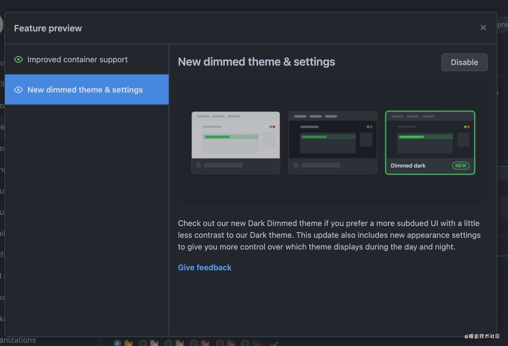
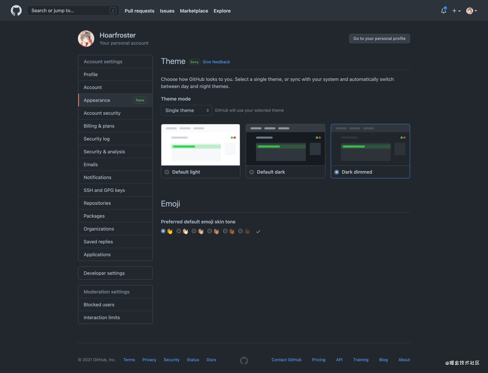
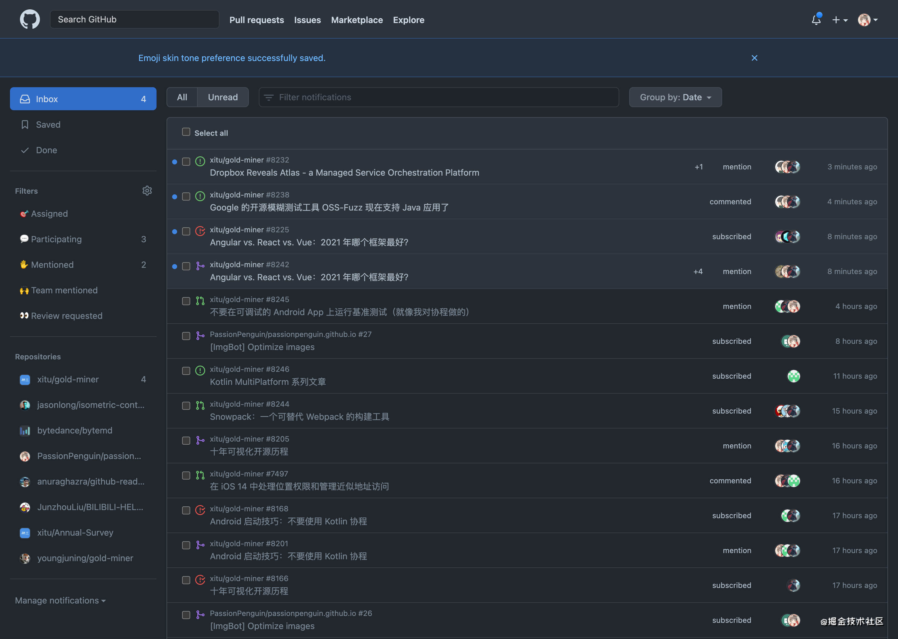
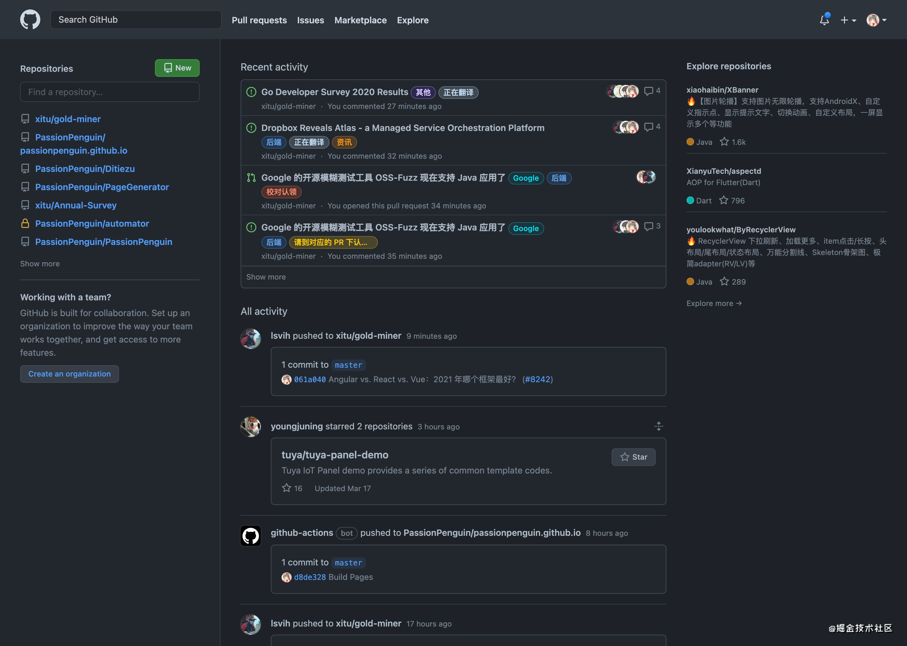
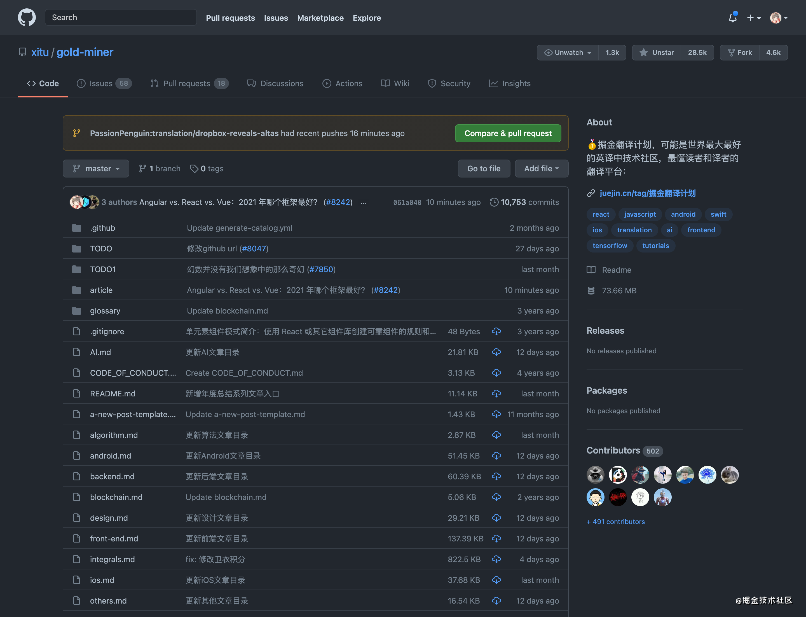
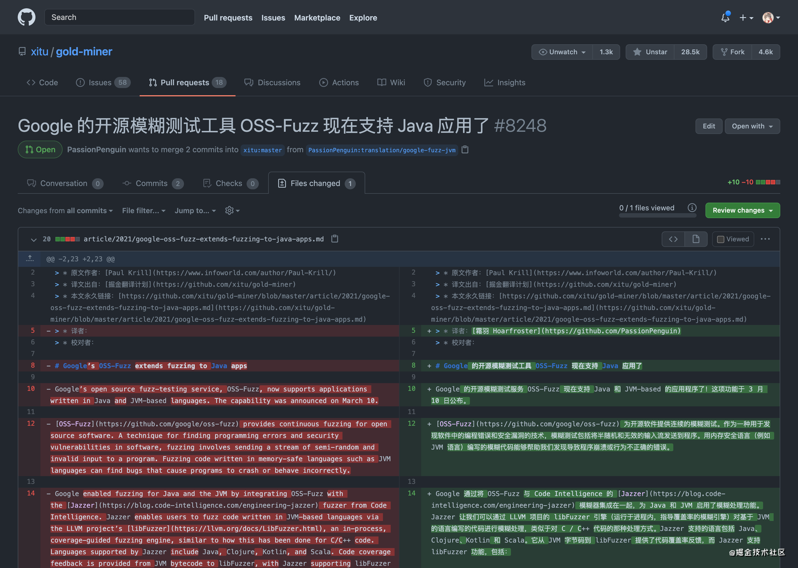
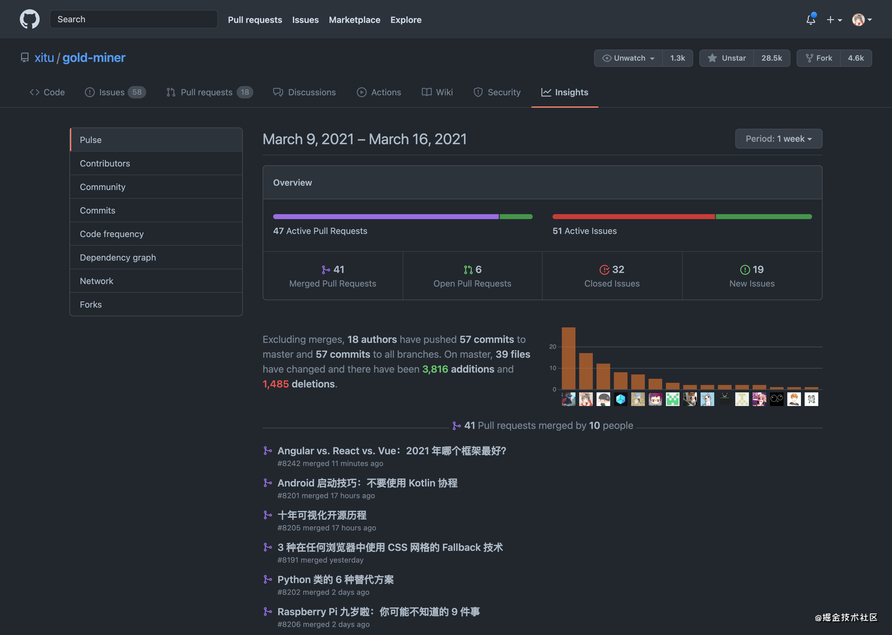

> 原文地址：GitHub Features Preview
> 标签：开发工具
>
> 
>
> 如果你希望使用更柔和的，与 Dark 主题对比度稍低一些的 UI，请查收一下我们最新推出的 Dimmed Dark 主题。 本次更新还包括新的外观设置，帮助你可以更好地控制白天和黑夜显示哪些主题。
>
> [反馈建议](https://support.github.com/contact/feedback?contact%5Bcategory%5D=other&contact%5Bsubject%5D=Product+feedback)

# GitHub 主题又多了一个 —— 新的 Dimmed Dark 主题以及设置页面！

眼睛瞎了没！GitHub 是不是同性交友绝佳之处！

快让我们打开 Dark Theme/Dimmed Dark Theme 保护我们的眼睛叭～

打开方式：

* 点击头像
* 点击 `Features Preview`

* 点击 `New dimmed theme & settings`
* 点击 `Enable`

效果如此：

