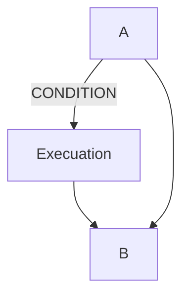
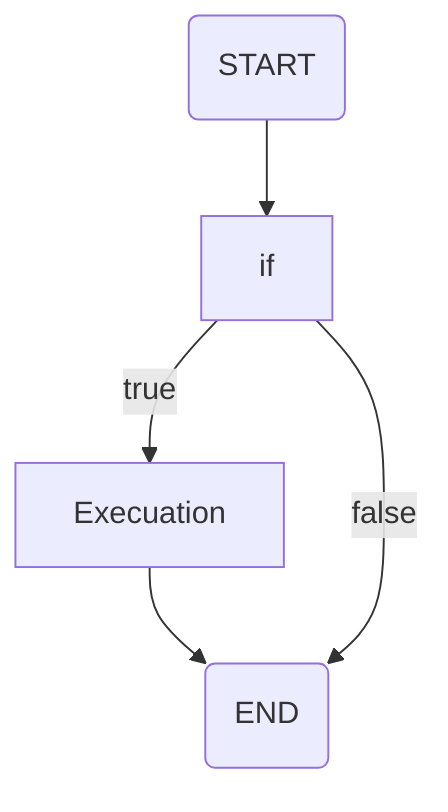
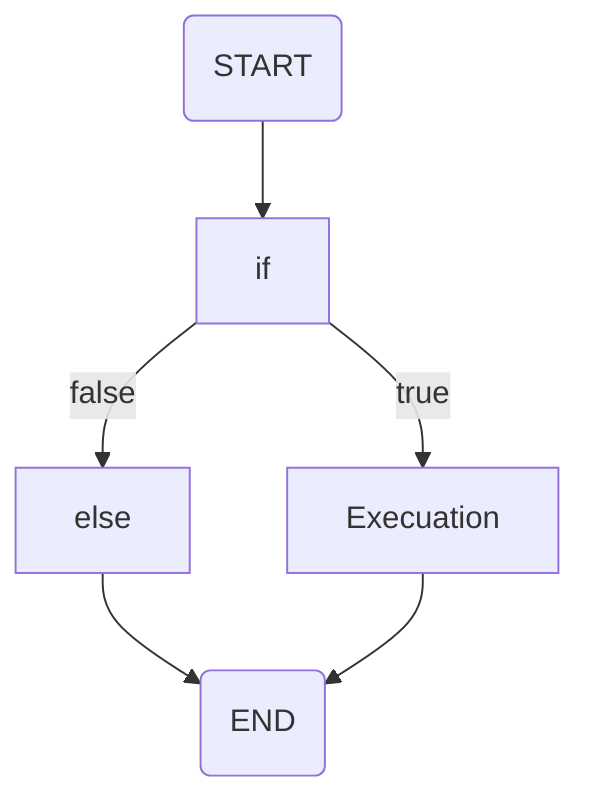
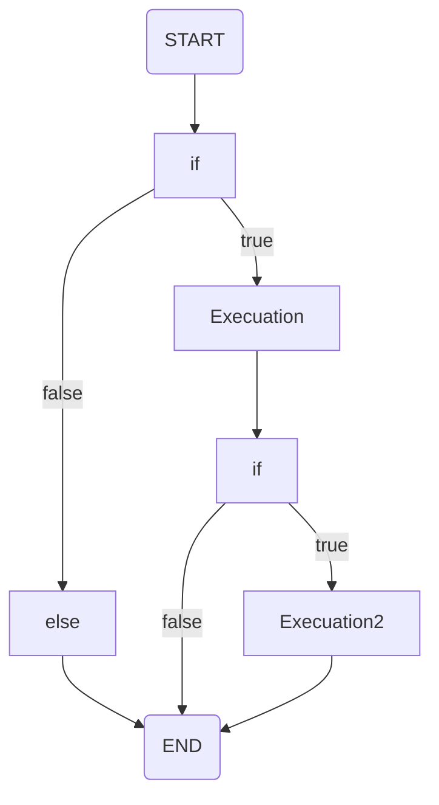
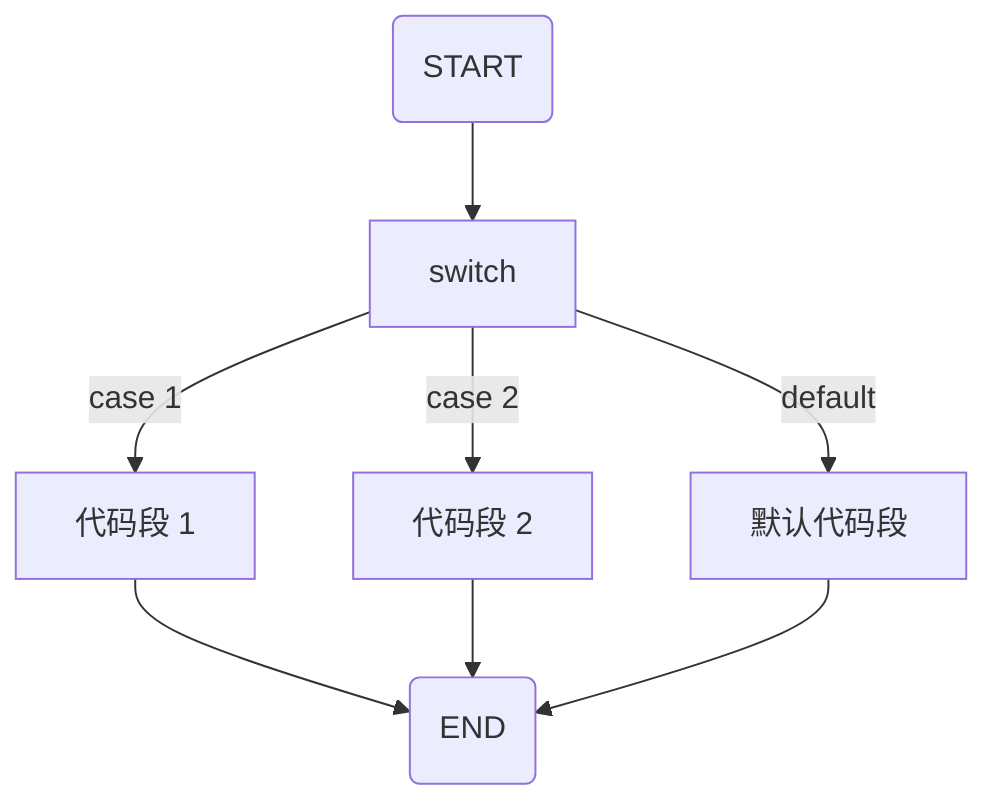

> * 标签：后端、Golang


# Go 的奇妙旅程：Go 的条件句｜Go 主题月


## Go 的条件句

当需要我们通过限定一个或多个条件下才去执行特定语句的时候，我们就应该选择条件句。

下图就完美地展示了程序语言中条件语句的结构：



当 CONDITION 的情况下，将会执行代码，否则直接跳过这个语段。

比如说如果有人形容 Penguin 词语不是 cute，那么就 gg 了 🐶：

```go
package main

import "fmt"

func main() {
	description := "ugly"
	if description != "cute" {
		fmt.Println("You fool. (doge)")
	}
}
```

Go 语言提供了以下几种条件判断语句：

| 语句 | 描述 |
| --- | --- |
| `if` 语句 | `if` 语句由一个布尔表达式后紧跟一个或多个语句组成 |
| `if-else` 语句 | 在 `if` 语句后可以使用可选的 `else` 语句，当 if 条件为否时就会执行 `else` 语句中的语句 |
| `if` 嵌套语句 | 你可以在 `if` 或 `else if` 语句中嵌入一个或多个 `if` 或 `else if` 语句 |
| `switch` 语句 | `switch` 语句用于基于不同条件执行不同动作 |
| `select` 语句 | `select` 语句类似于 `switch` 语句，但是 `select` 会随机执行一个可运行的 `case`。如果没有 `case` 可运行，它就会被阻塞，直到有匹配的 `case` 可运行才会恢复 |

注意：Go 没有三目运算符，所以不支持 ?: 形式的条件语句，当然，我们也只能够使用自定义函数解决了。

## 三目

虽然说三目语句的可读性可维护性不高（我指的是比较长的三目），但是真的好用。

Go 官方明确支持了不会支持三目，[这里这里](https://groups.google.com/d/msg/golang-nuts/dbyqx_LGUxM/tLFFSXSfOdQJ) 或者 [这里这里](http://golang.org/doc/faq#Does_Go_have_a_ternary_form)。Go 原生不支持三目语句，说是为了代码可读性（。

```go
func If(condition bool, trueVal, falseVal interface{}) interface{} {
    if condition {
        return trueVal
    }
    return falseVal
}
```

挺不方便的……

## if 语句

一般来说 if 语句都由一个布尔表达式引导，后紧跟一个代码段。

### if 语句语法

Go 中一个基本 if 句是这样的：

```go
if 布尔表达式 {
    /* 在布尔表达式为 true 时执行 */
}
```

if 语句在布尔表达式为 true 时，其后紧跟的代码段会被执行，而如果为 false 则不执行。如图所示：

流程图如下：



实例代码还是一样的：

```go
package main

import "fmt"

func main() {
	description := "ugly"
	if description != "cute" {
		fmt.Println("You fool. (doge)")
	}
}
```

### if-else 语句

我们可以在 if 语句后跟上 else 语句, 用于在布尔表达式为 false 时执行。

### if-else 语句语法

Go 编程语言中 if-else 语句的语法如下：

```go
if 布尔表达式 {
    /* 在布尔表达式为 true 时执行 */
} else {
    /* 在布尔表达式为 false 时执行 */
}
```

比如说……

```go
if description == "cute" {
	fmt.Println("I love u, my dear~")
} else {
	fmt.Println("找死")
}
```



### if 嵌套语句

我们可以在 if 或 else if 语句中嵌入一个或多个 if 或 else if 语句，以期更有针对性的编写条件语句，我指的是，超级套娃！！！

#### 嵌套版语法

Go 编程语言中 if...else 语句的语法如下：

```go
if 布尔表达式 1 {
    /* 在布尔表达式 1 为 true 时执行 */
    
    if 布尔表达式 2 {
        /* 在布尔表达式 1 和 2 都为 true 时执行 */
    } else {
        if 布尔表达式 3 {
            /* 在布尔表达式 1 和 3 都为 true 时执行 */
        }
    }
}
```



当然你也你可以以同样的方式在 if 语句中嵌套 else if-else 语句，不过这里霜羽想不到什么好点子给出好的栗子 🌰，客官放过霜羽叭……

## switch 语句

Go 中的 `switch` 语句允许我们使用一个变量，对一个列表与值依次比较，当符合条件时就会执行对应的代码块中的代码。

在 Go 编程中，`switch` 语句有两种类型：

表达式 `swtich` —— 在表达式 `switch` 中，`case` 包含一个表达式返回一个布尔值。

类型 `switch` —— 在类型 `switch` 中，`case` 包含的类型将与所给变量类型进行比较。



### 表达式 `swtich`

```go
switch A {
    /* A 可为可执行表达式或变量或留空 */
    case B:
        /* 代码段 
            B 可为表达式或变量 A 所对应类型的值
        */
    case C:
        /* 代码段 
            C 可为表达式或变量 A 所对应类型的值
        */
        
    /* 你可以有任意数量的表达式 */
    default : 
        /* 代码段
            可选，可以省略 */
}
```

比如说：

[`day8/switch-esp.go`](https://github.com/PassionPenguin/AwesomeGo/blob/master/day8/switch-esp.go)

```go
package main

import "fmt"

func main() {
	description := "ugly"
	switch description {
	case "ugly":
		fmt.Println("找死吗？")
	case "beautiful":
		fmt.Println("爱死你了！")
	default:
		fmt.Println("我没听懂啊……")
	}
}
```

### 类型 `swtich`

```go
switch A.(type) {
    case type1:
        /* 代码段 */
    case type2:
        /* 代码段 */
    default : 
}
```

比如说：

[`day8/switch-typ.go`](https://github.com/PassionPenguin/AwesomeGo/blob/master/day8/switch-typ.go)

```go
package main

import "fmt"

func main() {
	var description interface{}
	switch description.(type) {
	case string:
		fmt.Println("是个字符串")
	case int:
		fmt.Println("是个数字")
	default:
		fmt.Println("不知道诶")
	}
}
```

### fallthrough

在一个 `case` 中使用 `fallthrough` 会强制执行后面的 `case` 或 `default` 语句 —— `fallthrough` 不会判断下一条 `case` 的表达式结果是否为 `true`。

[`day8/switch-ft.go`](https://github.com/PassionPenguin/AwesomeGo/blob/master/day8/switch-ft.go)

```go
package main

import "fmt"

func main() {
	description := "ugly"
	switch description {
        case "beautiful":
            fmt.Println("爱死你了！")
        case "ugly":
            fmt.Println("找死吗？")
            fallthrough
        default:
            fmt.Println("我没听懂啊……")
	}
}
```

### 多条件

Go 支持多条件匹配：

```go
switch{
    case 1,2,3,4:
    default:
}
```

比如说：

[`day8/switch-mt.go`](https://github.com/PassionPenguin/AwesomeGo/blob/master/day8/switch-ft.go)

```go
package main

import "fmt"

func main() {
	description := "ugly"
	switch description {
	case "beautiful", "cute", "handsome":
		fmt.Println("爱死你了！")
	case "ugly":
		fmt.Println("找死吗？")
	default:
		fmt.Println("我没听懂啊……")
	}
}
```

### break

我们可以在 fallthrough 之前使用 break，（例如用 if 判断结果后 break），以退出 `switch` 流：

[`day8/switch-brk.go`](https://github.com/PassionPenguin/AwesomeGo/blob/master/day8/switch-ft.go)

```go
package main

import "fmt"

func main() {
	description := "ugly"
	switch description {
	case "beautiful", "cute", "handsome":
		fmt.Println("爱死你了！")
		if description == "cute" {
			break
		}
		fallthrough
	case "ugly":
		fmt.Println("找死吗？")
	default:
		fmt.Println("我没听懂啊……")
	}
}
```