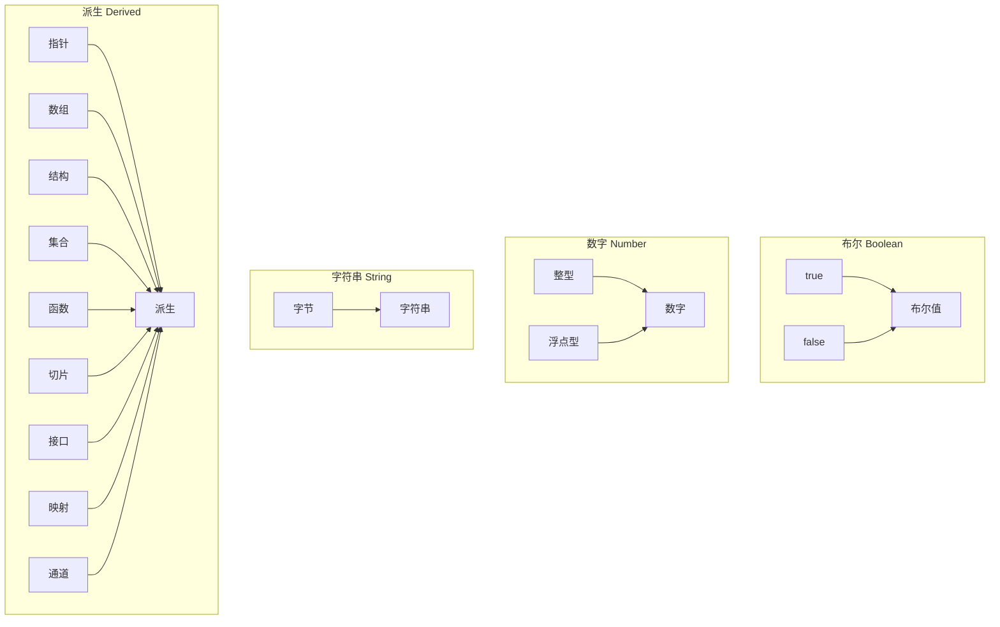

> * 标签：后端、Golang


# Go 的奇妙旅程：Go 的数据类型｜Go 主题月


## 数据类型

在 Go 编程语言中的数据类型用于声明函数和变量。

数据类型的出现是为了把数据分成所需内存大小不同的数据 —— 编程的时候需要用大数据的时候才需要申请大内存，而这样，我们才能更充分地利用内存。变量的类型决定了它在存储中占据的空间大小以及所存储的位数据的解释器（解释方法）。

Go 语言按类别有以下几种数据类型：

### 一图以蔽之

用图说话：



### 数字类型

#### 整型

预定义的与运行架构无关的整数类型有：

| 类型 | 说明 |
| --- | --- |
| uint8 | 无符号 8 位整数（`0` 到 `255`）|
| uint16 | 无符号 16 位整数（`0` 到 `65535`）|
| uint32 | 无符号 32 位整数（`0` 到 `4294967295`）|
| uint64 | 无符号 64 位整数（`0` 到 `18446744073709551615`）|
| int8 | 带符号的 8 位整数（`-128` 至 `127`）|
| int16 | 有符号 16 位整数（-`32768` 至 `32767`）|
| int32 | 有符号的 32 位整数（`-2147483648` 至 `2147483647`）|
| int64 | 有符号的 64 位整数（`-9223372036854775808` 至 `9223372036854775807`）|

#### 浮点型

预定义的与体系结构无关的浮点类型为-

| 类型 | 说明 |
| --- | --- |
| float32 | IEEE-754 32 位浮点数 |
| float64 | IEEE-754 64 位浮点数 ｜
| complex64 | 分别是 float32 的实部和虚部的复数 ｜
| complex128 | 分别是 float64 的实部和虚部的复数 ｜

`n` 位（bit）的整数的值是 `n` 位，并使用二进制的补码算术运算表示。

### 其他数值类型

还有一组具有特定于实现的大小的数字类型：

| 类型 | 说明 |
| --- | --- |
| byte | 与 uint8 相同 |
| rune | 与 int32 相同 |
| unit | 32 或 64 位 |
| int | 和 uint 的大小一样 |
| uintptr | 一个无符号整数，能存储指针 |

### 字符串

字符串的概念就是多个 `byte`（字节）的集合。一个字符串用双引号 `""`，或者 `` 表示。

[`day4/string-type.go`](https://github.com/PassionPenguin/AwesomeGo/blob/master/day4/string-type.go)

```go
package main

import "fmt"

func main() {
	question := "Hoarfroster is cute"
	response := `I agree with you`
	fmt.Println(question, response)
}
```

#### 转义

如果想要在字符串或字节中夹杂半角的单双引号，我们需要在他们前面加 `\`，变成 `\"` 和 `\'`（对应 "" 的字符串 和 '' 的字节）

[`day4/string-type.go`](https://github.com/PassionPenguin/AwesomeGo/blob/master/day4/string-type.go)

```go
package main

import "fmt"

func main() {
	stringWithQuote := "Hoarfroster love \""
	byteWithQuote := '\''
	fmt.Println(stringWithQuote, byteWithQuote)
}
```

或者 `\n`、`\r`、`\t`：

[`day4/string-type.go`](https://github.com/PassionPenguin/AwesomeGo/blob/master/day4/string-type.go)

```go
package main

import "fmt"

func main() {
	// 缩进
	fmt.Println("Hello \t Hoarfroster")
	// Hello	Hoarfroster

	// 输出换行
	fmt.Println("Hello \n Hoarfroster")
	// Hello
	// Hoarfroster

	// 移动光标到行首（回车）
	fmt.Println("Hello \r Hoarfroster")
	//  Hoarfroster
}
```

## 运算符

### 算数运算符

我们小学二年级的时候，就学过了四则运算，而程序在运行过程中执行四则运算时候，也需要算数运算符：

| 运算符 | 描述 | 说明 |
| --- | --- | --- |
| + | 表示相加 | 5 + 2 = 7 |
| - | 相减 | 5 - 2 = 3 |
| * | 相乘 | 5 * 2 = 10 |
| / | 相除取整 | 5 / 3 = 1 |
| % | 相除取余 | 5 % 3 = 2 |
| ++ | 自身加 1 | 5++ => 6 |
| -- | 自身减 1 | 5-- => 4 |

### 关系运算符

关系运算符的结果是布尔值：

| 运算符 | 描述 | 栗子 | 结果 |
| --- | --- | --- | --- |
| == | 比较相等 | 10 == 10 | `true` |
| != | 比较不等 | 10 != 10 | `false` |
| \> | 大于    | 100 > 1 | `true` |
| < | 小于    | 100 < 1 | `false` |
| > = | 大于等于 | 100 >= 100 | `true` |
| <= | 小于等于 | 100 >= 101 | `false` |

### 逻辑运算符

逻辑运算符的结果也是布尔值：

| 运算符 | 描述 | 一个字 |
| --- | --- | --- |
| && | 逻辑与 | 且 |
| &#124;&#124; | 逻辑或 | 或 |
| ! | 逻辑非 | 非 |

### 位运算符

| 运算符 | 描述 | 栗子 |
| --- | --- | --- |
| ^ | 异或 | a ^ b | 
| &^ | 位清空 | a &^ b |
| \<< | 按位左移 | a << b |
| \>> | 按位右移 | a \>> b |

### 赋值运算符

| 运算符 | 描述 |
| --- | --- |
| = | 把等号右侧的数值 赋给左边的变量 | 
| += | 自身加上后面的值 再赋给左边的变量 |
| -= | 自身减去后面的值 在赋给左边 |
| /= | 自身除后面的值 再赋值给左边
| %= | 自身与后面的值求余数后 再赋值给左边 |
| <<= | 左移后再赋值 |
| \>> = | 右移后再赋值 |
| &= | 按位与后再赋值 |
| &#124;= | 按位或后再赋值 |
| ^= | 按位异或后再赋值 |

### 占位运算符

| 运算符 | 描述 | 栗子 | 结果
| --- | --- | --- | --- |
| %d | 十进制的数字 | `fmt.Printf("%d",10)` | `10` |
| %T | 取类型 | `b := true; fmt.Printf("%T",b)` | `bool` |
| %s | 取字符串 | `s := "123"; fmt.Printf("%s",s)` | `123` |
| %t | 取bool类型的值 | `b := true; fmt.Printf("%t",b)` | `true` |
| %p | 取内存地址 | `p := "123"; fmt.Printf("%p", &p)` | `0xc0000461f0` |