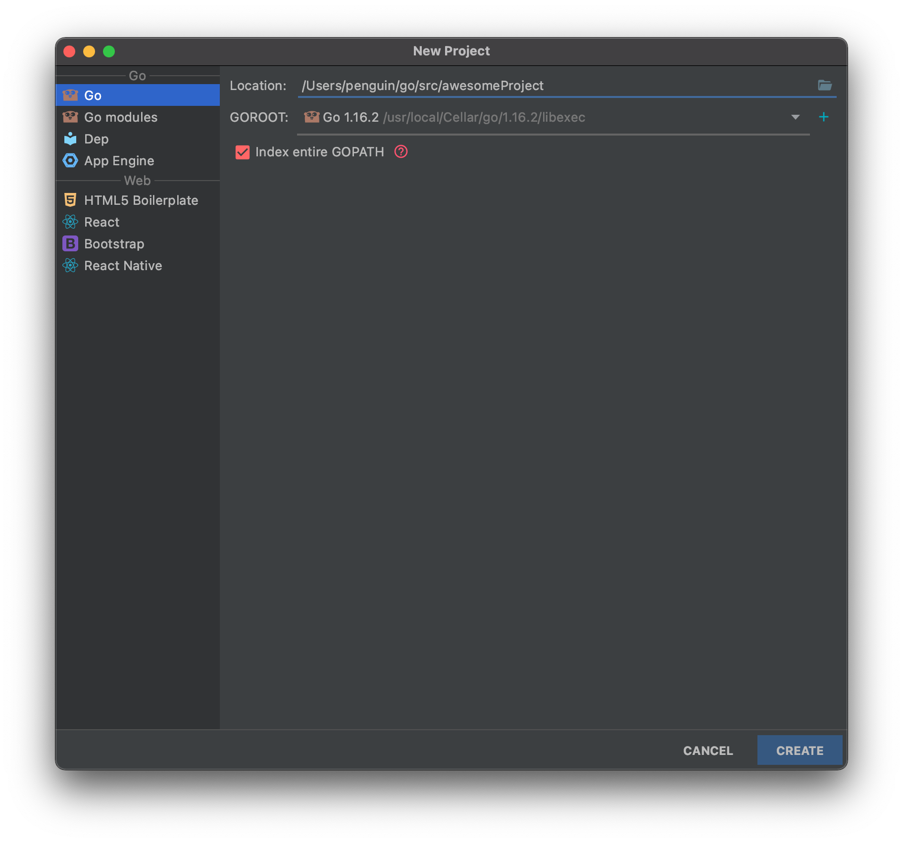

> * 标签：后端、Golang


# Go 的奇妙旅程：设置好 Go 的环境｜Go 主题月


## 什么是 Go 语言

计算机软件经历了数十年的发展，形成了多种学术流派，有**面向过程编程、面向对象编程、函数式编程、面向消息编程**等，这些思想究竟孰优孰劣，众说纷纭。但我们很容易发觉到，大多数现代的编程语言都在不断的<s>抄袭</s>（读书人的事**叫借鉴**，懂吗？***这叫格局！你格局小了***）

### Go 语言最主要的特性：

* 自动垃圾回收
* 更丰富的内置类型
* 函数多返回值
* 错误处理
* 匿名函数和闭包
* 类型和接口
* 并发编程
* 反射
* 语言交互性

（看一眼就好了，大家都喜欢吹，实践出真知，到底怎样慢慢学到时候就知道了）

### Go 是一门开源的静态类型编程语言。

它让构造**简单**、**可靠**且**高效**的软件变得容易～

Go 是从 2007 年末由 Robert Griesemer、Rob Pike 以及 Ken Thompson 在 Google 设计并主持开发的一门静态类型编译语言。后来参与开发的还有 Ian Lance Taylor 以及 Russ Cox 等人，并最终于 2009 年 11 月开源。在 2012 年早些时候发布了 Go v1 的稳定版本。

而就在上个月，Go 发布了 v1.16 🎉


Go 富有表现力，简洁，整洁且高效。它的并发机制使编写程序可以轻松地从多核和联网机器中最高效地运行，而其新颖的类型系统则可以实现灵活的模块化程序构建。Go 可以快速编译为机器代码，同时具有垃圾回收的便利性和运行时反射的功能。它是一种快速的，静态类型的编译语言，感觉就像是一种动态类型的解释语言

Go 的项目仓库可以在 [Google Source](https://go.googlesource.com/go) 或是 [GitHub](https://github.com/golang/go) 上找到：）


### Go 语言用途

Go 语言被设计成一门应用于运行 Web 服务器、存储集群或类似用途的巨型中央服务器的系统编程语言。

对于高性能分布式系统领域而言，Go 语言无疑比大多数其它语言有着更高的开发效率。它提供了海量并行的支持，这对于游戏服务端的开发而言是再好不过了。

## 怎么安装 Go 语言并配置好环境

### 安装 Go 语言环境

我们只需要直接访问[下载并安装 Golang](https://golang.org/doc/install) 页面即可完成基础的 Go 语言环境搭建。但这里笔者直接使用了 Homebrew 配置环境：

```shell
brew install go
```

### IDE 的选择

毕竟有了学生全套的 License，直接使用了 JetBrains Toolbox 安装了 [GoLand](https://www.jetbrains.com/go/) 工具～


然后构建了个项目：



## Hello Go


配置好了自己偏好的设置，试着写了一下第一段代码：

[`day1/hello.go`](https://github.com/PassionPenguin/AwesomeGo/blob/master/day1/hello.go)

```go
package main

import "fmt"

func main() {
	fmt.Println("Hello, World!")
}
```

运行一下，美美的 Hello World 来一勺～


当然我们也可以直接用 Shell 执行这段代码：

```shell
$ go run hello.go
Hello, World!
```