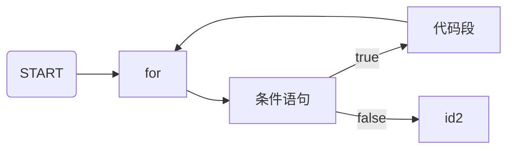

> * 标签：后端、Golang


# Go 的奇妙旅程：Go 的循环句｜Go 主题月


在不少实际问题中有许多具有规律性的重复操作，因此在程序中就需要重复执行某些语句。一般来说一个循环是这样的：



## Go 的循环句

循环提供了一种快速和简单的方式去做一些重复的事。你可以把循环想成一种计算机化的游戏，告诉某人在一个方向上走 X 步，然后在另一个方向上走 Y 步；例如，“向东走 5 步”可以用一个循环来这样表达：

```go
for step := 0; step < 5; step++ {
    fmt.Println("向东走了一步")
}
```

循环有很多种类，但本质上它们都做的是同一件事 —— 把一个动作重复了很多次（虽然说可能不重复，即重复次数为 0）。

各种循环机制提供了不同的方法去确定循环的开始和结束。不同情况下，某一种类型循环会比其它的循环用起来更简单。

Go 语言为我们提供了：

* for 循环

基本上我们可以用 for 循环替代其他所有的循环。

### 栗子

一个用于示例的输出企鹅真帅 1000x 的循环是这个样子的：

```go
for step := 0; step < 1000; step++ {
    fmt.Println("企鹅真帅")
}
```

## `for` 的组成

Go 语言的 `for` 循环有三个组成部分，可以组成千差万别的，适用于特定情况的循环结构。

和 C 语言的 `for` 一样：

```go
for init; condition; post { }
```

和 C 的 `while` 一样：

```go
for condition { }
```

和 C 的 `for(;;)` 一样：

```go
for { }
```

其中：

* `init`： 一般为赋值表达式，给控制变量赋初值；
* `condition`： 关系表达式或逻辑表达式，循环控制条件；
* `post`： 一般为赋值表达式，给控制变量增量或减量。

`for` 语句执行过程如下：

*
    1. 初始化（执行 `init`）
*
    2. 判别赋值表达式 init 是否满足给定条件

    * 若其值为 `true`，满足循环条件，则执行循环体内语句，然后执行 `post`，进入第二次循环，再判别 `condition`
    * 如果 `condition` 的值为 `false`，不满足条件，就终止 `for` 循环，执行循环体外下一个语句。

### 三元循环

Go 默认的 for 循环的与 C 或 Java 一个样子：

```go
sum := 0
for i := 1; i < 5; i++ {
    sum += i
}
fmt.Println(sum) // 10 (1+2+3+4)
```

* 一开始运行 `i := 1`
* 条件语句 `i < 5`
* 每次循环后运行 `i++`

### 类 While 循环

如果省略掉初始化和执行后操作语句，则会出现类似于 while 的循环：

```go
n := 1
for n < 5 {
    n *= 2
}
fmt.Println(n) // 8 (1*2*2*2)
```

* 条件语句 `n < 5`

### 无限循环

如果继续省略掉条件语句，则会出现无限循环：

```go
sum := 0
for {
    sum++ // 无限循环
}
fmt.Println(sum) // 不会被执行
```

### 范围循环

通常使用范围循环来更好地遍历 `slices`、`arrays`、`maps`、`channel` 或 `string` 中的元素。

```go
strings := []string{"霜羽", "好看"}
for i, s := range strings {
    fmt.Println(i, s)
}
```

### 跳过循环

与 Java 和 C 一样，在 Go 中我们使用 `continue` 关键词跳过单次循环：

[`day10/penguin-continue-say-cool.go`](https://github.com/PassionPenguin/AwesomeGo/blob/master/day10/penguin-continue-say-cool.go)

```go
for i := 1; i < 20; i++ {
    if i%2 != 0 { // 跳过循环
        continue
    }
    fmt.Println("霜羽在第 " + strconv.Itoa(i) + " 次循环表示 ta 很酷")
}
```