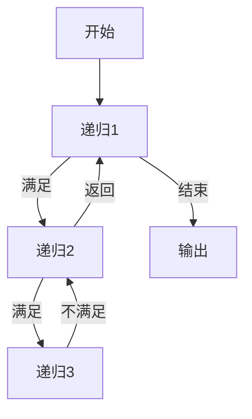

> * 标签：后端、Golang


# Go 的奇妙旅程：Go 的递归｜Go 主题月


程序调用自身的编程技巧称为递归（recursion）。递归做为一种算法在程序设计语言中广泛应用，尤其常用于计算当中。一个过程或函数在其定义或说明中有直接或间接调用自身的一种方法，它通常把一个大型复杂的问题层层转化为一个与原问题相似的规模较小的问题来求解，递归策略只需少量的程序就可描述出解题过程所需要的多次重复计算，大大地减少了程序的代码量。

递归的能力在于用有限的语句来定义对象的无限集合。一般来说，递归需要有：

1. 边界条件
2. 递归前进段
3. 递归返回段。

此时，当边界条件不满足时，递归前进；当边界条件满足时，递归返回，比如说：



Go 中递归的一个案例如下：

```go
func recursion() {
   recursion() /* 函数调用自身 */
}

func main() {
   recursion()
}
```

## Fibonacci

```go
package main

import "fmt"

func fibonacci(n int) int {
  if n < 2 {
   return n
  }
  return fibonacci(n - 2) + fibonacci(n - 1)
}

func main() {
    var i int
    for i = 0; i < 10; i++ {
       fmt.Printf("%d ", fibonacci(i))
    }
}
```