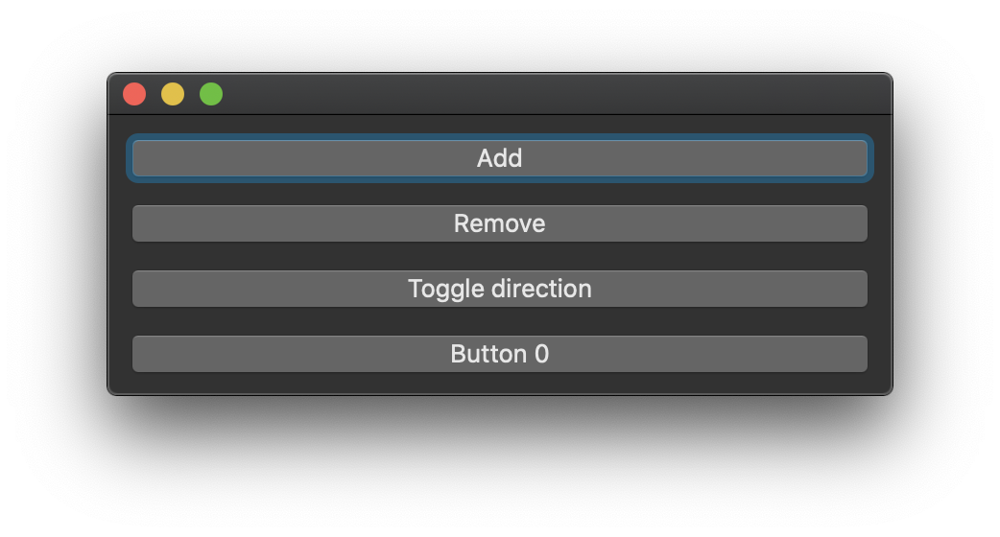

> * 标签：前端

# 新的 Svelte NodeGUI 让我们可以使用 Qt 和 Svelte 构建原生桌面端应用程序

[Jamie Birch](https://twitter.com/LinguaBrowse) 最近[发布了 Svelte NodeGUI](https://twitter.com/LinguaBrowse/status/1367929896685756422)，一个用于在 Windows、Linux 和 macOS 上构建桌面端应用程序的框架。这是一个相较 Electron 来说更轻量的代替方案，让我们能够使用 [Svelte 前端框架和编译器](https://svelte.dev/)，以及 [Qt 控件工具包](https://www.qt.io/)，还可以用 HTM'L 和 CSS 子集，构建桌面端应用程序。

Svelte NodeGUI 的文档展现了它的基本原理以及使用它的好处，如下所示：

> Svelte NodeGUI 是一个 Svelte 对 [NodeGUI](https://nodegui.org/)) 的渲染器。这是一个高效的 JavaScript 库，与跨平台 GUI 库 `Qt` 相捆绑。Qt 是最成熟最高效的构建桌面应用的库之一。这让 Svelte NodeGUI 在内存和 CPU 上更具效率，与其它的 JavaScript 桌面端 GUI 解决方案形成了明显的对比。一个用 Svelte NodeGUI 构建的 *Hello World* 应用程序在内存上比其他 GUI 解决方案少占用 20 MB。

有的开发者已经报告称一个基础的 *Hello World* 的用 Electron 构建的应用程序的尺寸会高达 [115 MB](https://medium.com/gowombat/how-to-reduce-the-size-of-an-electron-app-installer-a2bc88a37732) 甚至是 [275 MB](https://stackoverflow.com/questions/59731319/how-can-i-reduce-my-275mb-hello-world-electron-package-size)。Svelte NodeGUI 则成功地通过不内置 Chromium 浏览器包，编译一个内存更优的尺寸更小的可执行文件。

相反，我们无法在 Svelte NodeGUI 应用程序中使用所有的浏览器中有的 API 以及 HTML 和 CSS 的功能。Svelte NodeGUI 应用程序本质上是一个 Node.js 应用程序，其用户界面由 Qt 控件如 [`QMainWindow`](https://doc.qt.io/qt-5/qmainwindow.html)、[`QCheckBox`](https://doc.qt.io/qt-5/qcheckbox.html) 构建的，我们可以使用 [Qt 样式表语法](https://doc.qt.io/qt-5/stylesheet-syntax.html)样式化应用程序。它使用了 [Flexbox](https://developer.mozilla.org/en-US/docs/Learn/CSS/CSS_layout/Flexbox) 进行布局 —— 这是网络浏览器的一维布局方法。Qt 控件的数量和覆盖范围可能小于 [HTML 原生元素](https://www.htmlquick.com/reference/tags.html) 的数量和覆盖范围，这实际上也限制了我们 —— 我们只能使用 Qt 支持的 HTML 子集。Svelte NodeGUI 附带 13 种标签或称之为 UI 组件，包括按钮，图像标签，可编辑文本区域，进度条和窗口。

Qt 窗口小部件可能会发出事件（称为信号），可以监听事件并以编程方式将其与事件处理程序关联。NodeGUI 还提供了一组的内部事件，应用程序可以对其监听（即 [QEvents](https://svelte.nodeGUI.org/docs/GUIdes/handle-events#event-handling)）。Svelte NodeGUI 的文档提供了[以下示例，说明了布局机制和事件语法](https://svelte.nodeGUI.org/docs/GUIdes/handle-events#how-do-i-know-which-events-are-supported-)：

```jsx
<script lang="ts">
  import { onMount } from "svelte";
  import { Direction } from "@nodegui/nodegui";
  import type { QPushButtonSignals } from "@nodegui/nodegui";

  let additionalButtons: string[] = [];
  let direction: Direction = Direction.LeftToRight;

  function addHandler(): void {
    additionalButtons = [...additionalButtons, `Button ${additionalButtons.length}`];
  }
  function removeHandler(): void {
    additionalButtons = [...additionalButtons.slice(0, additionalButtons.length - 1)];
  }
  function toggleDirection(): void {
    direction = ((direction + 1) % 4) as Direction;
  }

  onMount(() => {
    (window as any).win = win; // Prevent garbage collection.
    win.nativeView.show();
    return () => {
      delete (window as any).win;
    };
  });
</script>

<window bind:this={win}>
  <boxView direction={direction}>
    <button text="Add" on={addHandler} />
    <button text="Remove" on={removeHandler} />
    <button text="Toggle direction" on={toggleDirection} />
    {#each additionalButtons as additionalButton (additionalButton)}
      <button text={additionalButton}/>
    {/each}
  </boxView>
</window>
```

如前面的代码示例所示，常规的 [Svelte 单文件组件语法](https://svelte.dev/tutorial/basics)用于描述应用程序逻辑。Svelte 的 `onMount` 生命周期挂钩用于显示原生应用程序窗口。窗口的内容被包装在 `<window>` 标签内，由四个按给定方向布置的按钮组成，用户可以通过单击按钮来切换。每次切换时，生成的桌面应用程序的用户界面都会在以下两个布局之间改变：




（来源：[Svelte NodeGUI 文档](https://svelte.nodegui.org/docs/guides/layout#boxview-layout)）

尽管我们无法使用使用浏览器 API，我们可以从大量现有的 Node.js 软件包中挑选我们想要的功能（例如 [Node Fetch](https://github.com/node-fetch/node-fetch)）。我们[也可以安装原生的 Node.js 模块](https://svelte.nodegui.org/docs/guides/using-native-node-modules)并使用这些模块。我们还可以使用 [Chromium 开发者工具](https://nodejs.org/en/docs/inspector/)[调试我们的 Svelte NodeGUI 应用程序](https://svelte.nodegui.org/docs/guides/debugging)，就像开发 Node.js 应用程序那样。

该版本在 HackerNews 上引起了热烈的讨论。一位用户[热烈地欢迎了桌面端原生应用程序的新功能](https://news.ycombinator.com/item?id=26361924)，如下：

> 看起来真的很好！乍一看，这似乎是我在 HackerNews 上看到的最好的替代品。
>
> 除了一致的 GUI 层，我认为许多团队坚持使用 Electron 的一个被低估的原因是用于跨平台构建和升级的成熟工具。DIY 真的非常痛苦。
>
> NodeGUI 目前似乎不支持交叉编译，这是否在计划中？升级、自动升级工具怎么样？代码签名？

[react-electron-boilerplate](https://electron-react-boilerplate.js.org/)，[neutralino](https://neutralino.js.org/) 和 [tauri](https://tauri.studio/en/) 则也同样是替代 Web 技术开发轻量级桌面应用程序的选项。Google 最近还[发布了 Flutter 2](https://www.infoq.com/news/2021/03/flutter-2-released/)，一个跨平台的 UI 工具包，致力于支持我们编写用于移动，网络，和单个代码库的桌面平台的应用程序。一名 HackerNews 读者还[提及了 Sciter.js](https://news.ycombinator.com/item?id=26364927)，它为 [Sciter](https://sciter.com/)，一种可嵌入的 HTML / CSS / Script 引擎，提供了 JavaScript 接口：

> VanilaJS 和 Sciter.JS 中的相同演示：[https://github.com/c-smile/sciter-js-sdk](https://github.com/c-smile/sciter-js-sdk)（请参阅屏幕截图）。
>
> 二进制文件约为 5 MB，即 HTML / CSS + QuickJS + NodeJS 运行时。
>
> 与 50MB+ 的 NodeGUI 相对应，即 Node.JS + QT。
>
> SvelteJS 也可以直接在 Sciter.JS 中使用。

Qt [针对商业和开源许可证提供了两种许可](https://www.qt.io/licensing/)。[NodeGUI 项目](https://docs.nodegui.org/) 的创建者则强调了[许可对软件分发的影响](https://twitter.com/a7ulr/status/1225498258233053184?s=21)：

> 只要遵守 LGPL 许可要求，你就可以免费将 Qt 用于商业应用程序。对于桌面应用程序，这相对容易实现。我们需要确保你正在动态链接到 Qt 库和额外的许可证和信用信息。更多信息请点击[此处](https://www.youtube.com/watch?v=bwTlCBbB3RY)。

[Svelte NodeGUI](https://github.com/nodegui/svelte-nodegui) 则是根据 MIT 许可分发的开源项目。
