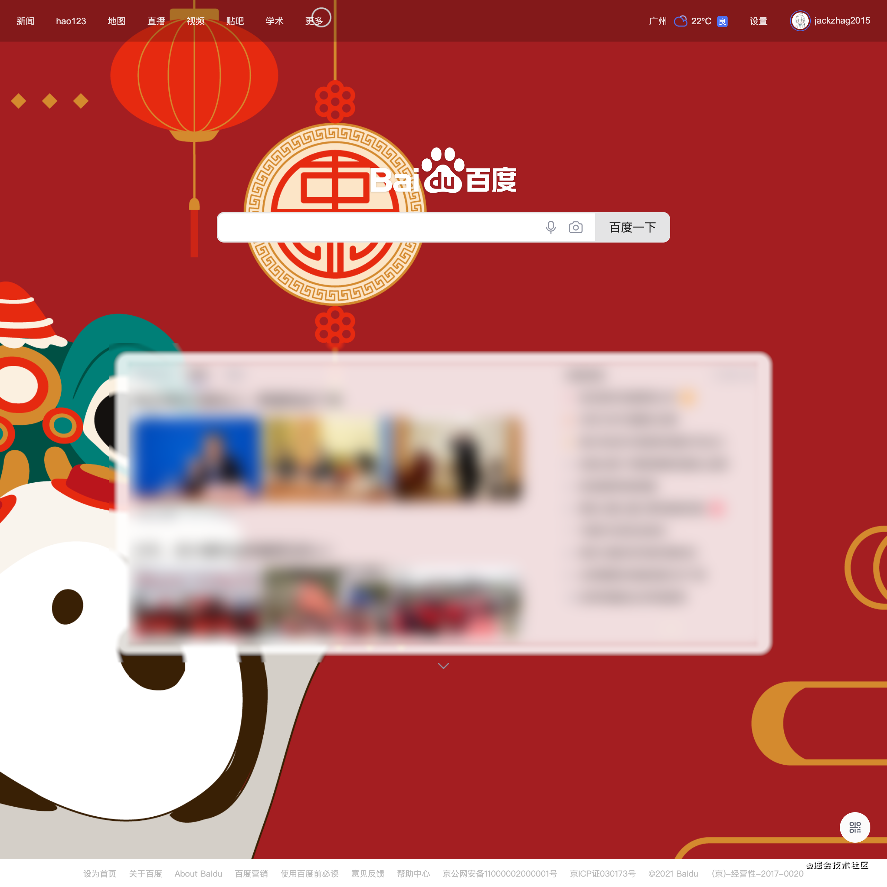
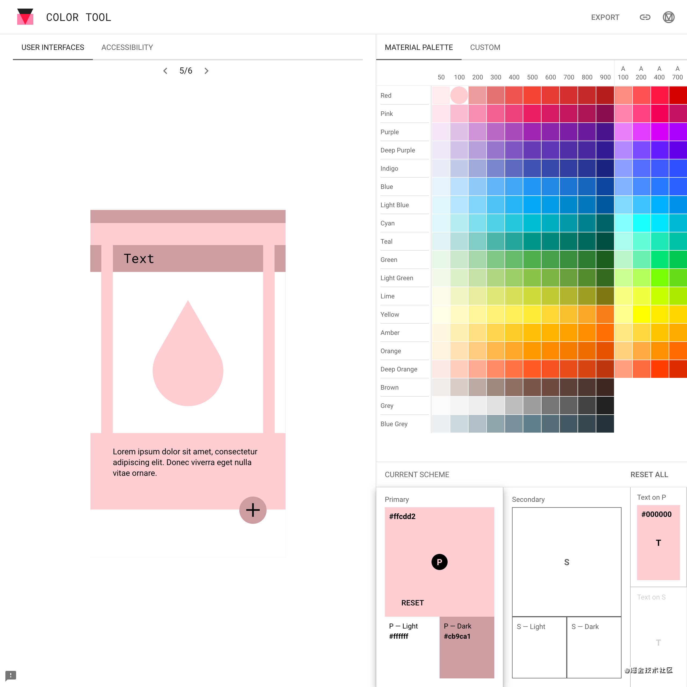

> 标签：设计、前端

# 淘宝网页端的 UI 更新了？让我们来瞧一瞧简约化

## 引入

刚准备瞧一眼某宝，突然发现了……

哇这极度消耗浏览器资源的主页竟然给我更新了！

尚且记得前几次打开淘宝，满屏 GIF 以及各种其他动效的领导画风淘宝 UI 首页，真的是：

相比起原来的 UI 而言，可谓是简洁风格十足了，各种内容**精炼、突出**，一眼能够定位到想要定位的元素。

在左侧的分类中选择，我们能够看到一个更美观的列表：

相比之前的列表的文字小，无关信息饱和度高干扰多，不易定位的缺点，这份 UI 可谓是不错的答卷了。

不过却除了首页以外，似乎也没有别的地方修改为这套 UI 了。

### 简洁化

**现在的移动端 UI 界面中极简风的设计越来越多了，甚至，这股风吹到了电脑端上。**

极简主义设计风之所以能够如此的受欢迎，很大程度是源自于它对于设计、开发的友好，它不仅让应用程序的加载速度更快（大多数情况下），而且还让应用程序对于不同屏幕的兼容性更加优异。与此同时，越来越多的用户也开始青睐极简风的设计。

极简风的 UI 界面不仅漂亮，而且在可用性上也非常的突出：它易于用户沉浸其中，它易于浏览，并且具备强大的视觉表现力。

## UI 设计风格越来越偏向简洁化

不知道大伙儿有木有发觉，每当我们开启各式各样的常用应用的那些个时候，若是不细心看，根本没办法说出个什么区别来，从购物商城类的 APP 到视频 APP 到阅读 APP，每一应用程序的设计方案都**极其类似**。

> 乳白色的背景图，乳白色的互动按键，乳白色的文本框。

这些个 UI 控件都很精确及（相）时（互）维（抄）持（袭）了。这类当代的页面设计设计风格，乍看真的很单调，但却也有着一定的道理。

毕竟当同类型的应用程序都互相抄袭着相近的逻辑互动、视觉元素，我们却也的确更少机会犯错。譬如说，打开一款应用程序分享自己账号的时候，我们会下意识的把手指放在屏幕的右下角，准备去点击导航栏……

就我个人的感觉来说，似乎先是 **Apple、MUJI，然后到 Google、GitHub，到大众点评，然后到百度**，**不断**扩散开简介风。尚且记得学 FE 的第三四年，就在模仿 MUJI 无印的设计。不得不说，无印良品的 UI 设计真的挺好看的 ψ(｀∇´)ψ。

甚至连百度最后都变更了过来：

还有那复古的 QQ 邮箱？想起它就真的想要吐槽授权码这个垃圾设计……

### 区别，究竟是些什么？

从界面设计的角度来说，十年前的软件和现在的软件，从 UI 上看最大的区别是什么？

大概更早的软件，几乎会在每个角落里塞几个菜单和按钮，不信，随便找几个比较老旧的政府网站瞧瞧。

据说最近广州市天河区政府教育系统的改卷、评卷、学生档案系统想要更新，也不知道效果如何，反正不久以前，**乱乱糟糟，UI 相互遮挡，一个页面功能繁多而难以操作……**

而当前的软件非常简洁，大多数的页面都**只关注于一个内容上**，更符合人的思维方式。现在扁平化大行其道，简单就是好的。确实是这样，每多一个选项，用户的学习成本就增加一倍。（虽然我还是感觉 Windows 7 也挺好看的……）

## 简约，真的是唯一策略嘛？

大多数情况下，的确是，这可以避免我们乱叠功能。

**但还有挺多的特例。**

macOS 系统有一堆的花里胡哨的功能，诸如 Magnification 放大镜功能，甚至大多数时候，Dock 对我来说都是个多余。

一个优秀的交互逻辑能够解决一切事情啊！

Command + Space `⌘ + `，再输入应用程序关键词，诸如 `Ch` 然后回车，马上就打开了浏览器。

又或是 Command + Tab `⌘ + ↹`，调出当前运行的应用程序列表，直接选择，一样的方便……

又或是，应用类型为编辑的，倘若一个页面只有寥寥几个功能，**真的是单薄！**

但是，面对大多数的设计稿的问题，**似乎简约简洁化设计，是最简单粗暴的解决方案？**

## 我们应该怎么做？

### 1. 移除无用元素

在我们的设计当中，每个元素都应该要**有其存在的意义**。而在极简主义的设计当中，每一个元素都应该是有目的、有针对性的存在，没有多余的、无用的元素。

所以，**极简主义的设计应该只保留绝对必要的那些组件。**

譬如说，一个购物网站的页面，应该在正文内容突出强调友情链接吗？

有这个必要吗？

### 2. 视觉焦点

其实很容易理解，即屏幕内容越精简，用户就越容易关注到你想要表达的信息。你想要表达的信息越突出，用户就越有可能先关注在它身上。

就譬如是 Apple 的页面，我们大多会发现，图片很大，文字相比，真的很小：

> （有没有大佬愿意赞助一台～）

视觉设计要围绕着内容来进行。这样的设计，是为了让信息更清晰，消除干扰，而且要让用户更容易关注到核心的内容。因为我们人的关注，会从视觉焦点，逐渐向不重要的信息转移。

譬如说，我先关注到上图中的背景图，然后关注到 一 Pro 到位，被吸引到了，我就会去继续阅读描述信息。

因此信息层级区分的更加明确，会让内容更容易理解。

### 3. 简约且搭配的配色方案

简化配色方案能够很好地帮你改善用户体验，太多的色彩可能会对一个极简的设计产生负面的影响。但是，限制色彩的数量并不意味着你只能使用黑白色调，而不需要其他的色彩。

极简主义的配色讲究的是使用必要的颜色来帮你构建整个视觉体系。如单色配色。单色配色是极简设计里面最常用的一种配色方案。单色配色是指主色和辅色都在统一色相上，这种配色方法往往会给人页面很一致化的感受。

尤其需要注意的，还有，配色方案必须相互搭配，必须一致。

**不要这边一个配色那边一个配色！！！**

在这里先推介一个颜色工具，Google Material Design 的：[Material Color 工具](https://material.io/resources/color/)

颜色相互搭配且保持一致的配色方案，能够给用户带来一个统一的印象，诸如 粉色——可爱，蓝色——科技，这些都是我们能够明白的。这里还有一个典型案例，就是 iMessage，按照消息的时间给信息上色。

### 4. 大胆的使用留白

留白（也叫负形）是指页面内元素的空间。尽管有人认为留白是在浪费屏幕，但是留白在设计中是非常重要的。

一个页面中存在过多的元素，没有留白，会让这个页面看起来很是拥挤，也加大了用户寻找信息的难度。

充满呼吸感的布局是极简主义设计中常见的元素，也几乎是必要的组成部分。留白指的是留出空间，它并不一定必须是白色。在极简风的设计当中，留白的存在让视觉焦点更为突出，此外，它还塑造出整个设计的空间感和区域，呈现整体框架和布局。

诸如 Google 首页，巨大的留白，直接点明主题 => **你给我点击搜索框搜索去，别瞎看！**

嗯……1920x1920 的分辨率下有点丑……

现在大多数机顶盒、电视机都内嵌了魔改后的 Android 系统，而甚至可以说，衡量国产魔改系统的标准就是，开机页面以及主页。

广告满屏？各种弹窗？

**这都不叫事！**

## 结语

说实在的，看着一些过时的论坛的 UI，真的很令人难受。

大多是关注点繁多，焦点极少，似乎每一个元素都是个焦点。

它们本应该与时俱进啊！

设计不是一门玄学，而着实是一门需要我们付出的学科。从布局，到交互。一份优秀的设计，是最好的广告，能够产生最强的用户粘性。**你的应用功能不必繁多，不必多么突出，甚至大多数时候，50% 的性能差异面对普通场景来说，足以忽略。**

我们平时下载应用的标准是什么？

只能看效果图啊！

而优化一份设计的最粗暴方法是什么？

我想，是简洁化设计。