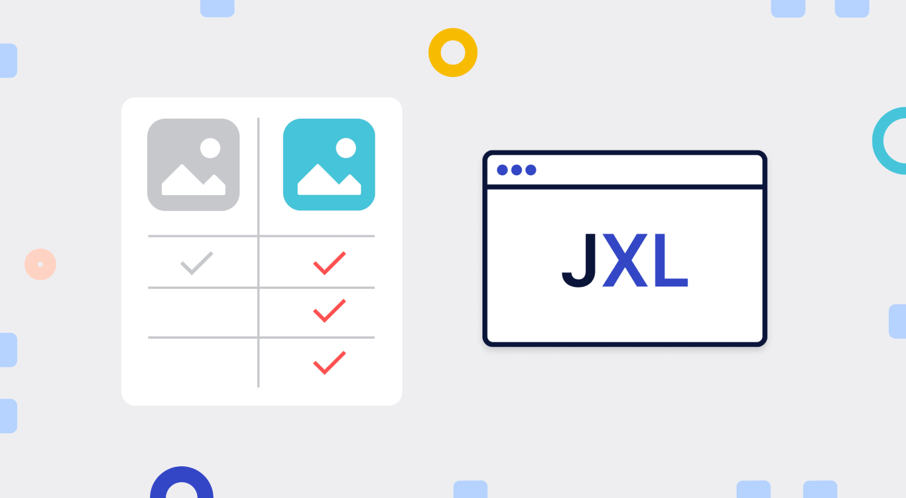

> * 原文地址：[Time for Next-Gen Codecs to Dethrone JPEG](https://cloudinary.com/blog/time_for_next_gen_codecs_to_dethrone_jpeg)
> * 原文作者：[Jon Sneyers](https://cloudinary.com/blog/author/jon_sneyers)
> * 译文出自：[掘金翻译计划](https://github.com/xitu/gold-miner)
> * 本文永久链接：[https://github.com/xitu/gold-miner/blob/master/article/2021/time-for-next-gen-codecs-to-dethrone-jpeg.md](https://github.com/xitu/gold-miner/blob/master/article/2021/time-for-next-gen-codecs-to-dethrone-jpeg.md)
> * 译者：[霜羽 Hoarfroster](https://github.com/Hoarfroster)
> * 校对者：[Kimhooo](https://github.com/Kimhooo)、[PingHGao](https://github.com/PingHGao)

# 是时候该罢黜 JPEG，独尊新编码了

我对图像编码十分狂热。如今，一场“图像编码之战”正在酝酿之中，而我并不是唯一[对此有想法](https://codecs.multimedia.cx/2020/11/an-upcoming-image-format-war/)的人。显然，作为 JPEG 委员会 JPEG XL 特设小组的主席，我坚定地致力于多年的图像编码的工作。但是，在本文中，我将努力做到公平和中立。

目标很明确：罢黜 JPEG 这位在 `` 标签诞生的 25 年以来（其实就是在网络上存在图片以来），一直居于统治地位的 *明智却年老的照片压缩大师*。JPEG 这个极度出色的图像编码现在已经达到了他的极限。为什么？仅仅提到他缺少对 alpha 透明度的支持，就足以让人烦恼许久，更不用说那色彩深度的 8 位的限制（也是他不支持 HDR 的原因），还有那和与现有技术相比相对薄弱的压缩。显然，进行谋权篡位的时候到了！

六名对手正在进入战场，请做好准备 —— 全军出击：

* **JPEG 2000** —— JPEG 小组，这是 JPEG 编码继承者中最早初露头角的一位，不过仅被 Safari 5+ 支持
* **WebP** —— Google，支持在所有现代浏览器中使用
* **HEIC** —— MPEG 小组，基于 HEVC，支持在 iOS 原生应用程序使用，但是不被任何一个包括 Safari 在内的浏览器支持
* **AVIF** —— 开源媒体协会，支持在 Chrome 和 Opera 浏览器中使用，可在 Firefox 中通过开启 `image.avif.enabled` 使用
* **JPEG XL** —— JPEG 小组，下一代编码但不被任何浏览器支持
* **WebP2** —— Google，一个针对 WebP 的实验性质的成功尝试，主要目标是达到与 AVIF 相似的压缩率，同时保持更快的编码和解码速度。

由于 [WebP2](https://chromium.googlesource.com/codecs/libwebp2/) 仍处于试验阶段，并且将是与 WebP 不兼容的全新格式，因此对他进行评估尚为时过早。其他图像编码则早已完成，不过完成时间有所不同：JPEG 2000 已经有了 20 年的历史，而 JPEG XL 项目才刚成立一个月。

坦率地说，基于 HEVC 的 HEIC 不是免费，或者说，不是开源的。即使得到了 Apple 的支持，HEIC 也不大可能成为替代 JPEG 的通用编码。

因此，本文重点关注将其余的新的编码（JPEG 2000、WebP、AVIF 和 JPEG XL）与掌控旧政权的 JPEG 和 PNG 比较。

## 压缩

显然压缩是图像编码的重要指标，快来看看数据吧：

* JPEG 是为了对相片进行有损压缩而创建，而 PNG 则专用于无损压缩，并在非摄影图像上表现最佳。在某种程度上，这两个编码是互补的，适用于我们实际应用中的各种用例和图像类型。
* JPEG 2000 不仅优于 JPEG，而且还可以进行无损压缩。但是在非摄影图像上他落后于 PNG。
* WebP 是专为替代 JPEG 和 PNG 所设计的，他在压缩结果上确实击败了两者，不过差距较小。对于高保真、有损压缩来说，WebP 有时甚至会比 JPEG 表现差。
* 相比 JPEG，HEIC 和 AVIF 更能有效地处理相片的有损压缩。虽然有时他们会在无损压缩方面落后于 PNG，但对于有损的非摄影图像来说会产生更好的结果。
* JPEG XL 在压缩效果上突飞猛进，远胜过 JPEG 和 PNG。

当有损压缩足够好（比如说针对 Web 图像而言）时，AVIF 和 JPEG XL 都有着比包括 WebP 在内的现有 Web 图像编码有着明显更好的结果。通常，AVIF 在[低保真高吸引力](https://cloudinary.com/blog/what_to_focus_on_in_image_compression_fidelity_or_appeal)的压缩方面处于领先地位，而 JPEG XL 在中保真到高保真方面表现出色。目前尚不清楚这是两种图像格式的固有属性，还是开发编码器的一个关注点。不过无论如何，他们俩都远超 JPEG，领先着几英里。

### 低保真度下的编码比较

1. 原图 - PNG 1799446 bytes

2. JPEG - 68303 bytes

3. JPEG 2000 - 67611 bytes

4. WEBP - 67760 bytes

5. HEIC - 69798 bytes

6. AVIF - 67629 bytes

7. JXL - 67077 bytes

## 速率

对一张全屏的 JPEG 或 PNG 进行解码仅需极短的时间 —— 几乎只在眨眼瞬间。较新的编码能够做到更好地压缩，但这也会增加复杂性。例如，限制 JPEG 2000 的主要因素之一，就是其过高的计算复杂性。

如果图像压缩的主要目标是加快传送速度，那请顺带考虑解码速度。因为通常解码速度比编码速度更重要，毕竟在许多用例中，我们只需编码一次即可，而这一过程可以在强大的机器上离线进行。相反，解码则需要在包括低端设备在内的各种设备上进行多次。

由于 CPU 速度在单核性能方面一直处于停滞状态，因此并行化多核处理变得越来越重要。毕竟，硬件的发展趋势是拥有更多的 CPU 内核，而不是更高的时钟速度。由于在多核处理器成为现实之前设计完成，JPEG 和 PNG 等较旧的编码本质上是顺序的，也就是说，多核对单图像解码没有任何好处。在这方面，JPEG 2000、HEIC、AVIF 和 JPEG XL 都更具前瞻性。

## 局限性

JPEG（至少是事实上的 JPEG）和 WebP 的主要缺点是他们只支持最大的 8 位色彩深度。虽然说对于具有标准动态范围（SDR）和有限色域（如 sRGB）的图像，这个深度就足够了。但对于高动态范围（HDR）和广色域图像，那需要更高的深度。

目前，10 位的色彩深度足以满足图像传送的需要，而其他所有图像编码都支持 10 位的深度。不过对于创作工作流（可能仍需要连续的图像转换）则可能需要更高的深度。

WebP 和 HEIC 不支持没有色度二次采样的图像则是另一种限制。对于许多照片，色度二次采样已经足够了。在其他情况下，比如说那些具有精细细节或具有彩色外观的纹理或彩色文本图像上，WebP 和 HEIC 图像的表现可能就差强人意了。

当前，最大尺寸限制对 Web 部署几乎没有问题。但是，对于摄影和图像创作，基于视频编码的格式的限制可能会令人望而却步。请注意，即使 HEIC 和 AVIF 允许在 HEIF 容器级别进行切片，即实际图像尺寸实际上是不受限制的，但在切片边界处可能会出现伪像。例如，Apple 的 HEIC 实现使用大小为 512x512 的独立编码的图块，这意味着在例如另存为 HEIC 时，编码解码器会将原本 1586x752 的图像被切成八个较小的图像块，如下所示：

如果你放大去关注一下那些独立编码的图块之间的边界，那你肯定能够很清晰地看到图块之间的不连续：

为避免此类图块边界伪像，在使用 HEIC 和 AVIF 的时候我们应该避免让图像超过最大每块尺寸（即 8K 视频帧的大小）。

## 动画

最初，GIF、JPEG 和 PNG 都只能表示静态图像。但 GIF 于 1989 年首先支持动画 —— 甚至在其他编码还没有出现之前，这可能是他尽管有其局限性和较差的压缩效果，但在今天仍在被广泛地使用的唯一原因。现在所有主流浏览器还支持动画 PNG（APNG）编码，这是一个[相对较新的状况](https://caniuse.com/apng)。

在大多数情况下，最好使用视频编码而不是为静止图像设计的图像编码对动画进行编码。HEIC 和 AVIF 分别基于 HEVC 和 AV1，是真正的视频编码。尽管 JPEG XL 也支持动画，但他仅执行帧内编码，而没有运动矢量和视频编码提供的其他高级帧间编码工具的功能。即使对于仅运行几秒钟的短视频片段，视频编码的压缩效果也要比所谓的动画静止图像编码（如 GIF 和 APNG 甚至 WebP 动画或 JPEG XL）明显更好。

> 注；如果浏览器在 `` 标签中接受他们可以在 `<video>` 标签中播放的所有视频编码那会好极了！不过唯一的区别是在 `` 标签中视频是自动播放、静音且循环播放的。借此这些新的精巧的视频编码格式（例如 VP9 和 AV1），就会被自动地应用于我们的动画之中，让我们最终能够摆脱那古老的 GIF 格式了～

## 功能

让我们谈回静止的图像。除了快速压缩 RGB 图片（没有大小或色彩深度限制）外，图像编码还必须提供其他所需功能。

对于 Web 图像尤其是大的图像来说，慢慢加载的图像，即[渐进式解码](https://cloudinary.com/blog/improve_the_web_experience_with_progressive_image_decoding)可是一项出色的功能。JPEG 编码系列在这方面最为强大。

此外所有新的编码均支持 Alpha 透明度。最新的还支持深度图，比如说我们可以使用深度图将效果应用于前景和背景。

具有多层的图像（称为叠加层）可以增强 Web 交付。一个典型的例子是我们可以为照片添加清晰的文字叠加层，从而具有更强的压缩效果和更少的伪影。不过，他在创作工作流程中最有用。此外，对于这些工作流程，JPEG XL 还提供了诸如图层名称、选择蒙版、专色通道以及对 16 位整数和 16 位、24 位或 32 位浮点图像进行快速无损编码的功能。

在抵御世代丢失的弹性方面，视频编码不能完全发挥出色的性能。不过对于 Web 交付，这种缺陷并不重要，我指的是在图像变成例如模因，而最终被重新编码多次的情况下除外。

最后，JPEG XL 的独特过渡功能是他可以有效地重新压缩[旧版 JPEG 文件](https://cloudinary.com/blog/legacy_and_transition_creating_a_new_universal_image_codec)，而不会产生内容的丢失。

## 希望与策略

最新一代的图像编码尤其是 AVIF 和 JPEG XL，是对旧 JPEG 和 PNG 编码的重大改进。可以肯定的是，JPEG 2000 和 WebP 还可以更有效地压缩并提供更多功能，不过总体效果并不显着且不够稳定，不足以保证快速广泛地采用。AVIF 和 JPEG XL 会做得更好 —— 至少我是这么希望的。

在未来的几十年中，会不会有一个赢家成为主导的编码？如果会有，那会是 AVIF、JPEG XL 还是即将推出的 WebP2？还是 WebP，毕竟他有着广泛的浏览器支持？会不会有多个获胜者，例如 AVIF 是低保真高吸引力的首选编码，而 JPEG XL 是高保真的首选编码？那些新的编码会不会输掉这场战斗，而旧的 JPEG 又能再次在被罢黜的尝试中存活吗？我想回答这些问题为时尚早。

就目前而言，一个好的事件策略可能是同时使用几种不同的图像编码方法。不仅要利用他们的独特优势，还要降低任何一种方法成为[专利巨魔](https://www.sisvel.com/licensing-programs/audio-and-video-coding-decoding/video-coding-platform/license-terms/av1-license-terms)攻击目标的可能性。磁盘空间在这里是无关紧要的，因为相对于存储它们的巨大存储空间，图像编码占用的空间微不足道。

此外，考虑到许多因素在起作用，但并非所有因素都是技术性的，因此很难预测编码采用的成功。我们只是希望新的编码能在这场战斗中取胜，这主要是与惯性和现状的“轻松”相对立的。最终，除非 JPEG 占主导地位，否则无论采用哪种新编码，我们都将受益于更强的压缩、更高的图像保真度和色彩准确性，从而能够使用更具吸引力且加载速度更快的图像。那将是每个人的胜利！

> ### 注：
>
> 同时，需要注意的是，上面列出的 AVIF 限制适用于当前定义的最高 AVIF 配置文件（“高级”配置文件），实际上有三个规则，像素数不得大于 35651584，宽度不得大于 16384 且高度不得大于 8704。也可以使用不带配置文件的 AVIF，然后适用 AV1 限制：色彩深度最高为 12 位，最大尺寸最高为 65535x65535（如果你选择使用网格，那还能够更大）。对于 HEIC 来说，可以将容器与具有高达 16 位色彩深度和 4:4:4 的压缩率的 HEVC 有效载荷一起使用，尽管大多数硬件实现均不支持该容器。

> 如果发现译文存在错误或其他需要改进的地方，欢迎到 [掘金翻译计划](https://github.com/xitu/gold-miner) 对译文进行修改并 PR，也可获得相应奖励积分。文章开头的 **本文永久链接** 即为本文在 GitHub 上的 MarkDown 链接。

---

> [掘金翻译计划](https://github.com/xitu/gold-miner) 是一个翻译优质互联网技术文章的社区，文章来源为 [掘金](https://juejin.im) 上的英文分享文章。内容覆盖 [Android](https://github.com/xitu/gold-miner#android)、[iOS](https://github.com/xitu/gold-miner#ios)、[前端](https://github.com/xitu/gold-miner#前端)、[后端](https://github.com/xitu/gold-miner#后端)、[区块链](https://github.com/xitu/gold-miner#区块链)、[产品](https://github.com/xitu/gold-miner#产品)、[设计](https://github.com/xitu/gold-miner#设计)、[人工智能](https://github.com/xitu/gold-miner#人工智能)等领域，想要查看更多优质译文请持续关注 [掘金翻译计划](https://github.com/xitu/gold-miner)、[官方微博](http://weibo.com/juejinfanyi)、[知乎专栏](https://zhuanlan.zhihu.com/juejinfanyi)。
