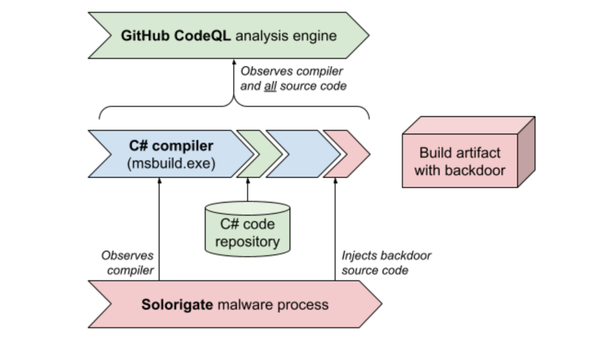

> * 原文地址：[Using GitHub code scanning and CodeQL to detect traces of Solorigate and other backdoors](https://github.blog/2021-03-16-using-github-code-scanning-and-codeql-to-detect-traces-of-solorigate-and-other-backdoors/)
> * 原文作者：[Bas van Schaik](https://github.blog/author/sjgithub/)
> * 译文出自：[掘金翻译计划](https://github.com/xitu/gold-miner)
> * 本文永久链接：[https://github.com/xitu/gold-miner/blob/master/article/2021/using-github-code-scanning-and-codeql-to-detect-traces-of-solorigate-and-other-backdoors.md](https://github.com/xitu/gold-miner/blob/master/article/2021/using-github-code-scanning-and-codeql-to-detect-traces-of-solorigate-and-other-backdoors.md)
> * 译者：[Badd](https://juejin.cn/user/1134351730353207)
> * 校对者：[PassionPenguin](https://github.com/PassionPenguin)，[greycodee](https://github.com/greycodee)

# 使用 GitHub 代码扫描和 CodeQL 工具检测 Solorigate 等后门程序

上个月，CodeQL 安全社区的一位成员向 C# 代码库贡献了关于 [CodeQL 复合查询](https://github.com/github/codeql/pull/5083)的代码，这有助于许多组织机构评估他们是否受影响于 SolarWinds 遭到的对全球关键网络基础设施的攻击。这次攻击也被称为 [Solorigate](http://aka.ms/solorigate)（微软的说法）或 Sunburst（FireEye 的说法）。在本文中，我们会阐释 GitHub 高级安全客户该如何使用 CodeQL 查询来排查他们的构建设施是否被恶意程序注入。

## 发生了什么事？

2020 年 12 月上旬，安全咨询公司 FireEye 公布了关于 SolarWinds 受到的攻击的详细信息。SolarWinds 是一家向多个组织机构提供网络监控工具的公司，其客户包括美国政府。黑客在 SolarWinds 的网络监控产品 Orion 中成功地植入了后门程序，而 SolarWinds 的大量客户都装载了 Orion。攻击者随后获取了部署着 Orion 产品的网络的访问权限。

过去几年里，Microsoft 一直在用 CodeQL 检测漏洞和数据泄露风险。这次关于 CodeQL 查询的贡献代码主要是为了应对这次的攻击，并优化[之前](https://msrc-blog.microsoft.com/2018/08/16/vulnerability-hunting-with-semmle-ql-part-1/)的[检测方式](https://msrc-blog.microsoft.com/2019/03/19/vulnerability-hunting-with-semmle-ql-part-2/)。

## 何为构建劫持？

这类恶意程序在**构建系统**中植入后门，以便于在发布的产品中的注入恶意代码，方便恶意程序的传播，进而危及使用产品的用户。该恶意程序甚至会监控对 `msbuild.exe`（[Microsoft 构建引擎](https://docs.microsoft.com/en-us/visualstudio/msbuild/msbuild)）的调用。通过给自己开通**调试特权**，构建劫持程序能够把额外的恶意代码注入到构建进程中。这意味着，虽然代码库本身不包含任何恶意代码或其他痕迹，但构建出来的产品却**确实**带有恶意程序。在这份 [Crowdstrike 提供的技术分析](https://www.crowdstrike.com/blog/sunspot-malware-technical-analysis/)中，有关于构建劫持过程更加详尽的解释。

## CodeQL 安全分析

GitHub CodeQL 是一个语义代码分析引擎，它使用**查询（Query）**来分析源代码并发现非预期的模式。例如，CodeQL 能追踪来自存在潜在危险（比如一个 SQL 声明中的字符串拼接会导致 SQL 注入漏洞）的不可信来源（比如一个 HTTP 请求）的数据。

在（编译后语言的）构建过程中，CodeQL 查询可以运行在由它在生成的源代码库中。因而，CodeQL 会密切观察构建过程，并随之提取用于构建二进制文件的相关源码。提取过程的产物是一个关系形式的源码的结构化表示 —— 一个 CodeQL 数据库。

## 使用 CodeQL 检测 Solorigate 的痕迹

如果一个构建服务器被 Solorigate 恶意程序的构建劫持组件植入了后门，那么恶意程序会在编译时注入额外代码。如果 CodeQL 在被感染的服务上观察构建进程，它会从真正的源码中提取被注入的恶意源码。产生的 CodeQL 数据库会因此包含 Solorigate 恶意源码的痕迹。请注意，如果你的 CodeQL 数据库生成于**没有**被感染的机器，那么这个数据库就不会包含任何被注入的代码。



[Microsoft 团队贡献的](https://github.com/github/codeql/pull/5083) CodeQL 查询代码会检测被恶意注入的 C# 代码的模式。运行这些查询的最佳方式，是在可能受影响的服务器上手动创建一个 CodeQL 数据库，并用 VS Code 的 CodeQL 插件分析这个数据库。

你还可以生成一个 CodeQL 数据库，然后通过 CI/CD 管道运行查询。这样就能在运行着 CI/CD 任务（以及用来构建发布文件）的系统中检测到构建注入。

### 使用 VS Code 运行 CodeQL 查询

1. 在 VS Code 中安装 [CodeQL 插件](https://codeql.github.com/docs/codeql-for-visual-studio-code/setting-up-codeql-in-visual-studio-code/)，然后按照[快速入门指南](https://marketplace.visualstudio.com/items?itemName=GitHub.vscode-codeql#quick-start-installing-and-configuring-the-extension-1)设置[起始工作区](https://marketplace.visualstudio.com/items?itemName=GitHub.vscode-codeql#cloning-the-codeql-starter-workspace)。
2. 在可能被注入的构建服务器上构建 C# 源码，从而[生成一个 CodeQL 数据库](https://codeql.github.com/docs/codeql-cli/creating-codeql-databases/)。
3. 把 CodeQL 数据库传到自己的机器上。
   **注意：**CodeQL 数据库本身不包含任何（有潜在危险的）编译文件或被注入的可执行文件。它包含（1）所编译的源码的一份纯文本副本，以及（2）该代码的一份关系展示。
4. [在 VS Code 中加载 CodeQL 数据库](https://codeql.github.com/docs/codeql-for-visual-studio-code/analyzing-your-projects/)。
5. 定位到 `**ql/csharp/ql/src/codeql-suites**`，在这里你会找到 CodeQL 查询文件 **`solorigate.qls`**。右击该文件，选择 **CodeQL: Run Queries in Selected Files（在选中文件中运行查询）**。


对每个可能受影响的代码库重复第 2 步至第 5 步。

### 在 GitHub 代码扫描中运行 CodeQL 查询

为了用 GitHub 代码扫描功能对一个 C# 代码库运行 CodeQL 查询，我们要在要分析的仓库中创建一个 `.github/codeql/solorigate.qls` 文件：

```yaml
- import: codeql-suites/solorigate.qls
from: codeql-csharp
```

然后，设置一个默认的 CodeQL 工作流（或编辑一个已有的工作流），并按照下面的代码修改模板的 `Initialize CodeQL` 部分：

```yaml
- name: Initialize CodeQL
uses: github/codeql-action/init@v1
with:
languages: csharp
queries: ./.github/codeql/solorigate.qls
```

如果你的代码需要一个特殊的构建命令来启动编译，那么请参考文档：[自定义 CodeQL 代码扫描分析](https://docs.github.com/en/github/finding-security-vulnerabilities-and-errors-in-your-code/configuring-the-codeql-workflow-for-compiled-languages)。

通过上面的配置，额外的 CodeQL 查询就可以运行了。如果 CodeQL 在源码中检测到了任何（Solorigate 或其他）恶意程序迹象，它就会在 GitHub 代码扫描界面里生成一个[警告](https://docs.github.com/en/github/finding-security-vulnerabilities-and-errors-in-your-code/managing-code-scanning-alerts-for-your-repository)。


若对更多信息和配置样例感兴趣，请参阅文档：[在 GitHub 代码扫描中运行自定义 CodeQL 查询](https://docs.github.com/en/github/finding-security-vulnerabilities-and-errors-in-your-code/configuring-codeql-code-scanning-in-your-ci-system#running-additional-queries)。

## 后续步骤

如果 CodeQL 在产品或代码库中标识出了可疑元素，那你就应该手动复查受影响区域的代码了。我们甚至建议你把源代码和 CodeQL 上看到的代码进行比较。

Microsoft 的 Solorigate 响应团队贡献的查询代码，对检测 Solorigate 等此类后门植入攻击有着启发性作用。这类攻击的危害不限于系统或网络层面。使用 CodeQL 分析代码库可以算是在审计技术版图中占有一席之地了。关于此次攻击的更多信息以及关于其他技术的建议，请参阅文章：[Microsoft Solorigate 资源中心](https://aka.ms/solorigate)。

如果你有任何关于 CodeQL 和 Solorigate 问题，请联系 GitHub 高级安全客服。如果你目前还不是 GitHub 用户，请[点击这里](https://enterprise.github.com/contact?utm_source=github&utm_medium=site&utm_campaign=adv-security&ref_page=/features/security&ref_cta=Contact%20Sales&ref_loc=hero)联系我们，我们会很乐意提供进一步协助。

## 延伸阅读

如果你想要了解关于 Solorigate 查询检测的更多技术背景信息，请参阅 [Microsoft 的这篇文章](https://www.microsoft.com/security/blog/2021/02/25/microsoft-open-sources-codeql-queries-used-to-hunt-for-solorigate-activity/)。

> 如果发现译文存在错误或其他需要改进的地方，欢迎到 [掘金翻译计划](https://github.com/xitu/gold-miner) 对译文进行修改并 PR，也可获得相应奖励积分。文章开头的 **本文永久链接** 即为本文在 GitHub 上的 MarkDown 链接。

---

> [掘金翻译计划](https://github.com/xitu/gold-miner) 是一个翻译优质互联网技术文章的社区，文章来源为 [掘金](https://juejin.im) 上的英文分享文章。内容覆盖 [Android](https://github.com/xitu/gold-miner#android)、[iOS](https://github.com/xitu/gold-miner#ios)、[前端](https://github.com/xitu/gold-miner#前端)、[后端](https://github.com/xitu/gold-miner#后端)、[区块链](https://github.com/xitu/gold-miner#区块链)、[产品](https://github.com/xitu/gold-miner#产品)、[设计](https://github.com/xitu/gold-miner#设计)、[人工智能](https://github.com/xitu/gold-miner#人工智能)等领域，想要查看更多优质译文请持续关注 [掘金翻译计划](https://github.com/xitu/gold-miner)、[官方微博](http://weibo.com/juejinfanyi)、[知乎专栏](https://zhuanlan.zhihu.com/juejinfanyi)。
