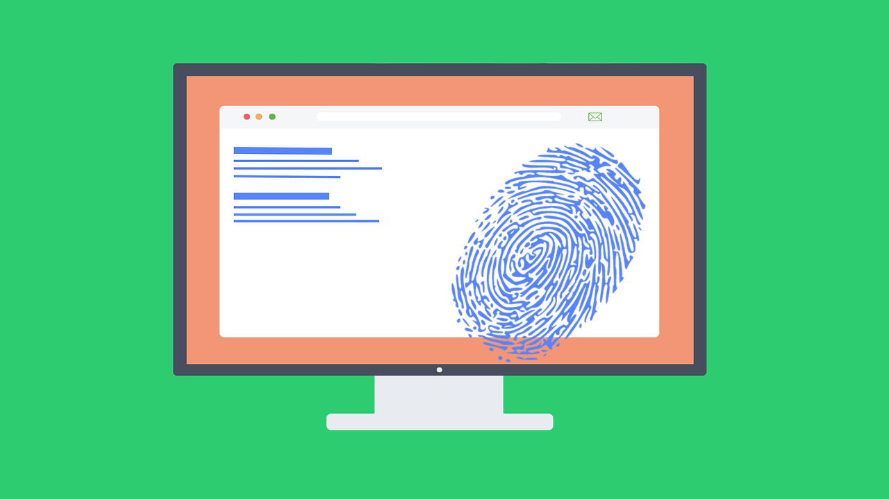
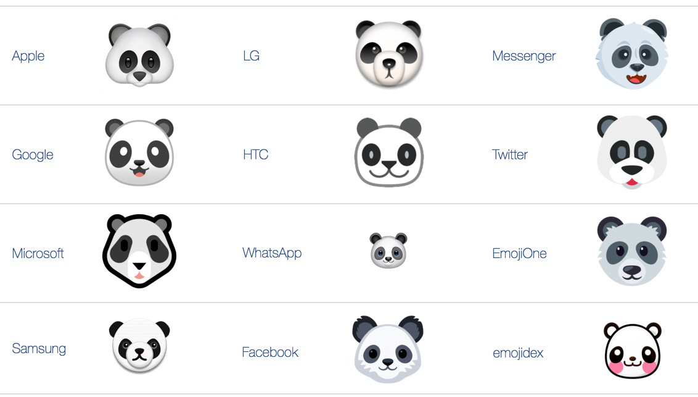
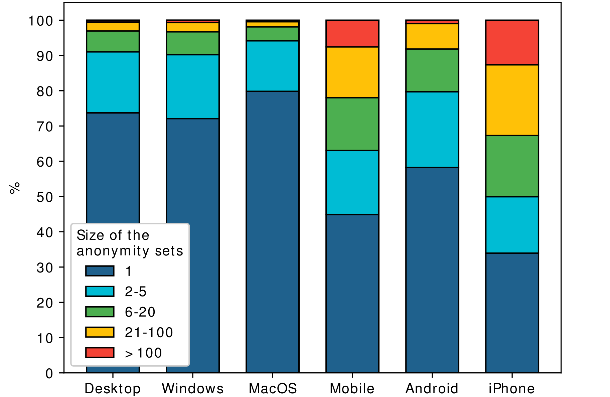
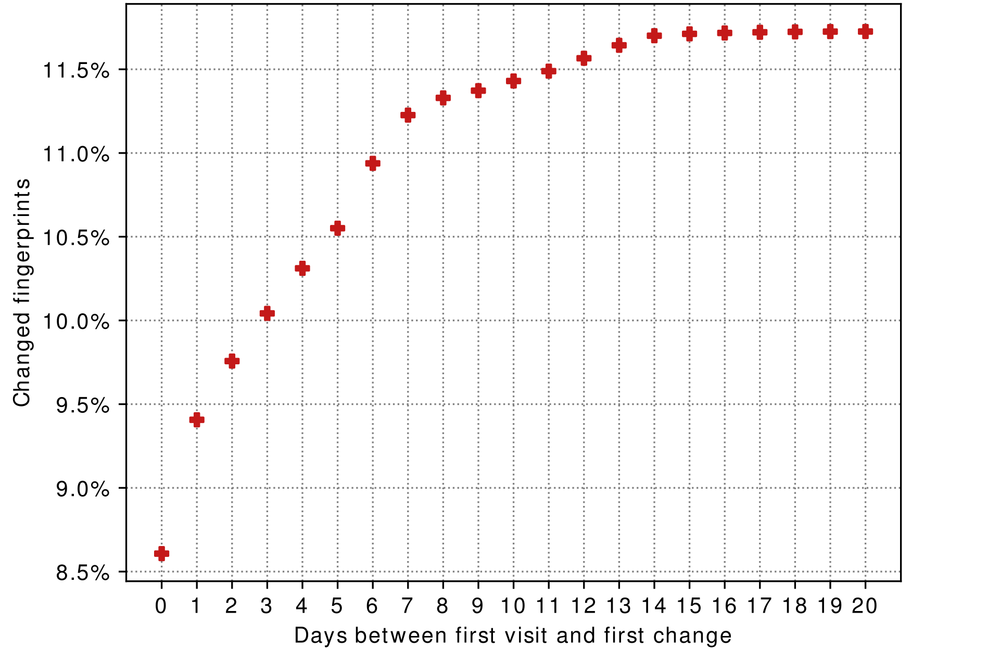
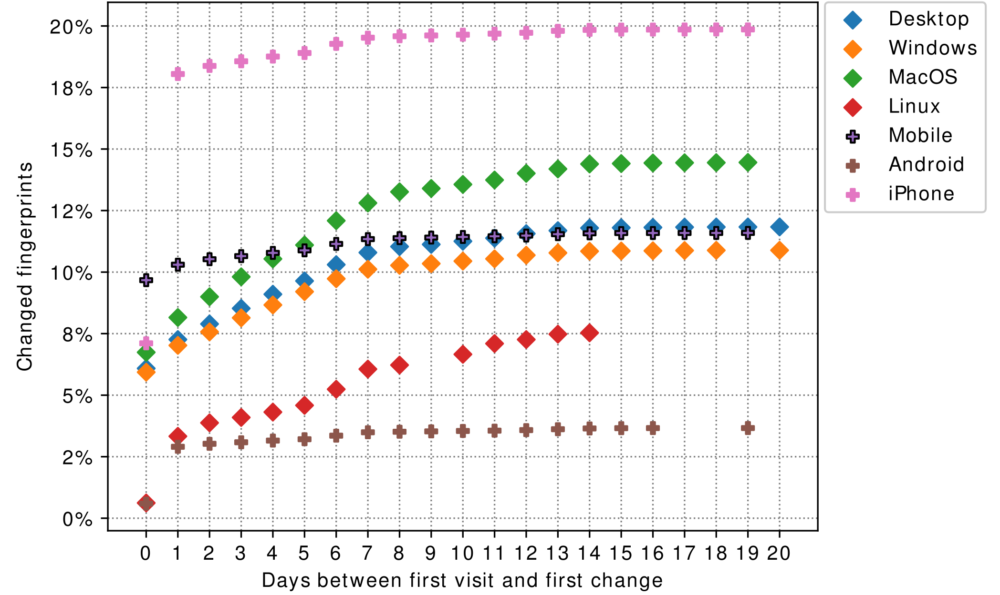
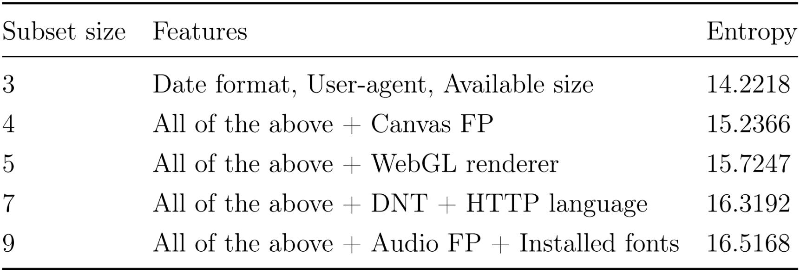

> * 原文地址：[We collected 500,000 browser fingerprints. Here is what we found.](https://medium.com/slido-dev-blog/we-collected-500-000-browser-fingerprints-here-is-what-we-found-82c319464dc9)
> * 原文作者：[Peter Hraška](https://medium.com/@peterhraka)
> * 译文出自：[掘金翻译计划](https://github.com/xitu/gold-miner)
> * 本文永久链接：[https://github.com/xitu/gold-miner/blob/master/article/2021/we-collected-500-000-browser-fingerprints-here-is-what-we-found.md](https://github.com/xitu/gold-miner/blob/master/article/2021/we-collected-500-000-browser-fingerprints-here-is-what-we-found.md)
> * 译者：[Usualminds](https://github.com/Usualminds)
> * 校对者：[PassionPenguin](https://github.com/PassionPenguin)、[Chorer](https://github.com/Chorer)、[lsvih](https://github.com/lsvih)

# 基于 50 万个浏览器指纹的新发现

你还记得自己上一次在网上寻找想要的商品时，会弹出很多与之相关广告页面吗？这时候你很有可能正在被跟踪，因为你的屏幕分辨率、时区和表情符号集这些信息都暴露在了网上。

没错，这种方法甚至可以在你使用无痕浏览模式 (也就是隐身模式) 时跟踪你。

 检查你的浏览器指纹](https://cdn-images-1.medium.com/max/2000/1*PxgUnoZ92Gg75mpgczP2xQ.png)

在 [Slido](https://slido.com) 上，我们进行了一次最大规模的浏览器指纹识别准确性的公开调查，并且是全球首次针对智能手机上的指纹信息表现进行的全面调查。

那么，让我们来看看什么是浏览器指纹，它们怎么被用来跟踪你，及其在这方面做得 “有多好”。

## 浏览器指纹是什么？

我会用一个简单的“相机和打字机”的类比来解释什么是浏览器指纹。

相机和打字机都可以很简单地通过它们的输出来进行识别和区分。

每台相机都会在图片上留下独特的噪声样式，每台打字机都会以特定的方式在字母周围留下墨迹。

通过观察两张照片并比较它们的噪声样式，我们可以准确地判定这是否是同一台相机所拍摄。

同样的原则也适用于浏览器。大多数浏览器都启用了 JavaScript 功能，它向外部公开了大量关于你的浏览器的信息。

可能是你的屏幕尺寸、表情符号、已安装的字体、语言、时区或显卡型号。所有这些都可以从你的浏览器获得，但是你也许从未注意过这一点。

就每个指纹信息本身而言，它们都是微不足道的。但通过组合使用，任何人都可以准确地通过它来识别特定的浏览器。

如果你感兴趣的话, 可以在 [我的网站](http://fp.virpo.sk) 上查看你的部分浏览器指纹信息。

## 如何使用浏览器指纹信息？

有人可能会认为浏览器指纹天生就有不好的一面，但事实并非如此。

以防诈骗为例。如果你有任何一种需要在线登录的账号，比如银行账户或者社交网络账户，一般情况下只需要通过邮箱和密码就可以登录。

如果有一天小偷盗取了你的登录凭证并试图从他的设备上登录，银行或社交网络是可以检测到这种异常行为的，因为浏览器指纹发生了变化。为了防止被诈骗，平台可能会要求你做出进一步的授权，比如短信验证码。

然而，迄今为止，浏览器指纹最广泛的应用是个性化的广告推送。“点赞”和“分享”按钮几乎出现在每个社交网站上，它们通常会包含一个 JavaScript 脚本来收集你的浏览器指纹信息，从而进一步获取你的浏览记录。

从某一个设备上收集单个指纹信息并不是很有价值。在一个网站上收集很多指纹信息也没有太大的用处。

但是因为与社交相关的按钮 —— 也就是包含浏览器指纹的脚本 —— 几乎无处不在，社交网络甚至知道你是怎么浏览网页的。

通过这种方式，那些科技巨头会向你推送你半小时前搜索内容的相关广告。

## 我的浏览器在任何地方和时间都能被识别出来吗？

当然不是。

这里有几个网站，比如 [AmIUnique](https://amiunique.org/) 和 [Panopticlick](https://panopticlick.eff.org/)，它们会基于数据库内大约 100 万个指纹信息，来确定你的浏览器指纹信息是否唯一。

你的浏览器指纹很可能会被标记为唯一的。这听起来很可怕，但请耐心听我说，当我们了解了指纹标记原理时，可能就没那么担心了。

这些网站将你的指纹与他们的整个数据库进行比较，该数据库包含了至少两到三年（或 Panopticlick 则是 45 天）收集的数据。

然而，45 天和 2 年的时间足够让你的浏览器指纹发生改变，而这不需要你做任何事情。例如，我的浏览器指纹在 60 天内改变了 6 次。

导致这种变化的可能是浏览器自动更新、调整窗口大小、安装新字体，甚至调整夏令时。所有这些都会让你的浏览器在很长一段时间内很难再次被唯一识别。

## 我们分析的数据

[Panopticlick](https://panopticlick.eff.org/static/browser-uniqueness.pdf) 和 [AmIUnique](https://hal.inria.fr/hal-01285470/file/beauty-sp16.pdf) 都发表了关于浏览器指纹的优秀科学论文，他们分析了几十万个浏览器指纹。

我们的数据在几个关键方面有所不同。我们相信这有助于我们揭示更多关于浏览器指纹的信息。

* 我们分析了 566704 个浏览器指纹，这大约是之前最大的研究分析的指纹数量的两倍
* 我们的数据集中，65% 的设备是智能手机
* 数据集包含了 31 个不同的浏览器指纹特征，每个设备都是使用的最先进的浏览器指纹脚本

我们非常重视网络隐私，因此所有数据都是匿名分析的。我们尽了很大的努力来确保这些数据除了用于本研究之外，在任何其他方面都是无效的。

## 结果

从我们的数据中得出的最直观的图表可能是显示匿名集大小的图表。

匿名设置基本上描述了有多少不同的设备共享了完全相同的浏览器指纹。

例如，大小为 1 的匿名集意味着浏览器指纹是唯一的。大小为 5 的匿名集意味着 5 个不同的设备拥有完全相同的指纹，因此，你不能仅仅根据指纹来区分它们。

我们数据集中大多数已占用设备类型的匿名设置大小结果如下：

看完这张图表，可以得出几个比较明确的结论:

* 74% 的桌面设备能够被唯一识别，而只有 45% 的移动设备能够被唯一识别。
* 在 iPhone 上收集的浏览器指纹中，只有 33% 是唯一的。
* 另外 33% 的 iPhone 几乎无法被跟踪，因为有 20 多部 iPhone 显示了完全相同的浏览器指纹。

#### 指纹变化率

当观察单个设备的浏览器指纹发生变化的频率时，我们看到了另一个有趣的现象。

以下图表显示了设备第一次访问和第一次更改浏览器指纹之间的天数：

我们可以看到，在 24 小时内，我们多次看到的设备中，近 10% 的设备成功改变了指纹。

让我们分别看看这在每种设备上的表现：

这张图表显示，19% 的 iPhone 手机在一周内更换了指纹，而同期只有 3% 的 Android。我们的数据表明，iPhone 比 Android 更难进行长时间的跟踪。

#### 最少的指纹个数

最后，我们讨论了到底需要从浏览器中收集多少指纹特性才能可靠地识别该浏览器。

为此，我们通过 [香农信息熵](https://en.wikipedia.org/wiki/Entropy_(information_theory)) 来评估指纹信息到底有多准确。其熵值越高，识别过程越准确。

**例如，14.2 的熵意味着每 19000 个浏览器指纹中就有一个与我的浏览器指纹完全相同。将熵值增加到 16.5 意味着，每 92500 个设备中就有一个和我拥有相同的指纹。**

在我们的实验中，我们找到了最准确的浏览器指纹信息的子集。

我们整个数据集的熵为 16.55，所以我们决定从 3 个指纹特征开始，增加子集的大小，直到子集的熵大于 16.5，结果如下：

实验表明，通过提取 3 个基本的浏览器特征，即日期格式、用户代理字符集和屏幕可用大小（屏幕大小减去程序坞、窗口栏等的大小），我们可以实现 14.2 的熵，在某些情况下，这已经足够识别浏览器（以及用户）。

如果我们用更难获得的特性 (如 `Canvas`、已安装字体列表等) 扩展子集，就能够达到熵为 16.5 的目标。

这就意味着网站和公司并不需要花太多精力来识别你的身份。

## 结论

那么我们可以从中得到什么呢？

* 那些科技巨头可以追踪到你的线上活动，但目前还不完全准确。
* 智能手机（尤其是 iPhone）比个人电脑更难追踪
* 设备的浏览器指纹变化非常频繁
* 浏览器指纹很容易获取

然而，如果你担心你的数据隐私，我这里也可以告诉你一些好消息。首先，[苹果宣布了一场针对浏览器指纹识别的保卫战](https://www.howtogeek.com/fyi/safari-battles-browser-fingerprinting-and-tracking-on-macos-mojave/)，它推出了最新的 Mac OS Mojave 版本。其次，GDPR 认为浏览器指纹是个人数据，必须进行相应的处理。最后还有许多 [插件和浏览器扩展](https://amiunique.org/tools) 会混淆浏览器指纹脚本。

所以，我们的浏览器隐私在未来并不像它看起来那么糟糕。诚然，有时你的浏览器可以被唯一地识别，但很多时候其他设备的浏览器指纹与你的完全相同，这使得你的浏览器更难被跟踪。

#### 研究动机

在 [Slido](https://slido.com) 上，我们试图使我们的 Web 应用程序的用户体验尽可能简单。当你使用我们的应用程序时，你通常不需要登录，我们希望保持这种方式。

我们进行这项研究的动机是：基于浏览器指纹的身份验证是否可以在不损害用户体验的情况下保护用户免受恶意脚本的攻击。

需要注意的是，智能手机的指纹信息也很重要，因为我们的应用流量主要来自智能手机。

而我们研究的结论是**否定的**

浏览器指纹本身不足以作为我们进行用户身份验证的充分条件。然而，它们足够准确地把你放在一群有着类似兴趣（比如猫或汽车）的人当中。

---

这就意味着浏览器指纹的使用在个别场景中是理想的，比如个性化的广告，这种情况下准确性并非其关键，或者防止银行诈骗，通过浏览器指纹追踪，让诈骗者有所畏惧到底是一件好事。

如果你想了解更多关于浏览器指纹识别的知识，我写了一篇关于和我自己研究相关的 [60 多页长的论文](http://virpo.sk/browser-fingerprinting-hraska-diploma-thesis.pdf)，你可以读读看。

你将了解到更多的关于每个浏览器特性提取是如何工作的，如何避免被浏览器指纹跟踪，并对本文中的图像和结果进行更详细的解释，等等。

---

非常感谢我的导师，RNDr. Michal Forišek 博士，在本次研究中为我提供了很大的帮助。

相关链接：

* [我的关于浏览器指纹的 60 多页的报告](http://virpo.sk/browser-fingerprinting-hraska-diploma-thesis.pdf)
* [http://fp.virpo.sk](http://fp.virpo.sk) —— 了解浏览器指纹是什么
* [https://panopticlick.eff.org](https://panopticlick.eff.org/static/browser-uniqueness.pdf) —— Panopticlick
* [https://amiunique.org](https://amiunique.org/) —— AmIUnique
* [https://audiofingerprint.openwpm.com](https://audiofingerprint.openwpm.com/) —— audio 特性在浏览器指纹中的应用
* [https://www.nothingprivate.ml/](https://www.nothingprivate.ml/) —— 无痕浏览并不是无痕的

> 如果发现译文存在错误或其他需要改进的地方，欢迎到 [掘金翻译计划](https://github.com/xitu/gold-miner) 对译文进行修改并 PR，也可获得相应奖励积分。文章开头的 **本文永久链接** 即为本文在 GitHub 上的 MarkDown 链接。

---

> [掘金翻译计划](https://github.com/xitu/gold-miner) 是一个翻译优质互联网技术文章的社区，文章来源为 [掘金](https://juejin.im) 上的英文分享文章。内容覆盖 [Android](https://github.com/xitu/gold-miner#android)、[iOS](https://github.com/xitu/gold-miner#ios)、[前端](https://github.com/xitu/gold-miner#前端)、[后端](https://github.com/xitu/gold-miner#后端)、[区块链](https://github.com/xitu/gold-miner#区块链)、[产品](https://github.com/xitu/gold-miner#产品)、[设计](https://github.com/xitu/gold-miner#设计)、[人工智能](https://github.com/xitu/gold-miner#人工智能)等领域，想要查看更多优质译文请持续关注 [掘金翻译计划](https://github.com/xitu/gold-miner)、[官方微博](http://weibo.com/juejinfanyi)、[知乎专栏](https://zhuanlan.zhihu.com/juejinfanyi)。
